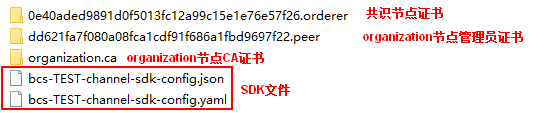

# 下载SDK配置和证书

BCS支持执行链代码、查询链代码等功能。开发应用之前您需要进行证书下载及SDK配置下载，SDK基于该配置文件可以方便地访问区块链网络并完成事务处理，您可以免去手工配置的繁琐流程。

## 前提条件

下载SDK配置前请确保业务链代码已安装并实例化。

## 下载SDK配置和证书

SDK配置、证书、用户应用程序是组合使用的。SDK配置文件中包含具体的链代码信息、证书路径信息，所以在下载SDK配置时需要指定链代码名称和证书存放路径（即下载的证书在应用程序执行机的最终存放路径）。如果证书路径后期有变更，您需要手动修改SDK配置文件中所有证书相关路径。

目前BCS支持三种证书：管理员证书、用户证书和CA证书。创建通道、加入通道、更新通道、安装链代码、实例化链代码、升级链代码和删除链代码需要使用管理员证书，交易和查询推荐使用用户证书。应用程序开发人员需要到区块链服务管理界面下载对应服务的证书。

-   管理员证书：组织的管理权限证书和私钥，可使用该身份进行通道和合约的管理。
-   用户证书：组织的用户权限证书和私钥，可使用该身份进行普通的交易和查询。
-   CA证书： 组织的根证书，可以使用该CA公私钥签发下一级证书。

> **说明：** 
>-   共识节点和Peer节点的管理证书是不同的，用户在通道内的管理操作，需要使用Peer节点管理证书，而不是共识节点管理证书。
>-   请妥善保管下载证书中的私钥，建议您对私钥进行加密存储。

1.  登录区块链服务管理控制台。
2.  单击左侧导航栏中的“服务管理”。
3.  在服务卡片中，单击“获取客户端配置”。
4.  勾选需要下载的内容，包括SDK文件、共识节点证书和Peer节点证书。
    -   SDK文件：配置应用SDK端要触发的组织节点，链码和证书存放路径。

        **表 1**  SDK文件参数说明

        
        <table><thead align="left"><tr id="row1120114214109"><th class="cellrowborder" valign="top" width="21%" id="mcps1.2.3.1.1">
参数名称

        </th>
        <th class="cellrowborder" valign="top" width="79%" id="mcps1.2.3.1.2">
说明

        </th>
        </tr>
        </thead>
        <tbody><tr id="row02054219107"><td class="cellrowborder" valign="top" width="21%" headers="mcps1.2.3.1.1 ">
链代码名称

        </td>
        <td class="cellrowborder" valign="top" width="79%" headers="mcps1.2.3.1.2 ">
根据您的实际情况填写。链代码名称需要和链代码安装、实例化时的一致。

        </td>
        </tr>
        <tr id="row122024241012"><td class="cellrowborder" valign="top" width="21%" headers="mcps1.2.3.1.1 ">
证书存放路径

        </td>
        <td class="cellrowborder" valign="top" width="79%" headers="mcps1.2.3.1.2 ">
用户在编译应用程序时，证书的最终存放路径。如果证书路径后期有变更，您需要手动修改SDK配置文件中所有证书相关路径。

        </td>
        </tr>
        <tr id="row8205420108"><td class="cellrowborder" valign="top" width="21%" headers="mcps1.2.3.1.1 ">
通道名称

        </td>
        <td class="cellrowborder" valign="top" width="79%" headers="mcps1.2.3.1.2 ">
选择一个通道。

        </td>
        </tr>
        <tr id="row020642171013"><td class="cellrowborder" valign="top" width="21%" headers="mcps1.2.3.1.1 ">
组织&amp;Peer节点

        </td>
        <td class="cellrowborder" valign="top" width="79%" headers="mcps1.2.3.1.2 ">
选择通道中的节点组织。

        </td>
        </tr>
        </tbody>
        </table>

    -   共识节点证书：与区块链系统交互时，需要使用共识节点管理证书。请妥善保管对应证书的私钥，建议您进行加密保存。
    -   Peer节点证书：用户在通道内的管理操作，需要使用Peer节点管理证书。请妥善保管对应证书的私钥，建议您进行加密保存。选择指定节点组织和要下载的证书类型。

5.  单击“下载”。将下载的SDK文件解压出yaml文件备用。将下载的证书文件压缩包解压并放置在某应用目录中，使应用程序可访问。

    假设BCS服务名称为“bcs-TEST”，服务中有1个区块链组织为“organization”。解压下载的配置包，文件夹结构示例如下：

    

