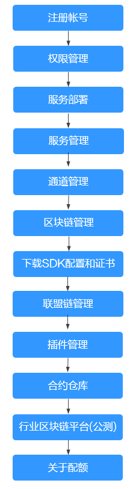

# 使用引导

区块链服务BCS提供服务部署、区块链管理、通道/业务链管理、成员管理、通知管理等功能。以下为区块链服务使用全景图，希望对您的使用有所引导及帮助。

> **说明：** 
>BCS本身不涉及用户敏感信息。使用BCS处理数据的目的、范围、处理方式、时限等请遵从当地适用的法律法规。BCS本身不建议传输和存储敏感数据，如果传输和存储敏感数据，请自行加密后再传输和存储。

**图 1**  使用引导  

1.  注册账号

    新用户请先注册完成实名认证，具体请参见[帐号注册](https://support.huaweicloud.com/usermanual-account/account_id_001.html)和[帐号实名认证](https://support.huaweicloud.com/usermanual-account/account_auth_00001.html)。

2.  [权限管理](权限管理.md)

    创建用户并授权使用BCS。

3.  [服务部署](服务部署.md)

    Hyperledger Fabric增强版支持在CCE集群部署和边缘集群部署。

4.  [服务管理](服务管理.md)

    提供Hyperledger Fabric增强版服务管理功能，可实时查看服务运行状况，并对区块链服务做相应的操作。

5.  [通道管理](通道管理.md)

    通道为组织节点提供通信渠道。通过通道管理功能您可以创建通道或为已有通道添加组织节点等。

6.  [区块链管理](区块链管理.md)

    提供界面化链代码管理功能，包括链代码安装、实例化、更新链代码。

7.  [下载SDK配置和证书](下载SDK配置和证书.md)

    开发应用之前需要进行配置文件下载，配置文件中包含用户证书和SDK。

8.  [联盟链管理](联盟链管理.md)

    当您已创建区块链服务类型为“联盟链”的区块链实例时，您可以通过邀请其他租户加入此联盟链，组建一个多成员参与的联盟链系统。

9.  [插件管理](插件管理.md)

    用于管理BCS实例的扩展功能，以支持选择性扩展满足特定需求的功能。

10. [合约仓库](合约仓库.md)

    提供已经实现某些基本功能的智能合约，您可以使用模板提供的基础功能代码，直接使用或二次开发符合自己业务逻辑的智能合约。

11. [行业区块链平台](行业区块链平台（公测）.md)

    行业区块链平台是提供具有行业属性的区块链平台，支持行业区块链应用、软硬资源、智能合约等管理和维护。

12. [关于配额](关于配额.md)

    支持查看服务的配额使用情况和扩大配额。

