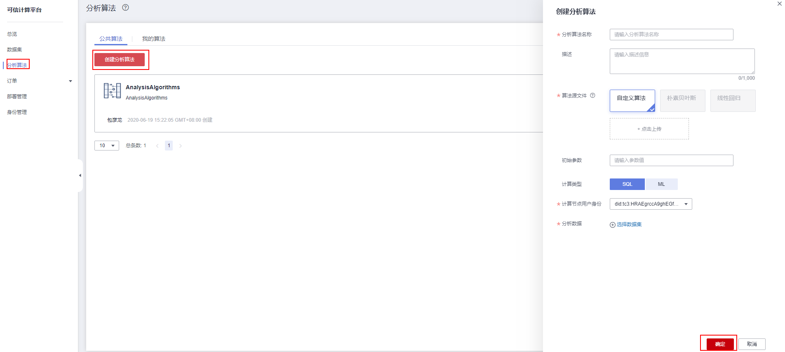

# 分析算法管理

分析算法是依赖于指定数据集的计算服务，基于链上发布的数据集提交分析算法。申请获取计算服务，实际上就是获得了指定数据集的使用权，使用方式就是使用计算服务中的分析算法进行计算，并最终获取到计算结果。

分析算法管理为您提供界面化分析算法管理功能，包括创建分析算法、申请分析算法等，方便您对算法进行相关管理操作。

1.  登录可信计算平台页面。单击左侧导航栏中的“分析算法”。
2.  单击“公共算法”或“我的算法”页面中的“创建分析算法”。
3.  在创建分析算法界面输入“分析算法名称”、“描述”及“初始参数”，选择或者上传“算法源文件”、“计算类型”、“计算节点”及“分析数据”等，如下图：

    **图 1**  创建分析算法  
    

4.  单击“确定”，完成算法创建。
5.  单击“公共算法”，在已创建的算法右侧单击“申请”\>“确定”，完成申请。
6.  单击“我的算法”，查看算法。
    -   可查看“我发布的”的算法，在算法右侧进行“删除”操作。
    -   可查看“我申请的”的算法。

-   **[分析算法编写](分析算法编写.md)**  

