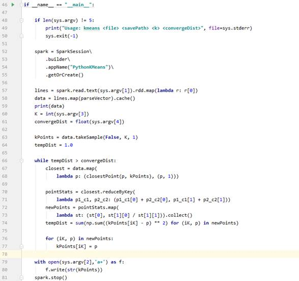

# 分析算法编写

算法脚本由用户自己编写并上传。目前支持PySpark，使用python语言编写，计算节点通过spark-submit提交计算任务。用户可以根据数据集中发布的sample样例数据设计自己的算法，实现例如sql查询、数据分析、机器学习等。

算法脚本需要接受3类参数：

-   数据文件路径\(不能为空，可以有多个\)
-   结果存储路径\(不能为空，需要将计算结果保存在该文件中，如果保存模型，需要将结果保存在该件夹下\)
-   计算依赖参数\(可以为空或者多个\)

如下示例，是一个kmean聚类算法的简单实现。在第48-50行设定函数接受参数，符合上述参数要求。第79-80行存储计算结果到给定文件中。更多示例可以查看[https://bcs.obs.cn-north-1.myhuaweicloud.com/tc3/TC3-Worker-Demo-master.tar](https://bcs.obs.cn-north-1.myhuaweicloud.com/tc3/TC3-Worker-Demo-master.tar)。

