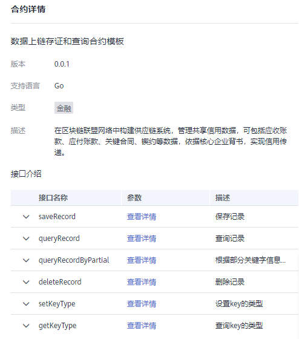
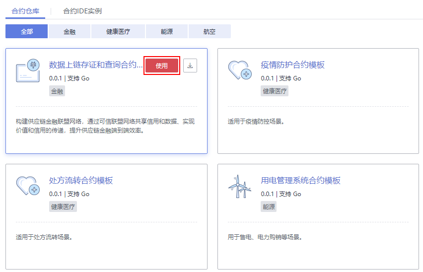
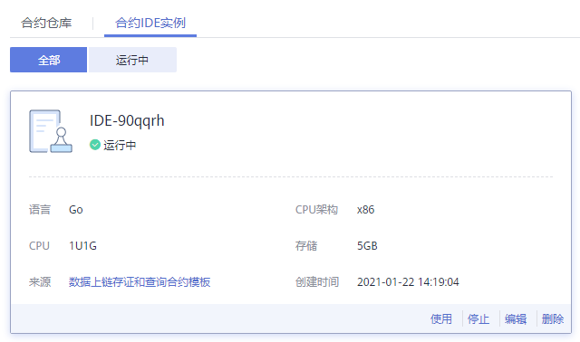

# 合约仓库

合约模板是已经实现某些基本功能的智能合约，您可以使用模板提供的基础功能代码，直接使用或二次开发符合自己业务逻辑的智能合约。

合约管理可以管理合约模板，您可以在合约模板市场查看各行业场景的合约模板，并下载模板使用。

## 约束与限制

合约仓库中提供的合约模板仅适用于Fabric服务，华为区块链服务暂不支持。

## 下载合约模板

1.  登录区块链服务管理控制台。
2.  在页面左侧选择“合约仓库”。
3.  在“合约仓库“页签下，您可以查看各类模板，包括金融、健康医疗、能源、航空等模板。
4.  在合约模板卡片上，单击模板名称，可查看合约模板的详细信息，包括合约模板的版本、支持语言、类型及其接口信息。

    **图 1**  查看合约详情  
    

5.  在合约模板卡片上，单击，下载合约模板到本地。

    您可在区块链服务管理界面，将下载的模板文件进行链代码的安装和实例化操作，具体请参见[链代码管理](链代码管理.md)。

## 使用CloudIDE在线编辑合约

该功能当前仅“华北-北京四”区域支持。

1.  登录区块链服务管理控制台。
2.  在页面左侧选择“合约仓库”。
3.  在“合约仓库“页签下，单击合约模板卡片上的“使用”。

    **图 2**  使用合约模板  
    

    > **须知：** 
    >此功能需要先开通CloudIDE服务才能使用，如果未开通，界面会跳转至CloudIDE服务开通页面，请根据界面提示开通。

4.  根据页面提示填写项目实例名称、描述，单击“确认”则会创建一个CloudIDE实例并进入加载页面。

    > **说明：** 
    >在创建实例完第一次启动过程中，页面加载时会下载合约代码至CloudIDE实例中，此过程请勿强行关闭页面，否则会导致创建的实例中没有合约代码。

5.  创建CloudIDE实例成功后，可以对合约代码进行在线编辑、调试。具体用法请参考[CloudIDE](https://support.huaweicloud.com/cloudide/index.html)。

    您可以在“合约IDE实例“页签下对已创建的CloudIDE实例进行使用、停止、编辑、删除操作。

    **图 3**  合约IDE实例  
    

