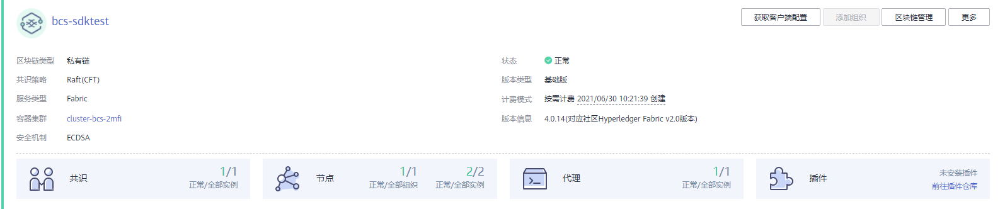
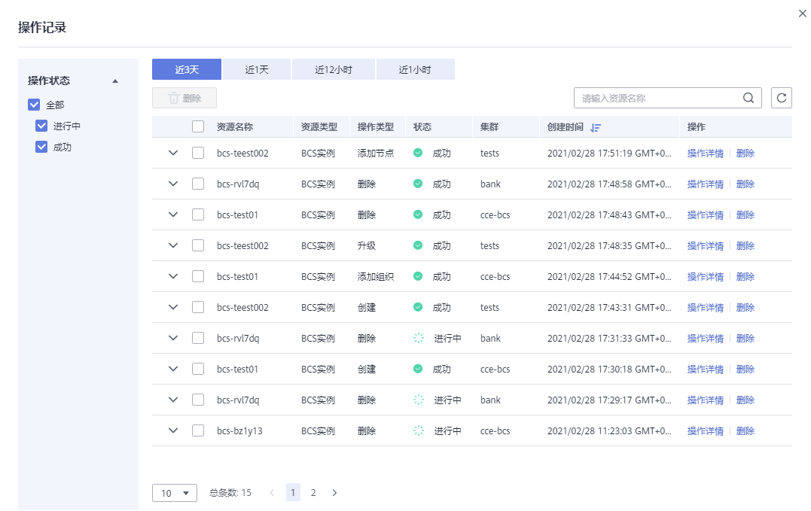

# 基于CCE集群

Hyperledger Fabric增强版服务支持在CCE集群和边缘集群上部署。本页面介绍如何部署基于CCE集群的Hyperledger Fabric增强版服务。

-   基于CCE集群部署：服务实例和区块链数据均存储在华为云上，当您没有可用的自有硬件资源时，可购买华为云资源并采用此方式部署。

    > **须知：** 
    >BCS服务需要独占CCE集群，部署BCS服务前请确保CCE集群未被使用。

-   基于边缘集群部署：区块链数据存储在您的自有节点上，即边缘节点上，BCS只提供区块链管理能力。当您已经有了可用的硬件资源时，为了减少资源浪费、降低您的投入成本，可采用此方式部署。

## 前提条件

如果您使用华为云帐号创建的IAM用户进行操作，IAM用户需要具备足够的权限才能操作并订购区块链服务。具体操作请参见：[权限管理](权限管理.md)。

您可以通过先创建用户组并授权再将用户加入到用户组的方式，使用户具有用户组中的权限。

## 部署区块链服务

完成环境准备工作后，可按照如下步骤购买并部署区块链服务。

> **说明：** 
>现网帐号欠费会导致服务网盘被释放，已购买的服务不可用。

1.  购买区块链服务。
    -   登录区块链服务管理控制台，进入“服务管理”，单击Hyperledger Fabric增强版的“购买”按钮。
    -   未部署可信计算插件的区块链服务，可选择添加可信计算插件，请执行以下步骤添加可信计算插件：

        1.  登录区块链服务管理控制台。
        2.  单击左侧导航栏中的“插件管理”。
        3.  在“插件仓库“页签下的可信插件卡片中，单击“安装“。

        > **说明：** 
        >-   已部署的区块链服务需要先升级到最新的版本，才可以添加可信计算。
        >-   已部署的服务，单击左侧导航栏中的“服务管理”，单击右侧的“操作记录”，查看操作记录并在服务右侧进行“操作详情”及“删除”操作。

2.  根据界面提示，配置区块链基本信息，参数如[表1](#table11911152765220)所示。

    **表 1**  基本信息配置

    
    <table><thead align="left"><tr id="row189131327125210"><th class="cellrowborder" valign="top" width="21.92%" id="mcps1.2.4.1.1">
参数

    </th>
    <th class="cellrowborder" valign="top" width="53.080000000000005%" id="mcps1.2.4.1.2">
描述

    </th>
    <th class="cellrowborder" valign="top" width="25%" id="mcps1.2.4.1.3">
示例

    </th>
    </tr>
    </thead>
    <tbody><tr id="row10914142785216"><td class="cellrowborder" valign="top" width="21.92%" headers="mcps1.2.4.1.1 ">
计费模式

    </td>
    <td class="cellrowborder" valign="top" width="53.080000000000005%" headers="mcps1.2.4.1.2 ">
区块链服务管理费收费模式，支持包年/包月、按需计费。

    </td>
    <td class="cellrowborder" valign="top" width="25%" headers="mcps1.2.4.1.3 ">
包年/包月

    </td>
    </tr>
    <tr id="row10914102718522"><td class="cellrowborder" valign="top" width="21.92%" headers="mcps1.2.4.1.1 ">
区域

    </td>
    <td class="cellrowborder" valign="top" width="53.080000000000005%" headers="mcps1.2.4.1.2 ">
区块链基础设施所在的区域，建议选择与业务应用系统相同的地域。

    </td>
    <td class="cellrowborder" valign="top" width="25%" headers="mcps1.2.4.1.3 ">
使用默认区域

    </td>
    </tr>
    <tr id="row98014253458"><td class="cellrowborder" valign="top" width="21.92%" headers="mcps1.2.4.1.1 ">
企业项目

    </td>
    <td class="cellrowborder" valign="top" width="53.080000000000005%" headers="mcps1.2.4.1.2 ">
请选择已创建的企业项目，将区块链服务添加至企业项目中。

    
 说明： 
<ul id="ul1745154235117"><li>如果您没有开通企业管理服务，将无法看到企业项目选项。
开通方法请参见<a href="https://support.huaweicloud.com/usermanual-em/pm_topic_0002.html" target="_blank" rel="noopener noreferrer">如何开通企业项目</a>。

    </li><li>如果您使用已有CCE集群部署区块链服务，建议您将区块链服务添加至CCE集群的企业项目中，如果区块链服务与部署区块链服务的CCE集群处于不同的企业项目，可能导致使用异常。</li></ul>
    

    </td>
    <td class="cellrowborder" valign="top" width="25%" headers="mcps1.2.4.1.3 ">
default

    </td>
    </tr>
    <tr id="row109151027185215"><td class="cellrowborder" valign="top" width="21.92%" headers="mcps1.2.4.1.1 ">
区块链服务名称

    </td>
    <td class="cellrowborder" valign="top" width="53.080000000000005%" headers="mcps1.2.4.1.2 ">
支持中英文字符、数字及中划线，不能以中划线开头，长度为4-24个字符。

    </td>
    <td class="cellrowborder" valign="top" width="25%" headers="mcps1.2.4.1.3 ">
bcs-wh

    </td>
    </tr>
    <tr id="row1291552716526"><td class="cellrowborder" valign="top" width="21.92%" headers="mcps1.2.4.1.1 ">
版本类型

    </td>
    <td class="cellrowborder" valign="top" width="53.080000000000005%" headers="mcps1.2.4.1.2 ">
BCS提供基础版、专业版、企业版和铂金版供您选择。

    </td>
    <td class="cellrowborder" valign="top" width="25%" headers="mcps1.2.4.1.3 ">
企业版

    </td>
    </tr>
    <tr id="row2091582725220"><td class="cellrowborder" valign="top" width="21.92%" headers="mcps1.2.4.1.1 ">
区块链类型

    </td>
    <td class="cellrowborder" valign="top" width="53.080000000000005%" headers="mcps1.2.4.1.2 ">
私有链指仅本租户内部使用的区块链服务，联盟链指可邀请其他租户一起组建联盟的区块链服务。

    </td>
    <td class="cellrowborder" valign="top" width="25%" headers="mcps1.2.4.1.3 ">
私有链

    </td>
    </tr>
    <tr id="row19504349114915"><td class="cellrowborder" valign="top" width="21.92%" headers="mcps1.2.4.1.1 ">
Fabric内核

    </td>
    <td class="cellrowborder" valign="top" width="53.080000000000005%" headers="mcps1.2.4.1.2 ">
区块链服务的版本号。

    
区块链版本4.x.x对应社区Hyperledger Fabric v2.2。

    </td>
    <td class="cellrowborder" valign="top" width="25%" headers="mcps1.2.4.1.3 ">
v2.2

    </td>
    </tr>
    <tr id="row674219421144"><td class="cellrowborder" valign="top" width="21.92%" headers="mcps1.2.4.1.1 ">
共识策略

    </td>
    <td class="cellrowborder" valign="top" width="53.080000000000005%" headers="mcps1.2.4.1.2 ">
区块链网络中节点之间达成共识需要遵从的规则。

    
支持快速拜占庭容错共识算法(FBFT)、Raft(CFT)，各策略分别具有不同的特性及使用场景，请参见<a href="https://support.huaweicloud.com/productdesc-bcs/bcs_productdesc_0002.html" target="_blank" rel="noopener noreferrer">产品功能</a>。

    
 说明： 

raft共识基础版默认1个orderer共识节点，专业版、企业版、铂金版默认3个orderer节点。

    

    </td>
    <td class="cellrowborder" valign="top" width="25%" headers="mcps1.2.4.1.3 ">
快速拜占庭容错共识算法(FBFT)

    </td>
    </tr>
    <tr id="row8881428111517"><td class="cellrowborder" valign="top" width="21.92%" headers="mcps1.2.4.1.1 ">
资源初始密码

    </td>
    <td class="cellrowborder" valign="top" width="53.080000000000005%" headers="mcps1.2.4.1.2 ">
登录区块链管理界面时的admin账户的密码、云主机的root密码和CouchDB密码。

    
登录区块链管理界面时的admin账户的密码、云主机的root密码和CouchDB密码为选填项、如果您填写了就以填写值为准、如果您不填写就以资源初始密码的值为准。

    </td>
    <td class="cellrowborder" valign="top" width="25%" headers="mcps1.2.4.1.3 ">
-

    </td>
    </tr>
    <tr id="row159571230121519"><td class="cellrowborder" valign="top" width="21.92%" headers="mcps1.2.4.1.1 ">
资源初始密码确认

    </td>
    <td class="cellrowborder" valign="top" width="53.080000000000005%" headers="mcps1.2.4.1.2 ">
再次输入资源初始密码进行确认。

    </td>
    <td class="cellrowborder" valign="top" width="25%" headers="mcps1.2.4.1.3 ">
-

    </td>
    </tr>
    <tr id="row1165202194315"><td class="cellrowborder" valign="top" width="21.92%" headers="mcps1.2.4.1.1 ">
购买时长

    </td>
    <td class="cellrowborder" valign="top" width="53.080000000000005%" headers="mcps1.2.4.1.2 ">
选择区块链服务的购买时长。

    </td>
    <td class="cellrowborder" valign="top" width="25%" headers="mcps1.2.4.1.3 ">
一个月

    </td>
    </tr>
    </tbody>
    </table>

3.  （可选）单击“快速创建”，系统将按照[表2](#table08701215185213)为您快速购买区块链服务。

    **表 2**  默认规格

    
    <table><thead align="left"><tr id="row0867101515214"><th class="cellrowborder" valign="top" width="20%" id="mcps1.2.6.1.1">
-

    </th>
    <th class="cellrowborder" valign="top" width="20%" id="mcps1.2.6.1.2">
基础版

    </th>
    <th class="cellrowborder" valign="top" width="20%" id="mcps1.2.6.1.3">
专业版

    </th>
    <th class="cellrowborder" valign="top" width="20%" id="mcps1.2.6.1.4">
企业版

    </th>
    <th class="cellrowborder" valign="top" width="20%" id="mcps1.2.6.1.5">
铂金版

    </th>
    </tr>
    </thead>
    <tbody><tr id="row17867615155217"><td class="cellrowborder" valign="top" width="20%" headers="mcps1.2.6.1.1 ">
购买CCE集群节点数

    </td>
    <td class="cellrowborder" valign="top" width="20%" headers="mcps1.2.6.1.2 ">
1

    </td>
    <td class="cellrowborder" valign="top" width="20%" headers="mcps1.2.6.1.3 ">
1

    </td>
    <td class="cellrowborder" valign="top" width="20%" headers="mcps1.2.6.1.4 ">
2

    </td>
    <td class="cellrowborder" valign="top" width="20%" headers="mcps1.2.6.1.5 ">
4

    </td>
    </tr>
    <tr id="row986871585214"><td class="cellrowborder" rowspan="2" valign="top" width="20%" headers="mcps1.2.6.1.1 ">
CCE节点规格

    </td>
    <td class="cellrowborder" valign="top" width="20%" headers="mcps1.2.6.1.2 ">
4核8GB

    </td>
    <td class="cellrowborder" valign="top" width="20%" headers="mcps1.2.6.1.3 ">
4核8GB

    </td>
    <td class="cellrowborder" valign="top" width="20%" headers="mcps1.2.6.1.4 ">
4核8GB

    </td>
    <td class="cellrowborder" valign="top" width="20%" headers="mcps1.2.6.1.5 ">
16核32GB

    </td>
    </tr>
    <tr id="row38680159526"><td class="cellrowborder" colspan="4" valign="top" headers="mcps1.2.6.1.2 mcps1.2.6.1.3 mcps1.2.6.1.4 mcps1.2.6.1.5 ">
（说明：如果默认规格售罄，则会默认购买其他较高规格。）

    </td>
    </tr>
    <tr id="row98684159526"><td class="cellrowborder" valign="top" width="20%" headers="mcps1.2.6.1.1 ">
CCE集群是否高可用

    </td>
    <td class="cellrowborder" valign="top" width="20%" headers="mcps1.2.6.1.2 ">
否

    </td>
    <td class="cellrowborder" valign="top" width="20%" headers="mcps1.2.6.1.3 ">
否

    </td>
    <td class="cellrowborder" valign="top" width="20%" headers="mcps1.2.6.1.4 ">
否

    </td>
    <td class="cellrowborder" valign="top" width="20%" headers="mcps1.2.6.1.5 ">
否

    </td>
    </tr>
    <tr id="row10869201595211"><td class="cellrowborder" valign="top" width="20%" headers="mcps1.2.6.1.1 ">
SFS（弹性文件服务 ）节点存储大小

    </td>
    <td class="cellrowborder" valign="top" width="20%" headers="mcps1.2.6.1.2 ">
40GB

    </td>
    <td class="cellrowborder" valign="top" width="20%" headers="mcps1.2.6.1.3 ">
100GB

    </td>
    <td class="cellrowborder" valign="top" width="20%" headers="mcps1.2.6.1.4 ">
100GB

    </td>
    <td class="cellrowborder" valign="top" width="20%" headers="mcps1.2.6.1.5 ">
500GB

    </td>
    </tr>
    <tr id="row38503225544"><td class="cellrowborder" valign="top" headers="mcps1.2.6.1.1 ">
EIP（弹性公网IP）

    </td>
    <td class="cellrowborder" colspan="4" valign="top" headers="mcps1.2.6.1.2 mcps1.2.6.1.3 mcps1.2.6.1.4 mcps1.2.6.1.5 ">
类型：全动态BGP；带宽： 5 Mbit/s

    </td>
    </tr>
    </tbody>
    </table>

4.  单击“下一步：资源配置”，进行资源配置，参数如[表3](#table169417818359)所示。

    **表 3**  资源配置

    
    <table><thead align="left"><tr id="row6942083350"><th class="cellrowborder" valign="top" width="21.92%" id="mcps1.2.4.1.1">
参数

    </th>
    <th class="cellrowborder" valign="top" width="53.080000000000005%" id="mcps1.2.4.1.2">
描述

    </th>
    <th class="cellrowborder" valign="top" width="25%" id="mcps1.2.4.1.3">
示例

    </th>
    </tr>
    </thead>
    <tbody><tr id="row99442883515"><td class="cellrowborder" valign="top" width="21.92%" headers="mcps1.2.4.1.1 ">
环境资源

    </td>
    <td class="cellrowborder" valign="top" width="53.080000000000005%" headers="mcps1.2.4.1.2 ">
根据实际需求选择“创建默认环境”或“自定义环境”。

    </td>
    <td class="cellrowborder" valign="top" width="25%" headers="mcps1.2.4.1.3 ">
自定义环境

    </td>
    </tr>
    <tr id="row12452183234410"><td class="cellrowborder" valign="top" width="21.92%" headers="mcps1.2.4.1.1 ">
集群

    </td>
    <td class="cellrowborder" valign="top" width="53.080000000000005%" headers="mcps1.2.4.1.2 ">
用于部署区块链服务。

    
可以使用已有CCE集群，创建新的CCE集群或者使用边缘集群。如果选择边缘集群，需要先纳管边缘节点并检查边缘节点状态。

    
 说明： 
<ul id="ul241819586461"><li>使用已有集群支持CCE 1.15及以下版本，还支持CCE 1.19版本。</li><li>Fabric1.4版本服务仅支持CCE 1.15及以下版本集群。</li></ul>
    

    </td>
    <td class="cellrowborder" valign="top" width="25%" headers="mcps1.2.4.1.3 ">
创建新的CCE集群

    </td>
    </tr>
    <tr id="row16452113216447"><td class="cellrowborder" valign="top" width="21.92%" headers="mcps1.2.4.1.1 ">
可用区

    </td>
    <td class="cellrowborder" valign="top" width="53.080000000000005%" headers="mcps1.2.4.1.2 ">
选择云主机所在的可用区。

    </td>
    <td class="cellrowborder" valign="top" width="25%" headers="mcps1.2.4.1.3 ">
可用区1

    </td>
    </tr>
    <tr id="row545253214413"><td class="cellrowborder" valign="top" width="21.92%" headers="mcps1.2.4.1.1 ">
云主机规格

    </td>
    <td class="cellrowborder" valign="top" width="53.080000000000005%" headers="mcps1.2.4.1.2 ">
选择CCE集群中云主机的规格。

    </td>
    <td class="cellrowborder" valign="top" width="25%" headers="mcps1.2.4.1.3 ">
4核/8GB

    </td>
    </tr>
    <tr id="row1945283294412"><td class="cellrowborder" valign="top" width="21.92%" headers="mcps1.2.4.1.1 ">
云主机个数

    </td>
    <td class="cellrowborder" valign="top" width="53.080000000000005%" headers="mcps1.2.4.1.2 ">
根据实际需求输入云主机个数。

    </td>
    <td class="cellrowborder" valign="top" width="25%" headers="mcps1.2.4.1.3 ">
2

    </td>
    </tr>
    <tr id="row445213244419"><td class="cellrowborder" valign="top" width="21.92%" headers="mcps1.2.4.1.1 ">
高可用

    </td>
    <td class="cellrowborder" valign="top" width="53.080000000000005%" headers="mcps1.2.4.1.2 ">
若您对系统可靠性要求比较高，可购买高可用云主机。

    </td>
    <td class="cellrowborder" valign="top" width="25%" headers="mcps1.2.4.1.3 ">
否

    </td>
    </tr>
    <tr id="row1345283212449"><td class="cellrowborder" valign="top" width="21.92%" headers="mcps1.2.4.1.1 ">
虚拟私有云

    </td>
    <td class="cellrowborder" valign="top" width="53.080000000000005%" headers="mcps1.2.4.1.2 ">
支持创建虚拟私有云、系统自动创建VPC和选择已有虚拟私有云。

    </td>
    <td class="cellrowborder" valign="top" width="25%" headers="mcps1.2.4.1.3 ">
系统自动创建VPC

    </td>
    </tr>
    <tr id="row132801111154512"><td class="cellrowborder" valign="top" width="21.92%" headers="mcps1.2.4.1.1 ">
所在子网

    </td>
    <td class="cellrowborder" valign="top" width="53.080000000000005%" headers="mcps1.2.4.1.2 ">
通过子网提供与其他网络隔离的、可以独享的网络资源，以提高网络安全。

    </td>
    <td class="cellrowborder" valign="top" width="25%" headers="mcps1.2.4.1.3 ">
系统自动创建子网

    </td>
    </tr>
    <tr id="row3451632104416"><td class="cellrowborder" valign="top" width="21.92%" headers="mcps1.2.4.1.1 ">
云主机登录方式

    </td>
    <td class="cellrowborder" valign="top" width="53.080000000000005%" headers="mcps1.2.4.1.2 ">
支持密码、密钥对两种方式。

    </td>
    <td class="cellrowborder" valign="top" width="25%" headers="mcps1.2.4.1.3 ">
密码

    </td>
    </tr>
    <tr id="row14512032104416"><td class="cellrowborder" valign="top" width="21.92%" headers="mcps1.2.4.1.1 ">
root密码

    </td>
    <td class="cellrowborder" valign="top" width="53.080000000000005%" headers="mcps1.2.4.1.2 ">
登录云主机时的root用户密码。

    
如果填写该项，则以填写值为准，如果不填写，则以资源初始密码为准。

    </td>
    <td class="cellrowborder" valign="top" width="25%" headers="mcps1.2.4.1.3 ">
-

    </td>
    </tr>
    <tr id="row1045193294417"><td class="cellrowborder" valign="top" width="21.92%" headers="mcps1.2.4.1.1 ">
确认密码

    </td>
    <td class="cellrowborder" valign="top" width="53.080000000000005%" headers="mcps1.2.4.1.2 ">
再次输入登录云主机时的root用户密码进行确认。

    </td>
    <td class="cellrowborder" valign="top" width="25%" headers="mcps1.2.4.1.3 ">
-

    </td>
    </tr>
    <tr id="row31542102169"><td class="cellrowborder" valign="top" width="21.92%" headers="mcps1.2.4.1.1 ">
是否使用CCE集群节点弹性IP

    </td>
    <td class="cellrowborder" valign="top" width="53.080000000000005%" headers="mcps1.2.4.1.2 "><ul id="ul85511147122018"><li>选择“是”，则将集群中绑定的弹性IP地址作为区块链网络访问地址，如果集群没有弹性IP，请先给集群绑定弹性IP后，再购买区块链服务；</li><li>选择“否”，则将使用集群内部地址作为区块链网络访问地址，应用需要和集群内部网络互通才能正常工作。</li></ul>
    
区块链服务支持EIP开启IPv6转换，开启后，将提供IPv4和IPv6弹性公网ip地址，区块链业务不受影响，如何开启请参见<a href="https://support.huaweicloud.com/bcs_faq/bcs_faq_1211.html" target="_blank" rel="noopener noreferrer">弹性IP如何开启IPv6转换功能</a>。

    </td>
    <td class="cellrowborder" valign="top" width="25%" headers="mcps1.2.4.1.3 ">
是

    </td>
    </tr>
    <tr id="row1475213195147"><td class="cellrowborder" valign="top" width="21.92%" headers="mcps1.2.4.1.1 ">
弹性IP计费方式

    </td>
    <td class="cellrowborder" valign="top" width="53.080000000000005%" headers="mcps1.2.4.1.2 "><ul id="ul1131412215188"><li>如果计费方式选择的是“包年包月”，则弹性IP计费方式为“按带宽计费”；</li><li>如果计费方式选择的是“按需计费”，则弹性IP计费方式可以选择为“按带宽计费”或者“按流量计费”。</li></ul>
    </td>
    <td class="cellrowborder" valign="top" width="25%" headers="mcps1.2.4.1.3 ">
按带宽计费

    </td>
    </tr>
    <tr id="row1745173214443"><td class="cellrowborder" valign="top" width="21.92%" headers="mcps1.2.4.1.1 ">
弹性IP带宽

    </td>
    <td class="cellrowborder" valign="top" width="53.080000000000005%" headers="mcps1.2.4.1.2 ">
根据实际需求，选择弹性IP带宽。

    </td>
    <td class="cellrowborder" valign="top" width="25%" headers="mcps1.2.4.1.3 ">
5 Mbit/s

    </td>
    </tr>
    </tbody>
    </table>

5.  单击“下一步：区块链配置”，进行区块链配置，参数如[表4](#table2088518231)所示。

    **表 4**  区块链配置

    
    <table><thead align="left"><tr id="row18925110231"><th class="cellrowborder" valign="top" width="21.92%" id="mcps1.2.4.1.1">
参数

    </th>
    <th class="cellrowborder" valign="top" width="52.99%" id="mcps1.2.4.1.2">
描述

    </th>
    <th class="cellrowborder" valign="top" width="25.09%" id="mcps1.2.4.1.3">
示例

    </th>
    </tr>
    </thead>
    <tbody><tr id="row79135115236"><td class="cellrowborder" valign="top" width="21.92%" headers="mcps1.2.4.1.1 ">
区块链配置

    </td>
    <td class="cellrowborder" valign="top" width="52.99%" headers="mcps1.2.4.1.2 ">
根据实际需求选择“系统默认配置”或“自定义配置”。

    </td>
    <td class="cellrowborder" valign="top" width="25.09%" headers="mcps1.2.4.1.3 ">
自定义配置

    </td>
    </tr>
    <tr id="row11522155717260"><td class="cellrowborder" valign="top" width="21.92%" headers="mcps1.2.4.1.1 ">
区块链管理初始密码

    </td>
    <td class="cellrowborder" valign="top" width="52.99%" headers="mcps1.2.4.1.2 ">
输入登录区块链服务管理界面的admin账户的密码进行确认。

    
如果填写该项，则以填写值为准，如果不填写，则以资源初始密码为准。

    </td>
    <td class="cellrowborder" valign="top" width="25.09%" headers="mcps1.2.4.1.3 ">
-

    </td>
    </tr>
    <tr id="row13332114511268"><td class="cellrowborder" valign="top" width="21.92%" headers="mcps1.2.4.1.1 ">
区块链管理确认密码

    </td>
    <td class="cellrowborder" valign="top" width="52.99%" headers="mcps1.2.4.1.2 ">
再次输入登录区块链服务管理界面的admin账户的密码进行确认。

    </td>
    <td class="cellrowborder" valign="top" width="25.09%" headers="mcps1.2.4.1.3 ">
-

    </td>
    </tr>
    <tr id="row16327645102619"><td class="cellrowborder" valign="top" width="21.92%" headers="mcps1.2.4.1.1 ">
存储卷类型

    </td>
    <td class="cellrowborder" valign="top" width="52.99%" headers="mcps1.2.4.1.2 "><ul id="ul19121104519265"><li>文件存储卷：高带宽、大容量的文件存储服务。</li><li>极速文件存储卷：低时延、高IOPS的文件存储服务。
极速文件存储卷（SFS Turbo）备份与数据恢复功能使用，请参见<a href="https://support.huaweicloud.com/bcs_faq/bcs_faq_0909.html" target="_blank" rel="noopener noreferrer">极速文件存储卷（SFS Turbo）备份与数据恢复功能使用指导</a>。

    </li></ul>
    </td>
    <td class="cellrowborder" valign="top" width="25.09%" headers="mcps1.2.4.1.3 ">
极速文件存储卷

    </td>
    </tr>
    <tr id="row04518196277"><td class="cellrowborder" valign="top" width="21.92%" headers="mcps1.2.4.1.1 ">
节点组织存储容量

    </td>
    <td class="cellrowborder" valign="top" width="52.99%" headers="mcps1.2.4.1.2 ">
用于存储共享分布式账本，共识数据和中间结果等。

    </td>
    <td class="cellrowborder" valign="top" width="25.09%" headers="mcps1.2.4.1.3 ">
500GB

    </td>
    </tr>
    <tr id="row2370162520273"><td class="cellrowborder" valign="top" width="21.92%" headers="mcps1.2.4.1.1 ">
账本数据存储方式

    </td>
    <td class="cellrowborder" valign="top" width="52.99%" headers="mcps1.2.4.1.2 ">
支持多种存储方式，不同方式的区别可参见界面提示信息。

    </td>
    <td class="cellrowborder" valign="top" width="25.09%" headers="mcps1.2.4.1.3 ">
文件数据库（GoLevelDB）

    </td>
    </tr>
    <tr id="row114210347384"><td class="cellrowborder" valign="top" width="21.92%" headers="mcps1.2.4.1.1 ">
部署方式

    </td>
    <td class="cellrowborder" valign="top" width="52.99%" headers="mcps1.2.4.1.2 ">
当版本类型选择“铂金版”时需要设置该参数。

    <ul id="ul38021636103915"><li>选择“全量部署”，则在购买区块链服务时需将全部Peer节点配置到节点组织中。</li><li>选择“部分部署”，则在购买区块链服务时只需将部分Peer节点配置到节点组织中，剩余Peer节点可在购买区块链服务以后任意时刻通过添加组织或添加节点方式部署。</li></ul>
    </td>
    <td class="cellrowborder" valign="top" width="25.09%" headers="mcps1.2.4.1.3 ">
部分部署

    </td>
    </tr>
    <tr id="row18317194517267"><td class="cellrowborder" valign="top" width="21.92%" headers="mcps1.2.4.1.1 ">
peer节点组织

    </td>
    <td class="cellrowborder" valign="top" width="52.99%" headers="mcps1.2.4.1.2 ">
为区块链服务添加peer节点组织。

    </td>
    <td class="cellrowborder" valign="top" width="25.09%" headers="mcps1.2.4.1.3 ">
organization，节点数量为2。

    </td>
    </tr>
    <tr id="row54757784219"><td class="cellrowborder" valign="top" width="21.92%" headers="mcps1.2.4.1.1 ">
部署节点总数

    </td>
    <td class="cellrowborder" valign="top" width="52.99%" headers="mcps1.2.4.1.2 ">
当版本类型选择“铂金版”且部署方式为“部分部署”时，需要设置该参数。最大可设置为铂金版Peer节点配额。

    
 说明： 

所有Peer节点自购买区块链订单完成之后开始计费。

    

    </td>
    <td class="cellrowborder" valign="top" width="25.09%" headers="mcps1.2.4.1.3 ">
50

    </td>
    </tr>
    <tr id="row12466425173413"><td class="cellrowborder" valign="top" width="21.92%" headers="mcps1.2.4.1.1 ">
通道配置

    </td>
    <td class="cellrowborder" valign="top" width="52.99%" headers="mcps1.2.4.1.2 ">
通道主要用于实现联盟链中业务的隔离。通道内包含业务的参与方（联盟内的部分或全部组织）作为通道成员。每个通道可视为一条子链，并且对应一套分布式账本。

    </td>
    <td class="cellrowborder" valign="top" width="25.09%" headers="mcps1.2.4.1.3 ">
默认创建名为“channel”的实例通道，并将刚才创建的示例节点组织添加进此通道。

    </td>
    </tr>
    <tr id="row9408192195911"><td class="cellrowborder" valign="top" width="21.92%" headers="mcps1.2.4.1.1 ">
共识节点数量

    </td>
    <td class="cellrowborder" valign="top" width="52.99%" headers="mcps1.2.4.1.2 ">
区块链网络中参与交易共识的节点数量。

    
当共识策略是Raft(CFT)时，共识节点数量为3。

    </td>
    <td class="cellrowborder" valign="top" width="25.09%" headers="mcps1.2.4.1.3 ">
3

    </td>
    </tr>
    <tr id="row13308194512620"><td class="cellrowborder" valign="top" width="21.92%" headers="mcps1.2.4.1.1 ">
安全机制

    </td>
    <td class="cellrowborder" valign="top" width="52.99%" headers="mcps1.2.4.1.2 ">
保证数据安全的加密算法，支持ECDSA和国密算法。

    </td>
    <td class="cellrowborder" valign="top" width="25.09%" headers="mcps1.2.4.1.3 ">
ECDSA

    </td>
    </tr>
    <tr id="row172951345182616"><td class="cellrowborder" valign="top" width="21.92%" headers="mcps1.2.4.1.1 ">
区块生成配置

    </td>
    <td class="cellrowborder" valign="top" width="52.99%" headers="mcps1.2.4.1.2 ">
产生的区块配置可支持区块产生时间，区块交易数量和区块容量，其中任何一个条件满足，区块就会产生，可根据交易频率和业务量灵活配置。

    
请根据实际选择“是”或“否”：

    <ul id="ul1540411352212"><li>是：自定义设置以下参数：区块产生时间、区块交易数量和区块容量。</li><li>否：无需设置参数，区块产生时间默认为2秒、区块交易数量默认为500个和区块容量默为2MB。</li></ul>
    </td>
    <td class="cellrowborder" valign="top" width="25.09%" headers="mcps1.2.4.1.3 ">
否

    </td>
    </tr>
    <tr id="row33451221522"><td class="cellrowborder" valign="top" width="21.92%" headers="mcps1.2.4.1.1 ">
添加RESTful API支持

    </td>
    <td class="cellrowborder" valign="top" width="52.99%" headers="mcps1.2.4.1.2 ">
若您需要使用RESTful方式进行链代码调用，则选择“是”。

    </td>
    <td class="cellrowborder" valign="top" width="25.09%" headers="mcps1.2.4.1.3 ">
否

    </td>
    </tr>
    <tr id="row12861245102612"><td class="cellrowborder" valign="top" width="21.92%" headers="mcps1.2.4.1.1 ">
添加可信计算平台

    </td>
    <td class="cellrowborder" valign="top" width="52.99%" headers="mcps1.2.4.1.2 ">
基于区块链，结合可信执行环境TEE（Trusted Execution Environment）实现数据资产可信共享，多方数据安全计算，保障数据隐私，达到数据可用不可见，实现全流程可信。

    
以下特点的区块链服务暂不支持：基础版服务、边缘集群、国密算法。

    
请根据实际选择“是”或“否”：

    <ul id="ul713010454263"><li>是：表示添加可信计算平台，可信计算平台的详细信息请参见<a href="可信计算平台（公测）.md">可信计算平台（公测）</a>。</li><li>否：表示不添加可信计算平台，若您后期需要添加可信计算平台，请参见<a href="插件介绍.md">插件介绍</a>安装可信插件。</li></ul>
    </td>
    <td class="cellrowborder" valign="top" width="25.09%" headers="mcps1.2.4.1.3 ">
否

    </td>
    </tr>
    </tbody>
    </table>

6.  单击“下一步：确认订单”。
7.  确认配置信息无误后，勾选协议和免责声明，并单击“提交订单”。

    请等待数分钟，安装页面提示安装成功，查看服务状态变为“正常”后，表示区块链服务部署完成。

    

## 后续操作（可选）

已部署的服务，支持查看创建、删除、升级、添加组织、添加节点操作记录。左侧操作状态栏会展示已有操作记录的状态，操作状态类型包括：进行中、成功和失败。

系统将保留最近三天的操作记录。

1.  登录区块链服务管理控制台，单击左侧导航栏中的“服务管理”。
2.  单击“操作记录”，查看各个资源的操作记录。

    您可以按资源名称关键词搜索操作记录，还可以在资源所在行进行“操作详情”及“删除”操作。

部署BCS的集群节点支持增加反亲和标签，在您需要将应用部署到区块链集群中时作区分隔离，以保证系统正常工作。

1.  登录CCE控制台，选择“资源管理 \> 节点管理”，可以看到节点列表，单击“操作”栏的“标签管理”。
2.  单击“添加标签”，填写需要增加标签的“键”为“nodeScope”、“值”为“userApplication”。
3.  单击“确定”，可以看到“标签变更成功”，再次单击“标签管理”，可查看到已经添加的标签。

