# 基于边缘集群部署

本页面介绍如何部署基于边缘集群的华为链服务。

同一个华为链服务所使用的多个边缘节点，这些边缘节点之间需要内部网络互通，华为链服务才能正常工作。

## 边缘节点规格要求

边缘节点既可以是物理机，也可以是虚拟机。请按照[表1](#table155322618422)提前准备好边缘节点。

**表 1**  边缘节点规格要求

<table><thead align="left"><tr id="row10554102674213"><th class="cellrowborder" valign="top" width="17.82%" id="mcps1.2.3.1.1">
项目

</th>
<th class="cellrowborder" valign="top" width="82.17999999999999%" id="mcps1.2.3.1.2">
规格要求

</th>
</tr>
</thead>
<tbody><tr id="row113111068288"><td class="cellrowborder" valign="top" width="17.82%" headers="mcps1.2.3.1.1 ">
OS

</td>
<td class="cellrowborder" valign="top" width="82.17999999999999%" headers="mcps1.2.3.1.2 ">
x86_64架构

Ubuntu 16.04 LTS (Xenial Xerus)、Ubuntu 18.04 LTS (Bionic Beaver) 、CentOS 7.x 和RHEL 7.x、银河麒麟4.0.2、中兴新支点v5.5、中标麒麟v7.0

</td>
</tr>
<tr id="row123101467282"><td class="cellrowborder" valign="top" width="17.82%" headers="mcps1.2.3.1.1 ">
内存

</td>
<td class="cellrowborder" valign="top" width="82.17999999999999%" headers="mcps1.2.3.1.2 "><ul id="ul1317213361282"><li>专业版8GB</li><li>企业版8GB</li></ul>
</td>
</tr>
<tr id="row133101163287"><td class="cellrowborder" valign="top" width="17.82%" headers="mcps1.2.3.1.1 ">
CPU

</td>
<td class="cellrowborder" valign="top" width="82.17999999999999%" headers="mcps1.2.3.1.2 "><ul id="ul1592274642814"><li>专业版&gt;=4核</li><li>企业版&gt;=4核</li></ul>
</td>
</tr>
<tr id="row163106652820"><td class="cellrowborder" valign="top" width="17.82%" headers="mcps1.2.3.1.1 ">
硬盘

</td>
<td class="cellrowborder" valign="top" width="82.17999999999999%" headers="mcps1.2.3.1.2 ">
区块数据将存放在/var/bcs/目录，请保证该目录有充足空间。建议磁盘大小如下：专业版500GB，企业版2TB。

</td>
</tr>
<tr id="row11309126152810"><td class="cellrowborder" valign="top" width="17.82%" headers="mcps1.2.3.1.1 ">
GPU（可选）

</td>
<td class="cellrowborder" valign="top" width="82.17999999999999%" headers="mcps1.2.3.1.2 ">
同一个边缘节点上的GPU型号必须相同。

 说明： 

当前支持Nvidia Tesla系列P4、P40、T4等型号GPU。

含有GPU硬件的机器，作为边缘节点的时候可以不适用GPU。

如果边缘节点使用GPU，您需要在纳管前安装GPU驱动。

</td>
</tr>
<tr id="row13309468288"><td class="cellrowborder" valign="top" width="17.82%" headers="mcps1.2.3.1.1 ">
NPU（可选）

</td>
<td class="cellrowborder" valign="top" width="82.17999999999999%" headers="mcps1.2.3.1.2 ">
华为昇腾AI加速处理器。

 说明： 

当前仅支持集成了华为昇腾310、910芯片的边缘节点，如Atlas 300推理卡、Atlas 500智能小站、Atlas 800推理服务器。

如果边缘节点使用NPU，请确保边缘节点已安装驱动（目前昇腾310仅支持1.3.x.x和1.32.x.x的固件版本，例如1.3.2.B893，可用npu-info命令查看固件版本）。如果没有安装驱动，请联系设备厂商获取支持。

</td>
</tr>
<tr id="row1730813642815"><td class="cellrowborder" valign="top" width="17.82%" headers="mcps1.2.3.1.1 ">
容器引擎（使用容器应用的场景必选）

</td>
<td class="cellrowborder" valign="top" width="82.17999999999999%" headers="mcps1.2.3.1.2 ">
Docker版本必须高于17.06，推荐使用18.06.3版本。

（请勿使用18.09.0版本Docker，该版本存在严重bug，详见<a href="https://github.com/docker/for-linux/issues/543" target="_blank" rel="noopener noreferrer">https://github.com/docker/for-linux/issues/543</a>；如果已使用此版本，请尽快升级。Atlas 500小站预置的Docker 18.09.0.60软件版本已经修改该问题。）

 说明： 

Docker安装完成后，请将Docker进程配置为开机启动，避免系统重启后Docker进程未启动引起的系统异常。

</td>
</tr>
<tr id="row113073613283"><td class="cellrowborder" valign="top" width="17.82%" headers="mcps1.2.3.1.1 ">
glibc

</td>
<td class="cellrowborder" valign="top" width="82.17999999999999%" headers="mcps1.2.3.1.2 ">
版本必须高于2.17。

</td>
</tr>
<tr id="row77001955193318"><td class="cellrowborder" valign="top" width="17.82%" headers="mcps1.2.3.1.1 ">
端口使用

</td>
<td class="cellrowborder" valign="top" width="82.17999999999999%" headers="mcps1.2.3.1.2 ">
边缘节点需要使用如下端口，请确保这些端口能够正常使用。

<ul id="ul11375717331"><li>8102：边缘节点日志上报至AOM</li><li>8149：边缘节点监控上报至AOM</li><li>8065：边缘节点告警上报至AOM</li><li>443：边缘节点连接IEF</li><li>8883：内置MQTT Broker使用的端口</li><li>1883：外置MQTT Broker使用的端口</li><li>20004：边缘节点上报消息到DIS</li><li>30603：边缘区块链console监听的端口</li></ul>
</td>
</tr>
<tr id="row1753806123111"><td class="cellrowborder" valign="top" width="17.82%" headers="mcps1.2.3.1.1 ">
时间同步

</td>
<td class="cellrowborder" valign="top" width="82.17999999999999%" headers="mcps1.2.3.1.2 ">
边缘节点时间需要与UTC标准时间保持一致，否则会导致边缘节点的监控数据、日志上传出现偏差。您可以选择合适的NTP服务器进行时间同步，从而保持时间一致。详细配置方法请参见<a href="https://support.huaweicloud.com/ief_faq/ief_faq_0053.html" target="_blank" rel="noopener noreferrer">如何同步NTP</a>。

</td>
</tr>
</tbody>
</table>

## 部署华为链服务

完成环境准备工作后，可按照如下步骤购买并部署华为链服务。

1.  登录区块链服务管理控制台，进入“服务管理”，在华为链页面单击“购买”。
2.  根据界面提示，配置区块链基本信息，参数如[表2](#zh-cn_topic_0000001105888388_table1025291617346)所示。

    **图 1**  边缘管理模式  
    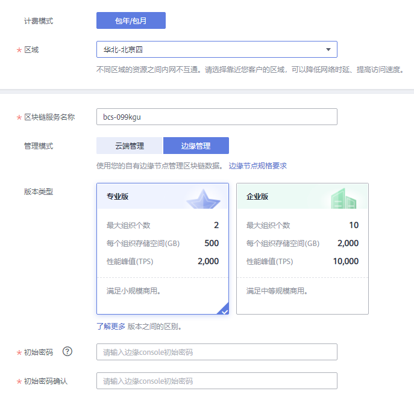

    **表 2**  基本信息配置

    
    <table><thead align="left"><tr id="zh-cn_topic_0000001105888388_row5250916183411"><th class="cellrowborder" valign="top" width="21.92%" id="mcps1.2.4.1.1">
参数

    </th>
    <th class="cellrowborder" valign="top" width="53.02%" id="mcps1.2.4.1.2">
描述

    </th>
    <th class="cellrowborder" valign="top" width="25.06%" id="mcps1.2.4.1.3">
示例

    </th>
    </tr>
    </thead>
    <tbody><tr id="zh-cn_topic_0000001105888388_row19250191616348"><td class="cellrowborder" valign="top" width="21.92%" headers="mcps1.2.4.1.1 ">
计费模式

    </td>
    <td class="cellrowborder" valign="top" width="53.02%" headers="mcps1.2.4.1.2 ">
区块链服务管理费收费模式，支持包年/包月。

    </td>
    <td class="cellrowborder" valign="top" width="25.06%" headers="mcps1.2.4.1.3 ">
包年/包月

    </td>
    </tr>
    <tr id="zh-cn_topic_0000001105888388_row525011611341"><td class="cellrowborder" valign="top" width="21.92%" headers="mcps1.2.4.1.1 ">
区域

    </td>
    <td class="cellrowborder" valign="top" width="53.02%" headers="mcps1.2.4.1.2 ">
区块链基础设施所在的区域，建议选择与业务应用系统相同的地域。

    </td>
    <td class="cellrowborder" valign="top" width="25.06%" headers="mcps1.2.4.1.3 ">
使用默认区域

    </td>
    </tr>
    <tr id="zh-cn_topic_0000001105888388_row14250141693410"><td class="cellrowborder" valign="top" width="21.92%" headers="mcps1.2.4.1.1 ">
区块链服务名称

    </td>
    <td class="cellrowborder" valign="top" width="53.02%" headers="mcps1.2.4.1.2 ">
支持英文字符、数字及中划线，不能以中划线开头，长度为4-24个字符。

    </td>
    <td class="cellrowborder" valign="top" width="25.06%" headers="mcps1.2.4.1.3 ">
bcs-hw

    </td>
    </tr>
    <tr id="row113967126537"><td class="cellrowborder" valign="top" width="21.92%" headers="mcps1.2.4.1.1 ">
管理模式

    </td>
    <td class="cellrowborder" valign="top" width="53.02%" headers="mcps1.2.4.1.2 ">
选择边缘管理：使用用户自有边缘节点管理区块链数据。

    </td>
    <td class="cellrowborder" valign="top" width="25.06%" headers="mcps1.2.4.1.3 ">
边缘管理

    </td>
    </tr>
    <tr id="zh-cn_topic_0000001105888388_row1225119161341"><td class="cellrowborder" valign="top" width="21.92%" headers="mcps1.2.4.1.1 ">
版本类型

    </td>
    <td class="cellrowborder" valign="top" width="53.02%" headers="mcps1.2.4.1.2 ">
BCS提供专业版、企业版供您选择。

    </td>
    <td class="cellrowborder" valign="top" width="25.06%" headers="mcps1.2.4.1.3 ">
专业版

    </td>
    </tr>
    <tr id="row32051213175515"><td class="cellrowborder" valign="top" width="21.92%" headers="mcps1.2.4.1.1 ">
初始密码

    </td>
    <td class="cellrowborder" valign="top" width="53.02%" headers="mcps1.2.4.1.2 ">
初始密码用于登录边缘侧console页面，请妥善保管。

    </td>
    <td class="cellrowborder" valign="top" width="25.06%" headers="mcps1.2.4.1.3 ">
-

    </td>
    </tr>
    <tr id="row3912201585515"><td class="cellrowborder" valign="top" width="21.92%" headers="mcps1.2.4.1.1 ">
初始密码确认

    </td>
    <td class="cellrowborder" valign="top" width="53.02%" headers="mcps1.2.4.1.2 ">
再次输入初始密码进行确认。

    </td>
    <td class="cellrowborder" valign="top" width="25.06%" headers="mcps1.2.4.1.3 ">
-

    </td>
    </tr>
    <tr id="zh-cn_topic_0000001105888388_row1025118168348"><td class="cellrowborder" valign="top" width="21.92%" headers="mcps1.2.4.1.1 ">
组织配置

    </td>
    <td class="cellrowborder" valign="top" width="53.02%" headers="mcps1.2.4.1.2 ">
支持增加组织成员数。

    
专业版支持最大成员组织数2个，企业版支持最大成员组织数10个。

    </td>
    <td class="cellrowborder" valign="top" width="25.06%" headers="mcps1.2.4.1.3 ">
-

    </td>
    </tr>
    <tr id="zh-cn_topic_0000001105888388_row925201614347"><td class="cellrowborder" valign="top" width="21.92%" headers="mcps1.2.4.1.1 ">
高级设置

    </td>
    <td class="cellrowborder" valign="top" width="53.02%" headers="mcps1.2.4.1.2 "><ul id="zh-cn_topic_0000001105888388_ul182511116173419"><li>共识策略：区块链网络中节点之间达成共识需要遵从的规则。默认为Raft(CFT)策略。</li><li>安全机制：保证数据安全的加密算法，默认为ECDSA；支持国密算法。</li></ul>
    </td>
    <td class="cellrowborder" valign="top" width="25.06%" headers="mcps1.2.4.1.3 ">
-

    </td>
    </tr>
    <tr id="zh-cn_topic_0000001105888388_row325231643412"><td class="cellrowborder" valign="top" width="21.92%" headers="mcps1.2.4.1.1 ">
购买时长

    </td>
    <td class="cellrowborder" valign="top" width="53.02%" headers="mcps1.2.4.1.2 ">
支持自定义购买服务的使用时间，最短1个月。

    
您可根据需要选择勾选自动续费，按月购买的自动续费周期为1个月，按年购买的自动续费周期为1年。

    </td>
    <td class="cellrowborder" valign="top" width="25.06%" headers="mcps1.2.4.1.3 ">
默认1个月

    </td>
    </tr>
    </tbody>
    </table>

3.  单击“立即创建”。
4.  确认配置信息无误后，勾选协议和免责声明，并单击“提交”。
5.  进入支付页面，确认订单费用无误后，单击“确认付款”，订单支付成功后，即可返回区块链服务控制台查看正在创建的服务。
6.  服务创建大概需要18-25分钟，请耐心等待。服务创建成功后，查看服务状态变为“正常”后，表示区块链服务部署完成。

## 注册边缘节点

部署服务完成后，请按照如下步骤注册边缘节点。

1.  在“华为链”页签，单击已创建成功的服务名称，进入服务详情页面。
2.  首次创建服务，在打开的注册边缘节点提示页面，单击“注册边缘节点”。

    **图 2**  注册边缘节点  
    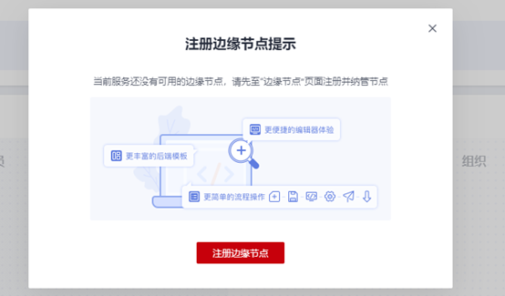

3.  在打开的页面，填写边缘节点名称和描述。

    **图 3**  填写边缘节点信息  
    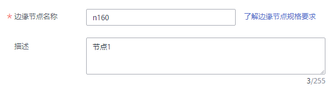

4.  单击“注册”。
5.  进入边缘节点配置页面，请按照页面提示操作：

    **图 4**  配置页面  
    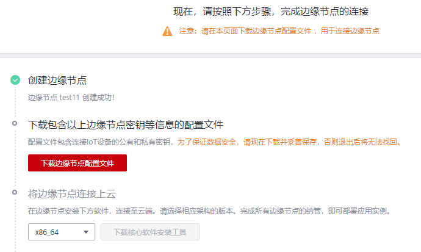

    1.  单击“下载边缘节点配置文件”。
    2.  单击“下载核心软件安装工具”。

        **图 5**  下载核心软件安装工具  
        

    3.  将前面[5.a](#li15992172710178)和[5.b](#li1866175315170)的配置文件和安装工具的压缩包同时上传到边缘节点同一个目录下。

        **图 6**  上传压缩包  
        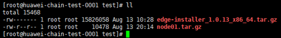

    4.  按照界面提示顺序复制命令并执行，以下截图仅供参考，请以实际操作的命令为准（命令行中的安装包名称与边缘节点名称一致）。

        **图 7**  安装信息  
        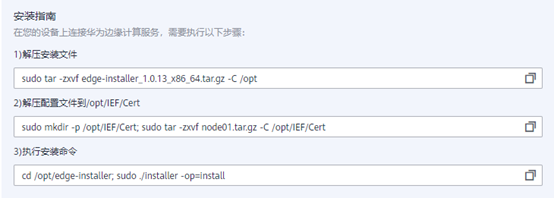

    5.  执行安装命令完成后，运行结果显示“install\_success”表示配置文件和工具安装成功。

        **图 8**  执行命令  
        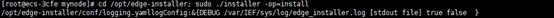

        **图 9**  安装成功  
        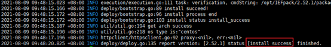

    6.  注册成功后，边缘节点页面显示一条“运行中”的节点记录。

        > **说明：** 
        >-   若节点状态显示“未纳管”，说明未进行边缘节点安装操作或安装过程中断，请重新按照[注册边缘节点](#section3398413926)的操作步骤完成安装。
        >-   若节点状态显示“故障”，请参考“边缘节点状态异常”进行排查。

        **图 10**  边缘节点记录  
        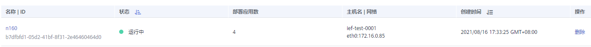

## 绑定边缘节点

边缘节点注册成功后，可以将组织和边缘节点进行绑定。

1.  在“华为链”页签，单击已创建成功的服务名称，进入服务详情页面。
2.  在左侧导航栏的“组织”页面，单击“绑定边缘节点”。
3.  在新打开的页面，选择组织和边缘节点。

    **图 11**  绑定边缘节点  
    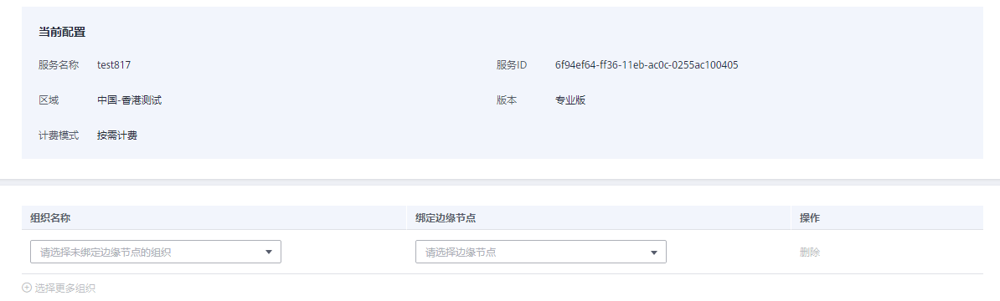

4.  单击“提交”。
5.  返回组织页面，组织状态显示正常表示绑定成功。

## 登录边缘Console

边缘节点绑定成功后，BCS服务默认将第一个绑定的边缘节点作为Console页面。登录边缘Console页面后浏览链信息、管理合约、下载配置文件。

1.  在“华为链”页签，单击已创建成功的服务名称，进入服务详情页面。
2.  单击左侧导航栏的“概览”。
3.  在“服务概览”页面下方，单击“边缘侧Console”。

    **图 12**  边缘侧Console  
    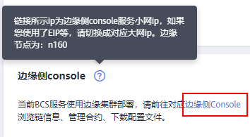

4.  将边缘节点内网IP更换为公网IP地址后，在打开的页面输入边缘console初始密码，用户名默认admin。

    > **说明：** 
    >用户名默认为admin，密码为您在部署区块链服务时设置的边缘console初始密码。为了保证系统安全，建议定期修改密码。

5.  登录成功后，进入区块链管理页面。详细操作请参考[管理区块链](管理区块链.md)。

