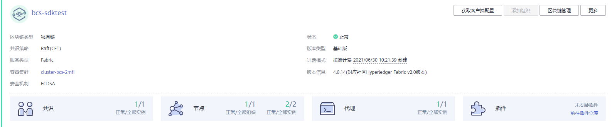
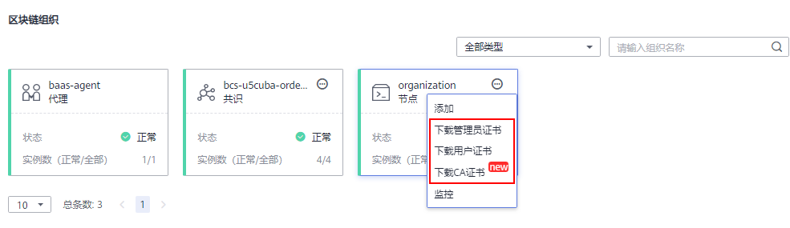

# 基本操作

提供Hyperledger Fabric增强版服务管理功能，可实时查看Hyperledger Fabric增强版服务运行状况，并对Hyperledger Fabric增强版服务做相应的操作。

## 操作步骤

1.  登录区块链服务管理控制台。
2.  单击左侧导航栏中的“服务管理”，可查看服务整体运行状况，具体参数说明请参见[表1](#table1319815314137)。

    

    **表 1**  参数说明

    
    <table><thead align="left"><tr id="row1195123101314"><th class="cellrowborder" valign="top" width="18.73%" id="mcps1.2.3.1.1">
参数

    </th>
    <th class="cellrowborder" valign="top" width="81.27%" id="mcps1.2.3.1.2">
说明

    </th>
    </tr>
    </thead>
    <tbody><tr id="row171966311137"><td class="cellrowborder" valign="top" width="18.73%" headers="mcps1.2.3.1.1 ">
区块链类型

    </td>
    <td class="cellrowborder" valign="top" width="81.27%" headers="mcps1.2.3.1.2 ">
区块链的类型，例如：联盟链、私有链。

    </td>
    </tr>
    <tr id="row71961331161318"><td class="cellrowborder" valign="top" width="18.73%" headers="mcps1.2.3.1.1 ">
版本类型

    </td>
    <td class="cellrowborder" valign="top" width="81.27%" headers="mcps1.2.3.1.2 ">
版本类型，包括基础版、专业版、企业版和铂金版。

    </td>
    </tr>
    <tr id="row5692142425319"><td class="cellrowborder" valign="top" width="18.73%" headers="mcps1.2.3.1.1 ">
服务类型

    </td>
    <td class="cellrowborder" valign="top" width="81.27%" headers="mcps1.2.3.1.2 ">
区块链的服务类型为Hyperledger Fabric增强版。

    </td>
    </tr>
    <tr id="row1919614317130"><td class="cellrowborder" valign="top" width="18.73%" headers="mcps1.2.3.1.1 ">
计费模式

    </td>
    <td class="cellrowborder" valign="top" width="81.27%" headers="mcps1.2.3.1.2 ">
计费模式，包括按需计费和包年/包月。

    <ul id="ul119673116131"><li>按需计费：会显示具体的创建时间。例如：按需计费 2020/08/10 20:30:21 创建。</li><li>包年/包月：会显示到期天数。例如：包年/包月 28天后到期。</li></ul>
    </td>
    </tr>
    <tr id="row7196831101310"><td class="cellrowborder" valign="top" width="18.73%" headers="mcps1.2.3.1.1 ">
共识策略

    </td>
    <td class="cellrowborder" valign="top" width="81.27%" headers="mcps1.2.3.1.2 ">
共识策略名称，例如：Raft(CFT)。

    
支持如下共识策略：

    <ul id="ul719603118132"><li>快速拜占庭容错共识算法(FBFT)：需要4-10个排序节点。在排序过程中最多可容忍 (N-1)/3 个错误节点存在（N为排序节点总）。支持v1.4.0和v2.2的Fabric内核。</li><li>Raft(CFT)：可保证部分排序节点出现非拜占庭故障时系统的正确运行，在排序过程中最多可容忍 (N-1)/2 个故障节点存在（N为排序节点总数）。支持v2.2的Fabric内核。</li></ul>
    </td>
    </tr>
    <tr id="row319713171315"><td class="cellrowborder" valign="top" width="18.73%" headers="mcps1.2.3.1.1 ">
状态

    </td>
    <td class="cellrowborder" valign="top" width="81.27%" headers="mcps1.2.3.1.2 ">
区块链服务状态。区块链服务状态包括：未知、正常、异常、创建中、升级中、添加中、弹性IP异常、删除中、已冻结、休眠中和集群已冻结。

    </td>
    </tr>
    <tr id="row31971031171317"><td class="cellrowborder" valign="top" width="18.73%" headers="mcps1.2.3.1.1 ">
创建时间

    </td>
    <td class="cellrowborder" valign="top" width="81.27%" headers="mcps1.2.3.1.2 ">
创建区块链服务的时间，例如：2020/08/10 20:30:21 GMT+08:00。

    </td>
    </tr>
    <tr id="row161971131111311"><td class="cellrowborder" valign="top" width="18.73%" headers="mcps1.2.3.1.1 ">
共识

    </td>
    <td class="cellrowborder" valign="top" width="81.27%" headers="mcps1.2.3.1.2 ">
共识信息，显示正常组织数量和全部组织数量。

    </td>
    </tr>
    <tr id="row3197163112139"><td class="cellrowborder" valign="top" width="18.73%" headers="mcps1.2.3.1.1 ">
节点

    </td>
    <td class="cellrowborder" valign="top" width="81.27%" headers="mcps1.2.3.1.2 ">
服务节点的信息，包括组织和实例的正常组织数量和全部组织数量。

    </td>
    </tr>
    <tr id="row21971731121314"><td class="cellrowborder" valign="top" width="18.73%" headers="mcps1.2.3.1.1 ">
代理

    </td>
    <td class="cellrowborder" valign="top" width="81.27%" headers="mcps1.2.3.1.2 ">
代理的信息，显示正常组织数量和全部组织数量。

    </td>
    </tr>
    <tr id="row19198231191317"><td class="cellrowborder" valign="top" width="18.73%" headers="mcps1.2.3.1.1 ">
插件

    </td>
    <td class="cellrowborder" valign="top" width="81.27%" headers="mcps1.2.3.1.2 ">
插件数量信息。例如：1/2表示全部实例2个，正常1个。

    </td>
    </tr>
    </tbody>
    </table>

3.  在区块链服务管理页面，您可以执行如[表2](#table19438062105251)下管理操作。

    **表 2**  操作列表

    
    <table><thead align="left"><tr id="row60765091105251"><th class="cellrowborder" valign="top" width="13.18%" id="mcps1.2.4.1.1">
类别

    </th>
    <th class="cellrowborder" valign="top" width="17.02%" id="mcps1.2.4.1.2">
操作项

    </th>
    <th class="cellrowborder" valign="top" width="69.8%" id="mcps1.2.4.1.3">
操作指导

    </th>
    </tr>
    </thead>
    <tbody><tr id="row168741638284"><td class="cellrowborder" valign="top" width="13.18%" headers="mcps1.2.4.1.1 ">
组织操作

    </td>
    <td class="cellrowborder" valign="top" width="17.02%" headers="mcps1.2.4.1.2 ">
添加组织

    </td>
    <td class="cellrowborder" valign="top" width="69.8%" headers="mcps1.2.4.1.3 "><ol id="ol197001141122219"><li>在服务卡片中，单击“添加组织”，输入“节点组织名称”、“节点数量”，并选择“网络存储”。</li><li>单击“提交”，完成组织的添加。</li></ol>
    
 说明： 
<ul id="ul596410812237"><li>基础版服务不支持添加组织。</li><li>在添加组织的过程，请勿对该服务进行其他操作，以免影响服务的正常运行。</li><li>添加组织将产生费用变化，包周期模式展示价格为添加组织后需支付的费用，按需模式展示价格为该服务变更后的每小时价格。</li><li>将该组织加入到已有通道后，请在实例化智能合约之前更新通道的背书策略，以免因证书校验失败导致实例化失败。</li><li>购买组织后，您需要支付的费用将发生变化，请关注界面上方的购买须知及界面下方的费用值。</li></ul>
    

    </td>
    </tr>
    <tr id="row13782154115"><td class="cellrowborder" rowspan="11" valign="top" width="13.18%" headers="mcps1.2.4.1.1 ">
服务操作

    </td>
    <td class="cellrowborder" valign="top" width="17.02%" headers="mcps1.2.4.1.2 ">
获取客户端配置

    </td>
    <td class="cellrowborder" valign="top" width="69.8%" headers="mcps1.2.4.1.3 ">
开发应用前您需要下载SDK配置和应用证书，用于访问区块链网络。单击“获取客户端配置”，您可以勾选需要下载的内容，包括SDK文件、共识节点证书和Peer节点证书，详情参见<a href="下载SDK配置和证书.md">下载SDK配置和证书</a>。

    </td>
    </tr>
    <tr id="row2715163915911"><td class="cellrowborder" valign="top" headers="mcps1.2.4.1.1 ">
区块链管理

    </td>
    <td class="cellrowborder" valign="top" headers="mcps1.2.4.1.2 ">
绑定弹性IP后才显示此操作。在服务卡片中，单击“区块链管理”可跳转至区块链服务管理界面，用户可以在此进行链代码查看、安装、实例化、更新、删除等操作。

    </td>
    </tr>
    <tr id="row47262356155953"><td class="cellrowborder" valign="top" headers="mcps1.2.4.1.1 ">
更新版本

    </td>
    <td class="cellrowborder" valign="top" headers="mcps1.2.4.1.2 ">
购买区块链后，如果区块链服务卡片中左上角显示“可升级”时，您可根据实际需求将区块链实例升级到最新版本。具体操作如下：

    <ol id="ol109296973210"><li>登录区块链服务控制台。</li><li>在左侧导航栏，单击“服务管理”。</li><li>在服务卡片中，单击“更多 &gt; 更新版本”。</li><li>在弹出的窗口，可以查看当前服务版本，或者选择最新版本，升级区块链服务版本。</li></ol>
    
 说明： 
<ul id="ul11326153810437"><li>更新版本期间会导致服务不可用，如果是联盟链还会影响到其他联盟参与方，请和联盟其他参与方达成共识后再操作，联盟所有成员都需要升级。</li><li>请不要在链码安装或实例化时进行升级操作。</li><li>支持社区Hyperledger Fabric 1.4到社区Hyperledger Fabric 2.2的跨大版本升级。如果是联盟链，请确保所有联盟成员组件也升级到此版本，否则无法正常交易。<ul id="ul132881626467"><li>BCS版本3.x.x对应社区Hyperledger Fabric 1.4.0版本。</li><li>BCS版本4.x.x对应社区Hyperledger Fabric 2.2版本。</li></ul>
    </li><li>更新版本只支持低版本到高版本的更新，更新成功后不支持版本回滚，更新失败时才允许执行版本回滚操作。</li></ul>
    

    </td>
    </tr>
    <tr id="row7917943132712"><td class="cellrowborder" valign="top" headers="mcps1.2.4.1.1 ">
版本回滚

    </td>
    <td class="cellrowborder" valign="top" headers="mcps1.2.4.1.2 ">
更新版本失败后，可以执行版本回滚。具体操作如下：

    <ol id="ol19152134562710"><li>登录区块链控制台。</li><li>在左侧导航栏，单击“服务管理”。</li><li>在服务卡片中，单击“更多 &gt; 版本回滚”。</li><li>版本回滚执行过程中，服务状态显示为“升级中”。待版本回滚完成，服务状态显示为“正常”。</li></ol>
    
 说明： 

版本回滚失败后，可继续执行回滚操作；若回滚成功则不再支持版本回滚，此时可继续执行更新版本操作。

    

    </td>
    </tr>
    <tr id="row158801014125515"><td class="cellrowborder" valign="top" headers="mcps1.2.4.1.1 ">
变更规格

    </td>
    <td class="cellrowborder" valign="top" headers="mcps1.2.4.1.2 ">
区块链服务提供四种规格版本供您选择，若您在部署期选择的版本不能满足您的业务需求，您可单击服务卡片中的“更多 &gt; 变更规格”进行变更，例如：由企业版变更为铂金版。

    
 说明： 

目前仅包周期企业版才支持此功能。

    

    </td>
    </tr>
    <tr id="row14594717173814"><td class="cellrowborder" valign="top" headers="mcps1.2.4.1.1 ">
重置管理密码

    </td>
    <td class="cellrowborder" valign="top" headers="mcps1.2.4.1.2 ">
在服务卡片中，单击“更多 &gt; 重置管理密码”，重置管理密码会将区块链管理和可信计算平台密码同时重置，若不想同时重置，可分别到区块链管理或可信计算平台页面单独修改密码。

    </td>
    </tr>
    <tr id="row18111133820478"><td class="cellrowborder" valign="top" headers="mcps1.2.4.1.1 ">
更新访问地址

    </td>
    <td class="cellrowborder" valign="top" headers="mcps1.2.4.1.2 ">
在服务卡片中，单击“更多 &gt; 更新访问地址”，更新地址后单击“更新”。

    </td>
    </tr>
    <tr id="row7953124014469"><td class="cellrowborder" valign="top" headers="mcps1.2.4.1.1 ">
休眠服务

    </td>
    <td class="cellrowborder" valign="top" headers="mcps1.2.4.1.2 ">
在服务卡片中，单击“更多 &gt; 休眠”，单击“确定”。

    
 说明： 
<ul id="ul157611546405"><li>按需计费的服务支持休眠，包月/包年的不支持休眠。</li><li>服务状态为“正常”的服务才能休眠。</li><li>休眠后停收该服务的管理费，直至唤醒。</li></ul>
    

    </td>
    </tr>
    <tr id="row69585275550"><td class="cellrowborder" valign="top" headers="mcps1.2.4.1.1 ">
唤醒服务

    </td>
    <td class="cellrowborder" valign="top" headers="mcps1.2.4.1.2 ">
在服务卡片中，单击服务列表操作列中的“更多 &gt; 唤醒”，单击“确定”。

    
 说明： 
<ul id="ul112138504010"><li>按需计费的服务支持唤醒，包月/包年的不支持唤醒。</li><li>服务状态为“休眠”的服务才能唤醒。</li><li>唤醒后将继续收取该服务的管理费。</li></ul>
    

    </td>
    </tr>
    <tr id="row69400421613"><td class="cellrowborder" valign="top" headers="mcps1.2.4.1.1 ">
转包周期

    </td>
    <td class="cellrowborder" valign="top" headers="mcps1.2.4.1.2 ">
在服务卡片中，单击“更多 &gt; 转包周期”。

    
修改计费模式，如果您在购买区块链服务时，计费模式选择了“按需计费”，服务购买完成后可以通过此功能将计费模式修改为包年/包月。

    
 说明： 

此功能升级中，暂不支持按需转包周期。

    

    </td>
    </tr>
    <tr id="row52283780105251"><td class="cellrowborder" valign="top" headers="mcps1.2.4.1.1 ">
删除/退订

    </td>
    <td class="cellrowborder" valign="top" headers="mcps1.2.4.1.2 ">
在服务卡片中，单击“更多 &gt; 删除/退订”。

    <ul id="ul495763433213"><li>删除：若您的服务为按需计费，则单击服务列表操作列中的“更多 &gt; 删除”。</li><li>退订：若您的服务为包周期计费，则单击服务列表操作列中的“更多 &gt; 退订”。退订申请审核通过后将会退回部分费用。</li></ul>
    </td>
    </tr>
    <tr id="row20699132533713"><td class="cellrowborder" valign="top" width="13.18%" headers="mcps1.2.4.1.1 ">
其他操作

    </td>
    <td class="cellrowborder" valign="top" width="17.02%" headers="mcps1.2.4.1.2 ">
查看失败记录

    </td>
    <td class="cellrowborder" valign="top" width="69.8%" headers="mcps1.2.4.1.3 ">
在服务管理页面的左上角，显示失败记录数目，您也可以单击失败记录后的，查看失败记录，单击右侧的“操作详情”，可以查看区块链服务的操作详情。

    
 说明： 

创建失败的服务费用会在0.5~1h之内原路返回至账户。

    

    </td>
    </tr>
    </tbody>
    </table>

4.  单击服务名称，查看服务详情。
    -   查看服务概览

        单击“概览”页签，查看服务详情、区块链组织信息、CPU使用率、物理内存使用率和插件等信息。

    -   查看监控

        单击“监控“页签，查看服务监控和实例监控的详细信息。

    -   查看日志

        单击“日志“页签，查看服务的日志信息。

        查看监控和日志的具体操作，请参见[查看监控指标和日志信息](查看监控指标和日志信息.md)。

    -   下载证书

        在“概览”页签中的区块链组织中，单击，下载对应的证书。

        

        > **说明：** 
        >目前Hyperledger Fabric增强版已提供一键获取区块链客户端配置的能力，您也可以通过服务卡片上的“获取客户端配置”按钮下载SDK文件、共识节点证书和Peer节点证书，具体方法参见[下载SDK配置和证书](下载SDK配置和证书.md)。

    -   添加节点

        在“概览”页签中的区块链组织中，单击，单击“添加”，输入添加的节点数量，确认变更后规格单击“提交”。

        > **说明：** 
        >-   在Peer节点添加过程中请勿对该服务进行其他操作，以免影响服务的正常运行。
        >-   添加操作将产生费用变化，包周期模式展示价格为变更前后需补交的差价，按需模式展示价格为该服务变更后的每小时价格。
        >-   专业版和企业版每个组织最多允许2个Peer，铂金版每个组织最多允许5个Peer。超过后无法添加。

