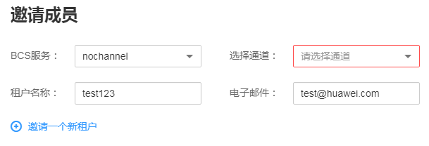

# 成员管理

您可以通过邀请成员加入某个通道组建联盟链系统。私有链不可以进行成员邀请。

## 邀请成员

1.  登录区块链服务管理控制台。
2.  在页面左侧选择“成员管理”。单击页面右上角“邀请成员”。

    

3.  在邀请成员页面，选择邀请方的BCS服务、通道，填写被邀请方的租户名称及（可选）电子邮件。

    

4.  （可选）单击可添加多个成员进行邀请。
5.  单击确定，邀请通知信息将发送至被邀请方。若填写了电子邮件，则邮箱会收到相关通知信息。

    > **说明：**   
    >被邀请方不可邀请其他租户，即只有创建服务的租户才能邀请其他租户。  

