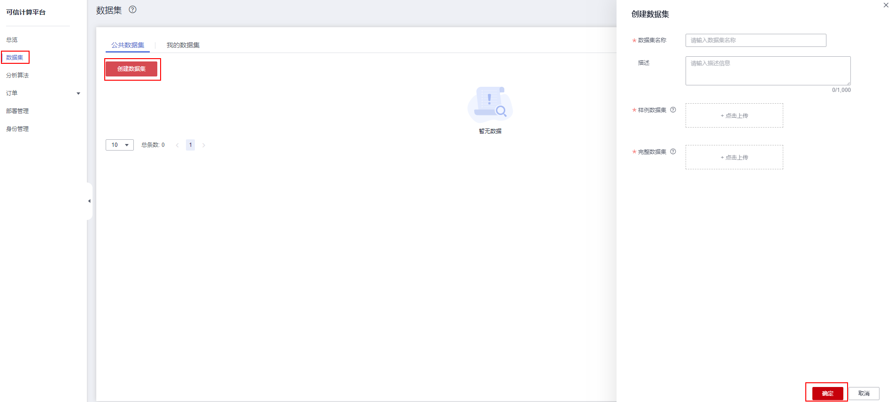

# 数据集管理

数据集发布者可以上传数据集到服务端。数据集加密后会发布在区块链上，以便需要此数据集的客户获取。数据集申请者可以申请已发布的公共数据集。

数据集管理为您提供界面化数据集管理功能，包括创建数据集、申请公共数据集等，方便您对数据集进行相关管理操作。

1.  登录可信计算平台页面。单击左侧导航栏中的“数据集”。
2.  单击“公共数据集”页面中的“创建数据集”。
3.  在创建数据集界面输入“数据集名称”及“数据集描述”，上传“样例数据集”及“完整数据集”等，如下图：

    **图 1**  创建数据集  
    

4.  单击“确定”，完成数据集创建。
5.  单击“公共数据集”，申请公共数据集。
    -   已创建的数据集右侧单击“申请”\>“确定”，完成申请。
    -   已创建的数据集右侧单击“下载样本”，可将数据集样本下载到本地。

6.  单击“我的数据集”，获取数据集。
    -   可查看“我发布的”的数据集，在数据集右侧进行“下载样本”及“删除”操作。
    -   可查看“我申请的”的数据集，在数据集右侧进行“下载样本”操作。

