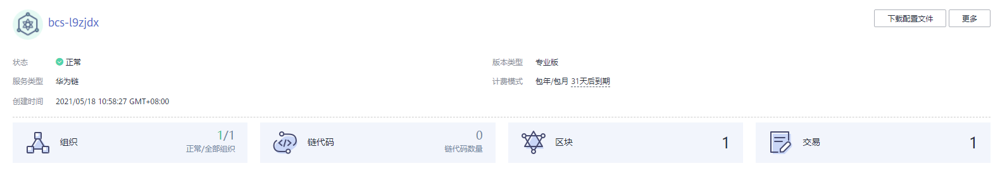

# 服务管理

提供华为服务管理功能，可实时查看华为链服务运行状况，并对区块链服务做相应的操作。

## 操作步骤

1.  登录区块链服务管理控制台。
2.  单击左侧导航栏中的“服务管理”，选择华为链页签，可查看服务整体运行状况，具体参数说明请参见[表1](#zh-cn_topic_0000001105728556_table1319815314137)。

    

    **表 1**  参数说明

    
    <table><thead align="left"><tr id="zh-cn_topic_0000001105728556_row1195123101314"><th class="cellrowborder" valign="top" width="18.73%" id="mcps1.2.3.1.1">
参数

    </th>
    <th class="cellrowborder" valign="top" width="81.27%" id="mcps1.2.3.1.2">
说明

    </th>
    </tr>
    </thead>
    <tbody><tr id="zh-cn_topic_0000001105728556_row171966311137"><td class="cellrowborder" valign="top" width="18.73%" headers="mcps1.2.3.1.1 ">
状态

    </td>
    <td class="cellrowborder" valign="top" width="81.27%" headers="mcps1.2.3.1.2 ">
区块链服务状态。区块链服务状态包括：正常、不可用、创建中、扩容中、缩容中、删除中、升级中、变更中、故障、冻结中、已冻结、解冻中、已休眠、唤醒中、休眠中、安装中。

    </td>
    </tr>
    <tr id="zh-cn_topic_0000001105728556_row141749331595"><td class="cellrowborder" valign="top" width="18.73%" headers="mcps1.2.3.1.1 ">
服务类型

    </td>
    <td class="cellrowborder" valign="top" width="81.27%" headers="mcps1.2.3.1.2 ">
华为链

    </td>
    </tr>
    <tr id="zh-cn_topic_0000001105728556_row1919614317130"><td class="cellrowborder" valign="top" width="18.73%" headers="mcps1.2.3.1.1 ">
版本类型

    </td>
    <td class="cellrowborder" valign="top" width="81.27%" headers="mcps1.2.3.1.2 ">
版本类型：专业版、企业版或铂金版。

    </td>
    </tr>
    <tr id="zh-cn_topic_0000001105728556_row7196831101310"><td class="cellrowborder" valign="top" width="18.73%" headers="mcps1.2.3.1.1 ">
计费模式

    </td>
    <td class="cellrowborder" valign="top" width="81.27%" headers="mcps1.2.3.1.2 ">
计费模式：包年/包月，同时显示该服务使用期限

    </td>
    </tr>
    <tr id="zh-cn_topic_0000001105728556_row160091612124"><td class="cellrowborder" valign="top" width="18.73%" headers="mcps1.2.3.1.1 ">
创建时间

    </td>
    <td class="cellrowborder" valign="top" width="81.27%" headers="mcps1.2.3.1.2 ">
创建区块链服务的时间，例如：2021/05/18 10:58:27 GMT+08:00

    </td>
    </tr>
    <tr id="zh-cn_topic_0000001105728556_row319713171315"><td class="cellrowborder" valign="top" width="18.73%" headers="mcps1.2.3.1.1 ">
组织

    </td>
    <td class="cellrowborder" valign="top" width="81.27%" headers="mcps1.2.3.1.2 ">
已增加组织的数量

    </td>
    </tr>
    <tr id="zh-cn_topic_0000001105728556_row31971031171317"><td class="cellrowborder" valign="top" width="18.73%" headers="mcps1.2.3.1.1 ">
链代码

    </td>
    <td class="cellrowborder" valign="top" width="81.27%" headers="mcps1.2.3.1.2 ">
链代码数量

    </td>
    </tr>
    <tr id="zh-cn_topic_0000001105728556_row161971131111311"><td class="cellrowborder" valign="top" width="18.73%" headers="mcps1.2.3.1.1 ">
区块

    </td>
    <td class="cellrowborder" valign="top" width="81.27%" headers="mcps1.2.3.1.2 ">
区块数量

    </td>
    </tr>
    <tr id="zh-cn_topic_0000001105728556_row3197163112139"><td class="cellrowborder" valign="top" width="18.73%" headers="mcps1.2.3.1.1 ">
交易

    </td>
    <td class="cellrowborder" valign="top" width="81.27%" headers="mcps1.2.3.1.2 ">
交易数量

    </td>
    </tr>
    </tbody>
    </table>

3.  在华为链服务管理页面，基于华为云资源创建的服务，您可以执行如[表2](#zh-cn_topic_0000001105728556_table19438062105251)下管理操作。

    **表 2**  操作列表

    
    <table><thead align="left"><tr id="zh-cn_topic_0000001105728556_row60765091105251"><th class="cellrowborder" valign="top" width="19.6%" id="mcps1.2.3.1.1">
操作项

    </th>
    <th class="cellrowborder" valign="top" width="80.4%" id="mcps1.2.3.1.2">
操作指导

    </th>
    </tr>
    </thead>
    <tbody><tr id="zh-cn_topic_0000001105728556_row47262356155953"><td class="cellrowborder" valign="top" width="19.6%" headers="mcps1.2.3.1.1 ">
下载配置文件

    </td>
    <td class="cellrowborder" valign="top" width="80.4%" headers="mcps1.2.3.1.2 ">
在服务卡片中，单击“下载配置文件”，在“下载配置文件”页面填写相关参数，单击“下载”。

    </td>
    </tr>
    <tr id="row76979161979"><td class="cellrowborder" valign="top" width="19.6%" headers="mcps1.2.3.1.1 ">
添加组织

    </td>
    <td class="cellrowborder" valign="top" width="80.4%" headers="mcps1.2.3.1.2 "><ol id="ol19390144751518"><li>在服务卡片中，单击“添加组织”，在新打开的页面输入组织名称。</li><li>单击“立即添加”。</li><li>确认组织信息无误后，勾选协议和免责声明，并单击“提交”。</li><li>进入支付页面，确认订单费用无误后，单击“确认付款”，订单支付成功后，即可返回区块链服务控制台查看已添加成功的组织。</li></ol>
    
 说明： 
<ul id="ul19051545122211"><li>在添加组织过程中请勿对该服务进行其他操作，以免影响服务的正常运行。</li><li>添加组织将产生费用变化，包周期模式展示价格为添加组织后需支付的费用。</li></ul>
    

    </td>
    </tr>
    <tr id="zh-cn_topic_0000001105728556_row137921115164517"><td class="cellrowborder" valign="top" width="19.6%" headers="mcps1.2.3.1.1 ">
退订

    </td>
    <td class="cellrowborder" valign="top" width="80.4%" headers="mcps1.2.3.1.2 ">
在服务卡片中，单击“更多 &gt; 退订”。退订申请审核通过后将会退回部分费用。

    </td>
    </tr>
    </tbody>
    </table>

4.  在华为链服务管理页面，基于边缘集群创建的服务，您可以执行如[表3](#table16766740183516)下管理操作。

    **表 3**  操作列表

    
    <table><thead align="left"><tr id="row1767174053510"><th class="cellrowborder" valign="top" width="19.6%" id="mcps1.2.3.1.1">
操作项

    </th>
    <th class="cellrowborder" valign="top" width="80.4%" id="mcps1.2.3.1.2">
操作指导

    </th>
    </tr>
    </thead>
    <tbody><tr id="row197675408353"><td class="cellrowborder" valign="top" width="19.6%" headers="mcps1.2.3.1.1 ">
下载配置文件

    </td>
    <td class="cellrowborder" valign="top" width="80.4%" headers="mcps1.2.3.1.2 ">
在服务卡片中，单击“下载配置文件”，在“下载配置文件”页面填写相关参数，单击“下载”。

    </td>
    </tr>
    <tr id="row3768144018353"><td class="cellrowborder" valign="top" width="19.6%" headers="mcps1.2.3.1.1 ">
添加组织

    </td>
    <td class="cellrowborder" valign="top" width="80.4%" headers="mcps1.2.3.1.2 "><ol id="ol276844083514"><li>在服务卡片中，单击“添加组织”，在新打开的页面输入组织名称，绑定边缘节点。</li><li>单击“立即添加”。</li><li>确认组织信息无误后，勾选协议和免责声明，并单击“提交”。</li><li>进入支付页面，确认订单费用无误后，单击“确认付款”，订单支付成功后，即可返回区块链服务控制台查看已添加成功的组织。</li></ol>
    
 说明： 
<ul id="ul576810406358"><li>在添加组织过程中请勿对该服务进行其他操作，以免影响服务的正常运行。</li><li>添加组织将产生费用变化，包周期模式展示价格为添加组织后需支付的费用。</li><li>添加组织前确定已注册边缘节点。</li></ul>
    

    </td>
    </tr>
    <tr id="row19768204033514"><td class="cellrowborder" valign="top" width="19.6%" headers="mcps1.2.3.1.1 ">
退订

    </td>
    <td class="cellrowborder" valign="top" width="80.4%" headers="mcps1.2.3.1.2 ">
在服务卡片中，单击“更多 &gt; 退订”。退订申请审核通过后将会退回部分费用。

    </td>
    </tr>
    </tbody>
    </table>

5.  单击服务名称，进入服务详情页面，参考[表4](#table1357816915373)进行如下操作。

    **表 4**  操作说明

    
    <table><thead align="left"><tr id="row457809123712"><th class="cellrowborder" valign="top" width="20.82208220822082%" id="mcps1.2.4.1.1">
类型

    </th>
    <th class="cellrowborder" valign="top" width="14.74147414741474%" id="mcps1.2.4.1.2">
操作

    </th>
    <th class="cellrowborder" valign="top" width="64.43644364436445%" id="mcps1.2.4.1.3">
说明

    </th>
    </tr>
    </thead>
    <tbody><tr id="row205781698371"><td class="cellrowborder" rowspan="4" valign="top" width="20.82208220822082%" headers="mcps1.2.4.1.1 ">
基于华为云资源部署的服务

    </td>
    <td class="cellrowborder" valign="top" width="14.74147414741474%" headers="mcps1.2.4.1.2 ">
概览

    </td>
    <td class="cellrowborder" valign="top" width="64.43644364436445%" headers="mcps1.2.4.1.3 ">
在左侧导航栏“概览”页面，查看服务详情、网络分布、区块链状态等信息。

    </td>
    </tr>
    <tr id="row257815916372"><td class="cellrowborder" valign="top" headers="mcps1.2.4.1.1 ">
组织

    </td>
    <td class="cellrowborder" valign="top" headers="mcps1.2.4.1.2 "><ol id="ol113531322154112"><li>在左侧导航栏“组织”页面，查看已添加组织的状态、已用/可用存储量 (GB)、计费模式等信息。</li><li>或者单击右上角的“添加组织”。</li><li>添加成功后，若需要删除组织，单击操作列的“退订”。</li></ol>
    </td>
    </tr>
    <tr id="row205795916374"><td class="cellrowborder" valign="top" headers="mcps1.2.4.1.1 ">
区块浏览器

    </td>
    <td class="cellrowborder" valign="top" headers="mcps1.2.4.1.2 ">
在左侧导航栏“区块浏览器”页面，查看区块列表和交易列表等详细信息。

    </td>
    </tr>
    <tr id="row11579793375"><td class="cellrowborder" valign="top" headers="mcps1.2.4.1.1 ">
链代码管理

    </td>
    <td class="cellrowborder" valign="top" headers="mcps1.2.4.1.2 ">
在左侧导航栏“链代码管理”页面，查看已安装的链代码详细信息。

    </td>
    </tr>
    <tr id="row15796916373"><td class="cellrowborder" rowspan="5" valign="top" width="20.82208220822082%" headers="mcps1.2.4.1.1 ">
基于边缘集群部署的服务

    </td>
    <td class="cellrowborder" valign="top" width="14.74147414741474%" headers="mcps1.2.4.1.2 ">
概览

    </td>
    <td class="cellrowborder" valign="top" width="64.43644364436445%" headers="mcps1.2.4.1.3 ">
在左侧导航栏“概览”页面，查看服务详情、网络分布、区块链状态等信息。

    </td>
    </tr>
    <tr id="row1924728174014"><td class="cellrowborder" valign="top" headers="mcps1.2.4.1.1 ">
添加组织

    </td>
    <td class="cellrowborder" valign="top" headers="mcps1.2.4.1.2 "><ol id="ol169451547154212"><li>在左侧导航栏“组织”页面，查看已添加组织的状态、已用/可用存储量 (GB)、计费模式等信息。</li><li>单击右上角的“添加组织”，输入组织名称和绑定边缘节点。</li><li>添加成功后，若需要删除组织，单击操作列的“退订”。</li></ol>
    </td>
    </tr>
    <tr id="row61661364564"><td class="cellrowborder" valign="top" headers="mcps1.2.4.1.1 ">
退订组织

    </td>
    <td class="cellrowborder" valign="top" headers="mcps1.2.4.1.2 ">
在左侧导航栏“组织”页面，单击操作列的“退订”。

    
 说明： 

退订失败时，有可能该组织绑定的边缘节点被绑定过或者绑定失败，因此退订组织时请先将先删除该边缘节点目录“/var/paas/evs/baas”除database之外的内容。

    
退订失败时，有可能该组织绑定的边缘节点部署过华为链服务或者部署失败，因此退订组织时请先删除边缘节点“/var/paas/evs/baas”目录下除database之外的内容。

    

    </td>
    </tr>
    <tr id="row5353438489"><td class="cellrowborder" valign="top" headers="mcps1.2.4.1.1 ">
绑定边缘节点

    </td>
    <td class="cellrowborder" valign="top" headers="mcps1.2.4.1.2 "><ol id="ol14349956174818"><li>在左侧导航栏“组织”页面，单击右上角的“绑定边缘节点”。</li><li>选择组织和对应边缘节点信息。</li><li>单击“提交”。</li><li>返回组织页面，组织状态显示正常表示绑定成功。
 说明： 
<ul id="ul187584135312"><li>1个边缘节点只能绑定1个组织，1个组织可以绑定1个或2个边缘节点。</li><li>绑定失败时，有可能该边缘节点部署过华为链服务或者部署失败，因此绑定时请先将边缘节点“/var/paas/evs/baas”目录内容清空。</li></ul>
    

    </li></ol>
    </td>
    </tr>
    <tr id="row98931014124016"><td class="cellrowborder" valign="top" headers="mcps1.2.4.1.1 ">
边缘节点

    </td>
    <td class="cellrowborder" valign="top" headers="mcps1.2.4.1.2 "><ol id="ol18463154854415"><li>在左侧导航栏“边缘节点”页面，查看已注册节点的状态、主机名/网络等信息。</li><li>单击右上角的“注册边缘节点”完成节点注册。</li><li>注册成功后，若需要删除节点，单击操作列的“删除”。
 说明： 

删除节点时，请确保此边缘节点对应组织上的全部应用已经卸载完毕。

    

    </li></ol>
    </td>
    </tr>
    </tbody>
    </table>

