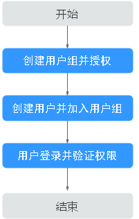

# 权限管理

如果您需要对您所拥有的BCS进行精细的权限管理，您可以使用[统一身份认证服务](https://support.huaweicloud.com/usermanual-iam/iam_01_0001.html)（Identity and Access Management，简称IAM），通过IAM，您可以：

-   根据企业的业务组织，在您的华为云帐号中，给企业中不同职能部门的员工创建IAM用户，让员工拥有唯一安全凭证，并使用BCS资源。
-   根据企业用户的职能，设置不同的访问权限，以达到用户之间的权限隔离。
-   将BCS资源委托给更专业、高效的其他华为云帐号或者云服务，这些账号或者云服务可以根据权限进行代运维。

如果华为云帐号已经能满足您的要求，不需要创建独立的IAM用户，您可以跳过本章节，不影响您使用BCS服务的其它功能。

本章节为您介绍对用户授权的方法，操作流程如[图1](#fig1351611812271)所示。

## 前提条件

给用户组授权之前，请您了解用户组可以添加的BCS权限，并结合实际需求进行选择，BCS支持的系统权限，请参见：[BCS系统权限](https://support.huaweicloud.com/productdesc-bcs/bcs_productdesc_0015.html)。若您需要BCS对除之外的其它服务授权，IAM支持服务的所有权限请参见[权限策略](https://support.huaweicloud.com/usermanual-permissions/iam_01_0001.html)。

## 示例流程

**图 1**  给用户授予BCS权限流程  

1.  [创建用户组并授权](https://support.huaweicloud.com/usermanual-iam/iam_03_0001.html)

    在IAM控制台创建用户组，并授予区块链服务的操作权限“BCS Administrator”。

    > **说明：** 
    >如果选择“BCS Administrator”，由于该权限有依赖，除了勾选BCS Administrator外，还需要同时勾选依赖的角色和策略：CCE Administrator、SWR Administrator、VPC Administrator、SFS Administrator、BSS Administrator、ECS FullAccess、AOM Administrator、APM Administrator、DMS Administrator、IEF Administrator才能生效。
    >ECS FullAccess为策略，其余都为角色。

2.  [创建用户并加入用户组](https://support.huaweicloud.com/usermanual-iam/iam_02_0001.html)

    在IAM控制台创建用户，并将其加入[1](#li10176121316284)中创建的用户组。

3.  [用户登录](https://support.huaweicloud.com/usermanual-iam/iam_01_0552.html)并验证权限

    新创建的用户登录控制台，验证区块链服务的操作权限。

