# 查看告警信息

BCS服务自身提供运维监控能力，运维人员可以通过BCS查看告警信息。告警源包括BCS和CCE，常见告警参见[表1](#zh-cn_topic_0278784994_table17580191315157)。

> **说明：** 
>建议根据下表做初步筛查，如仍无法消除告警，请联系技术支持人员。
>对于告警源为CCE的告警，若BCS服务相关实例状态正常，且业务正常，则请参考[CCE 常见问题](https://support.huaweicloud.com/zh-cn/cce_faq/cce_faq_00006.html)进行排查。

**表 1**  BCS服务常见告警

<table><thead align="left"><tr id="zh-cn_topic_0278784994_row10580413151513"><th class="cellrowborder" valign="top" width="19.869999999999997%" id="mcps1.2.4.1.1">
告警名称

</th>
<th class="cellrowborder" valign="top" width="8.469999999999999%" id="mcps1.2.4.1.2">
告警源

</th>
<th class="cellrowborder" valign="top" width="71.66%" id="mcps1.2.4.1.3">
处理建议

</th>
</tr>
</thead>
<tbody><tr id="zh-cn_topic_0278784994_row10580213191511"><td class="cellrowborder" valign="top" width="19.869999999999997%" headers="mcps1.2.4.1.1 ">
节点连接排序节点失败

</td>
<td class="cellrowborder" valign="top" width="8.469999999999999%" headers="mcps1.2.4.1.2 ">
BCS

</td>
<td class="cellrowborder" valign="top" width="71.66%" headers="mcps1.2.4.1.3 ">
节点连接排序节点失败，可能原因有：

<ul id="ul197233864517"><li>短暂的网络波动导致peer节点与orderer节点通信失败。</li><li>Orderer节点本身状态异常。</li></ul>

如果是由于短暂的网络波动，那么该告警会在几分钟内自动停止并自动清除。

如果该告警持续存在，未能在若干分钟后清除，那么可能节点与排序节点的连接已经断开，此时请根据以下步骤进行排查：

<ol id="ol216118524613"><li>登录区块链服务管理控制台，在左侧导航栏单击“服务管理”，单击服务名称进入服务详情页。</li><li>在“监控”页签下的活动告警中，从“资源名称”中获取containerName的值。
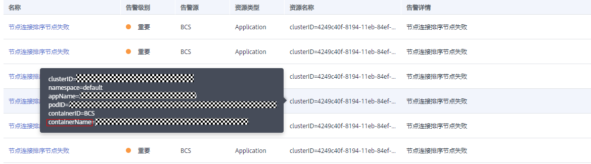

</li><li>登录服务所在CCE集群下的所有节点（节点需绑定弹性IP），执行<strong id="b857118314710">docker ps |grep </strong><em id="i235031917145">containerName</em>命令（如下图所示），查询到的前缀为k8s_peer（如果查询的是orderer则是k8s_orderer）的容器即为触发告警的容器，最前方为对应的容器ID。
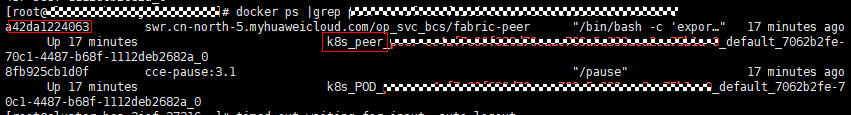

 说明： 

登录服务所在CCE集群下节点的方法可参考<a href="查看运维日志.md#section127554933219">后台虚拟机查看运维日志（CCE集群）</a>。

</li><li>查看容器是否正常。</li><li>若orderer节点异常，可以尝试使用<strong id="b1867244019145">docker restart </strong><em id="i1234274121410">容器ID</em>命令重启节点。</li><li>如果上述步骤没能帮助您解决该问题，请进入AOM页面下的“日志 &gt; 日志文件”页签，下载发出告警的服务集群上的Peer和Orderer日志文件到本地，联系并提供给运维人员进行处理。</li></ol>
</td>
</tr>
<tr id="zh-cn_topic_0278784994_row10580151316156"><td class="cellrowborder" valign="top" width="19.869999999999997%" headers="mcps1.2.4.1.1 ">
节点访问数据库失败

</td>
<td class="cellrowborder" valign="top" width="8.469999999999999%" headers="mcps1.2.4.1.2 ">
BCS

</td>
<td class="cellrowborder" valign="top" width="71.66%" headers="mcps1.2.4.1.3 ">
节点在访问状态数据库文件时产生异常，可能原因有：

<ul id="ul1938413912515"><li>状态数据库文件损坏或丢失。</li><li>状态数据库挂载的存储服务被删除。</li></ul>

处理方法如下：

<ol id="ol1462121025213"><li>登录区块链服务管理控制台，在左侧导航栏单击“服务管理”，单击服务名称进入服务详情页。</li><li>先单击容器集群进入云容器引擎控制台，在“资源管理 &gt; 存储管理”页面下查看BCS服务对应集群下绑定的peer的存储服务是否存在且正常。<ul id="ul14959133714158"><li>若存储服务不存在或不正常，请创建新的存储服务并重新绑定到BCS服务；</li><li>若存储服务存在且正常，请根据下面的步骤处理。</li></ul>
</li><li>在“监控”页签下的活动告警中，从“资源名称”中获取containerName的值。

</li><li>单击告警条目，根据告警信息定位发出告警的集群信息（clusterID），以及告警的容器名称（containerName）。</li><li>进入相应的云容器引擎的“资源管理 &gt; 存储管理”页面，根据集群信息筛选查看服务相对应的数据库存储服务是否存在。
若不存在，请根据CCE存储管理的存储卷创建方法，创建相应的存储卷并进行关联。

</li><li>登录服务所在CCE集群下的所有节点（节点需绑定弹性IP），执行<strong id="b191457409527">docker ps |grep </strong><em id="i453923815167">containerName</em>命令（如下图所示），查询到的前缀为k8s_peer（如果查询的是orderer则是k8s_orderer）的容器即为触发告警的容器，最前方为对应的容器ID。

 说明： 

登录服务所在CCE集群下节点的方法可参考<a href="查看运维日志.md#section127554933219">后台虚拟机查看运维日志（CCE集群）</a>。

</li><li>使用<strong id="b89544135320">docker exec -it </strong><em id="i043017417537">容器ID</em><strong id="b2951141175312"> bash</strong>进入相应的容器。</li><li>使用<strong id="b2050518515136">find / -name production</strong>命令，进入查找到的路径（路径如下图）。
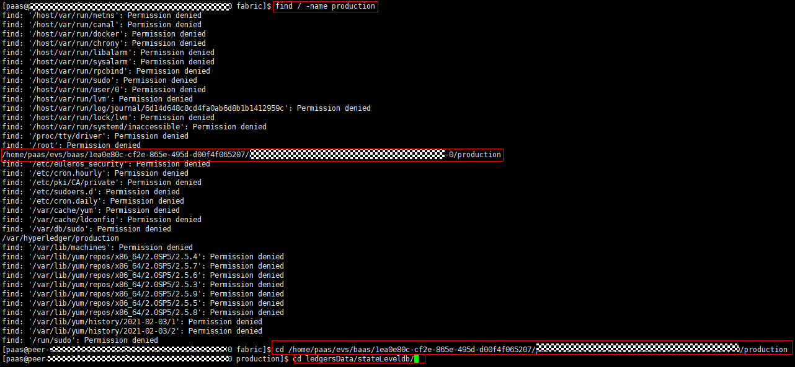

进入上述路径后查看ledgersData/stateLeveldb/路径下的CURRENT、LOG以及MANIFEST-000****文件是否存在。

若不存在可尝试使用<strong id="b434618558165">docker restart </strong><em id="i3732185591612">容器ID</em>命令重启Peer容器。

</li><li>如果上述步骤没能帮助您解决该问题，请进入AOM页面下的“日志 &gt; 日志文件”页签，下载发出告警的服务集群上的Peer和Orderer日志文件到本地，联系并提供给运维人员进行处理。</li></ol>
</td>
</tr>
<tr id="zh-cn_topic_0278784994_row195814131156"><td class="cellrowborder" valign="top" width="19.869999999999997%" headers="mcps1.2.4.1.1 ">
Peer节点磁盘空间不足

</td>
<td class="cellrowborder" valign="top" width="8.469999999999999%" headers="mcps1.2.4.1.2 ">
BCS

</td>
<td class="cellrowborder" valign="top" width="71.66%" headers="mcps1.2.4.1.3 ">
Peer节点磁盘空间不足，需扩容。扩容方法如下：

<ol id="ol23693522016"><li>登录区块链服务管理控制台，在左侧导航栏单击“服务管理”，单击服务名称进入服务详情页。</li><li>在“监控”页签下的活动告警中，从“资源名称”中获取containerID的值。
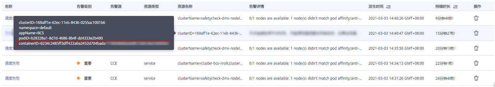

</li><li>登录服务所在CCE集群下的所有节点（节点需绑定弹性IP），分别执行<strong id="b3730336411">docker ps</strong>命令，直到找到CONTAINER ID对应的NAMES值，CONTAINER ID值为上一步获取的containerID的前12位。
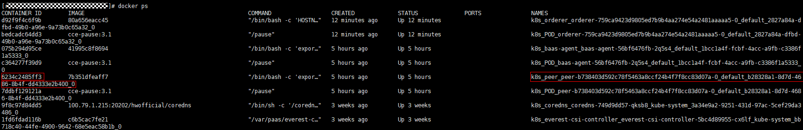

假设NAMES值为“k8s_<strong id="b15204151184511">peer_peer-b738403d592c78f5463a8ccf24b4f7f8cc83d07a-0</strong>_default_b28328a1-8d7d-4686-8b4f-dd4333e2b400_0”，则对应的节点名称为“<strong id="b1620415111455">peer_peer-b738403d592c78f5463a8ccf24b4f7f8cc83d07a-0</strong>”。
 说明： 

登录服务所在CCE集群下节点的方法可参考<a href="查看运维日志.md#section127554933219">后台虚拟机查看运维日志（CCE集群）</a>。

</li><li>在BCS服务详情页，单击“更多信息 &gt; 网络存储”，获取节点名称对应的云硬盘存储卷所在列的值，即云硬盘存储卷PVC名称。</li><li>登录CCE控制台，在左侧导航栏单击“资源管理 &gt; 存储管理”。</li><li>在“云硬盘存储卷”页签下，选择BCS服务所在集群，单击PVC名称所在行的“更多 &gt; 扩容”进行磁盘空间扩容操作。</li></ol>
</td>
</tr>
<tr id="zh-cn_topic_0278784994_row5581013101514"><td class="cellrowborder" valign="top" width="19.869999999999997%" headers="mcps1.2.4.1.1 ">
Orderer节点磁盘空间不足

</td>
<td class="cellrowborder" valign="top" width="8.469999999999999%" headers="mcps1.2.4.1.2 ">
BCS

</td>
<td class="cellrowborder" valign="top" width="71.66%" headers="mcps1.2.4.1.3 ">
Orderer节点磁盘空间不足，需扩容。扩容方法如下：

<ol id="ol7552450102711"><li>登录区块链服务管理控制台，在左侧导航栏单击“服务管理”，单击服务名称进入服务详情页。</li><li>在“监控”页签下的活动告警中，从“资源名称”中获取containerID的值。
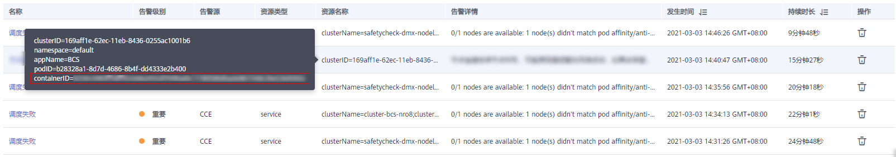

</li><li>登录服务所在CCE集群下的所有节点（节点需绑定弹性IP），分别执行<strong id="b6400172013313">docker ps</strong>命令，直到找到CONTAINER ID对应的NAMES值，CONTAINER ID值为上一步获取的containerID的前12位。
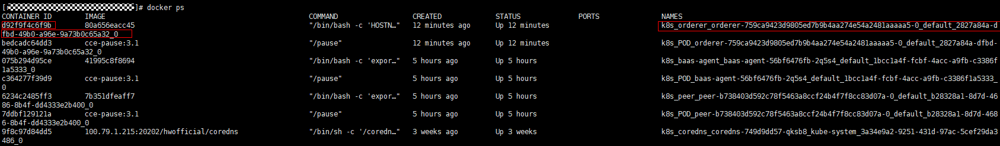

假设NAMES值为“k8s_<strong id="b66651922172910">orderer_orderer-759ca9423d9805ed7b9b4aa274e54a2481aaaaa5-0</strong>_default_2827a84a-dfbd-49b0-a96e-9a73b0c65a32_0”，则对应的节点名称为“<strong id="b467112616290">orderer_orderer-759ca9423d9805ed7b9b4aa274e54a2481aaaaa5-0</strong>”。
 说明： 

登录服务所在CCE集群下节点的方法可参考<a href="查看运维日志.md#section127554933219">后台虚拟机查看运维日志（CCE集群）</a>。

</li><li>在BCS服务详情页，单击“更多信息 &gt; 网络存储”，获取节点名称对应的云硬盘存储卷所在列的值，即云硬盘存储卷PVC名称。</li><li>登录CCE控制台，在左侧导航栏单击“资源管理 &gt; 存储管理”。</li><li>在“云硬盘存储卷”页签下，选择BCS服务所在集群，单击PVC名称所在行的“更多 &gt; 扩容”进行磁盘空间扩容操作。</li></ol>
</td>
</tr>
<tr id="row1453803715316"><td class="cellrowborder" valign="top" width="19.869999999999997%" headers="mcps1.2.4.1.1 ">
拉取镜像失败

</td>
<td class="cellrowborder" valign="top" width="8.469999999999999%" headers="mcps1.2.4.1.2 ">
CCE

</td>
<td class="cellrowborder" valign="top" width="71.66%" headers="mcps1.2.4.1.3 ">
镜像地址有误，如某些局点插件中配置的镜像地址错误、镜像仓库配置的权限有误。

大并发拉取镜像的时候，有概率失败，重试后如能拉取成功，则告警会清除。

</td>
</tr>
<tr id="row15391637534"><td class="cellrowborder" valign="top" width="19.869999999999997%" headers="mcps1.2.4.1.1 ">
拉取镜像重试失败

</td>
<td class="cellrowborder" valign="top" width="8.469999999999999%" headers="mcps1.2.4.1.2 ">
CCE

</td>
<td class="cellrowborder" valign="top" width="71.66%" headers="mcps1.2.4.1.3 ">
镜像地址有误，如某些局点插件中配置的镜像地址错误、镜像仓库配置的权限有误。修改地址重试后如能拉取成功，则告警会清除。

</td>
</tr>
<tr id="row195391837630"><td class="cellrowborder" valign="top" width="19.869999999999997%" headers="mcps1.2.4.1.1 ">
创建失败

</td>
<td class="cellrowborder" valign="top" width="8.469999999999999%" headers="mcps1.2.4.1.2 ">
CCE

</td>
<td class="cellrowborder" valign="top" width="71.66%" headers="mcps1.2.4.1.3 ">
请关注baas-agent、peer、orderer的Pod状态。

排查点：

<ol id="ol3221720153711"><li>判断容器资源分配是否正确：
登录CCE控制台，单击左侧导航栏“工作负载 &gt; 无状态负载”或“工作负载 &gt; 有状态负载”，单击负载名称进入负载详情页，在“实例列表”页签中查看CPU申请量和内存申请量。

</li><li>判断节点资源是否充足：
登录CCE控制台，单击左侧导航栏的“资源管理 &gt; 节点管理”，在“可分配资源”列中，查看实例所在节点的可分配CPU和可分配内存的大小。

</li></ol>
</td>
</tr>
<tr id="row195394372313"><td class="cellrowborder" valign="top" width="19.869999999999997%" headers="mcps1.2.4.1.1 ">
启动重试失败

</td>
<td class="cellrowborder" valign="top" width="8.469999999999999%" headers="mcps1.2.4.1.2 ">
CCE

</td>
<td class="cellrowborder" valign="top" width="71.66%" headers="mcps1.2.4.1.3 ">
请关注baas-agent、peer、orderer的Pod状态。

排查点：

<ol id="ol18349131221119"><li>判断容器资源分配是否正确：
登录CCE控制台，单击左侧导航栏“工作负载 &gt; 无状态负载”或“工作负载 &gt; 有状态负载”，单击负载名称进入负载详情页，在“实例列表”页签中查看CPU申请量和内存申请量。

</li><li>判断节点资源是否充足：
登录CCE控制台，单击左侧导航栏的“资源管理 &gt; 节点管理”，在“可分配资源”列中，查看实例所在节点的可分配CPU和可分配内存的大小。

</li></ol>
</td>
</tr>
<tr id="row4618433317"><td class="cellrowborder" valign="top" width="19.869999999999997%" headers="mcps1.2.4.1.1 ">
状态异常

</td>
<td class="cellrowborder" valign="top" width="8.469999999999999%" headers="mcps1.2.4.1.2 ">
CCE

</td>
<td class="cellrowborder" valign="top" width="71.66%" headers="mcps1.2.4.1.3 ">
请关注baas-agent、peer、orderer的Pod状态。

排查点：

<ol id="ol773053816459"><li>查看健康检查是否失败：登录CCE控制台，单击左侧导航栏“工作负载 &gt; 无状态负载”或“工作负载 &gt; 有状态负载”，单击负载名称进入负载详情页，查看“更新升级 &gt; 高级配置 &gt; 健康检查”中的信息。</li></ol>
</td>
</tr>
<tr id="row6604319320"><td class="cellrowborder" valign="top" width="19.869999999999997%" headers="mcps1.2.4.1.1 ">
调度失败

</td>
<td class="cellrowborder" valign="top" width="8.469999999999999%" headers="mcps1.2.4.1.2 ">
CCE

</td>
<td class="cellrowborder" valign="top" width="71.66%" headers="mcps1.2.4.1.3 ">
请关注baas-agent、peer、orderer的Pod状态。

排查点：

<ol id="ol1952314196285"><li>判断节点资源是否充足：登录CCE控制台，单击左侧导航栏的“资源管理 &gt; 节点管理”，在“可分配资源”列中，查看实例所在节点的可分配CPU和可分配内存的大小。</li><li>判断Pod调度策略是否正确：登录CCE控制台，单击左侧导航栏“工作负载 &gt; 无状态负载”或“工作负载 &gt; 有状态负载”，单击负载名称进入负载详情页，查看“ 调度策略 &gt; 自定义调度策略”。</li></ol>

 说明： 

CoreDNS插件是一款通过链式插件的方式为Kubernetes提供域名解析服务的DNS服务器。CoreDNS正常运行需要集群中至少有两个节点。因此当BCS实例所在集群中节点数量小于2个时，会频繁出现“调度失败”告警，不影响BCS功能使用。

判断方法：

<ol id="ol29238523260"><li>登录区块链服务管理控制台。</li><li>在左侧导航栏，单击“服务管理”。</li><li>在服务卡片上，单击区块链名称，查看区块链服务的详细信息。</li><li>进入“监控”页签，单击告警所在行的“资源名称”列，查看name的值，若name值为“coredns-”开头，则该告警为无需处理。</li></ol>

</td>
</tr>
<tr id="row861043237"><td class="cellrowborder" valign="top" width="19.869999999999997%" headers="mcps1.2.4.1.1 ">
节点重启

</td>
<td class="cellrowborder" valign="top" width="8.469999999999999%" headers="mcps1.2.4.1.2 ">
CCE

</td>
<td class="cellrowborder" valign="top" width="71.66%" headers="mcps1.2.4.1.3 ">
节点发生过重启。如果该节点上部署了baas-agent、peer、orderer服务，则排查对应Pod状态是否异常。如果该节点上未部署上述服务则对BCS服务无影响。

排查点：

<ol id="ol185181532134114"><li>是否由于人为操作（关机、重启等）导致重启。</li><li>是否由于节点资源过载导致重启：登录AOM控制台，单击左侧导航栏的“监控 &gt; 主机监控”，查看CPU使用率和内存使用率。</li></ol>
</td>
</tr>
<tr id="row660437313"><td class="cellrowborder" valign="top" width="19.869999999999997%" headers="mcps1.2.4.1.1 ">
节点状态异常

</td>
<td class="cellrowborder" valign="top" width="8.469999999999999%" headers="mcps1.2.4.1.2 ">
CCE

</td>
<td class="cellrowborder" valign="top" width="71.66%" headers="mcps1.2.4.1.3 ">
如果该节点上部署了baas-agent、peer、orderer服务，则需恢复节点状态或迁移服务到其它节点。

排查点：

<ol id="ol4301162910424"><li>判断节点资源是否充足：登录CCE控制台，单击左侧导航栏的“资源管理 &gt; 节点管理”，在“可分配资源”列中，查看实例所在节点的可分配CPU和可分配内存的大小。</li><li>重启节点。</li><li>重置节点：登录CCE控制台，在左侧导航栏中选择“资源管理 &gt; 节点管理”，单击节点后的“更多 &gt; 重置节点”。</li></ol>
</td>
</tr>
<tr id="row459511429264"><td class="cellrowborder" valign="top" width="19.869999999999997%" headers="mcps1.2.4.1.1 ">
节点内存资源告警

</td>
<td class="cellrowborder" valign="top" width="8.469999999999999%" headers="mcps1.2.4.1.2 ">
BCS

</td>
<td class="cellrowborder" valign="top" width="71.66%" headers="mcps1.2.4.1.3 ">
节点虚机内存使用率超过80%，可能原因有：

<ol id="ol1864811272276"><li>短时间交易请求过多。</li><li>容器所在节点内存资源规格与服务规格不匹配。</li></ol>

排查点：

<ol id="ol181118520517"><li>登录区块链服务管理控制台。在左侧导航栏，单击“服务管理”。</li><li>在“Hyperledger Fabric增强版”页签，单击服务名称进入服务详情页。</li><li>在“监控”页签下的活动告警中，从“资源名称”中获取containerName的值。
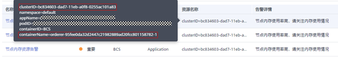

</li><li>登录云容器引擎控制，找到告警容器所在的集群节点。在“资源管理-节点管理”页面单击节点名称进入弹性云服务器页面。

</li><li>在弹性云服务器页面，先将云服务关机，再单击选择“更多 &gt; 变更规格 ”，在新打开的云服务器变更规格页面，根据情况选择合适的内存规格。

</li></ol>
</td>
</tr>
<tr id="row1320004185815"><td class="cellrowborder" valign="top" width="19.869999999999997%" headers="mcps1.2.4.1.1 ">
节点内存使用率过高

</td>
<td class="cellrowborder" valign="top" width="8.469999999999999%" headers="mcps1.2.4.1.2 ">
BCS

</td>
<td class="cellrowborder" valign="top" width="71.66%" headers="mcps1.2.4.1.3 ">
节点虚机内存使用率超过90%，可能原因有：

<ol id="ol15858144514506"><li>短时间交易请求过多。</li><li>容器所在节点内存资源规格与服务规格不匹配。</li></ol>

排查点：

<ol id="ol38581945115015"><li>登录区块链服务管理控制台。在左侧导航栏，单击“服务管理”。</li><li>在“Hyperledger Fabric增强版”页签，单击服务名称进入服务详情页。</li><li>在“监控”页签下的活动告警中，从“资源名称”中获取containerName的值。

</li><li>登录云容器引擎控制，找到告警容器所在的集群节点。在“资源管理-节点管理”页面单击节点名称进入弹性云服务器页面。
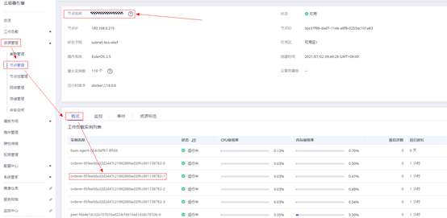

</li><li>在弹性云服务器页面，先将云服务关机，再单击选择“更多 &gt; 变更规格 ”，在新打开的云服务器变更规格页面，根据情况选择合适的内存规格。
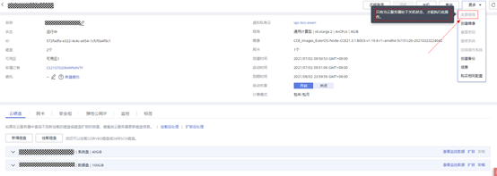

</li></ol>
</td>
</tr>
</tbody>
</table>

## 查看告警

1.  登录区块链服务管理控制台。
2.  在左侧导航栏，单击“服务管理”，可查看已创建服务的基本信息，包括区块链的类型、共识策略、状态、创建时间等信息。
3.  在服务卡片上，单击区块链名称，可查看区块链服务的详细信息。
4.  单击“监控”页签，可查看告警信息。这里展示的是与该区块链服务相关的告警，告警源包括BCS和CCE。在右上角可以选择查看“近30分钟”、“近1小时”或“近1天”的告警，也可以输入告警名称搜索告警。

    **图 1**  告警统计信息  
    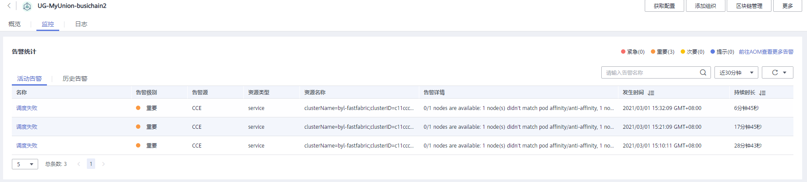

1.  单击告警名称，例如“节点连接排序节点告警”，查看告警详情。告警源包括BCS和CCE，告警处理建议参见[表1](#zh-cn_topic_0278784994_table17580191315157)。

