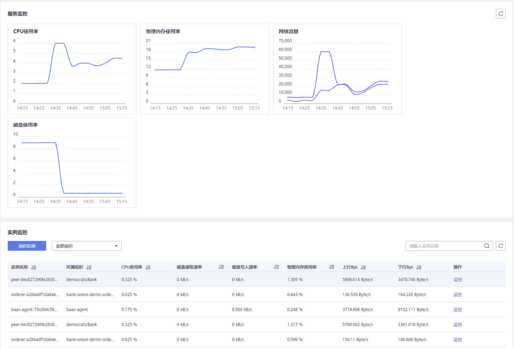
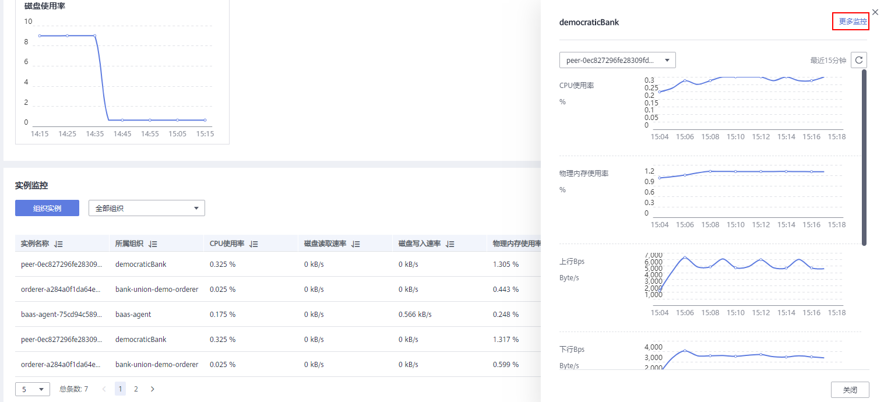
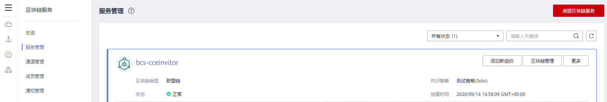
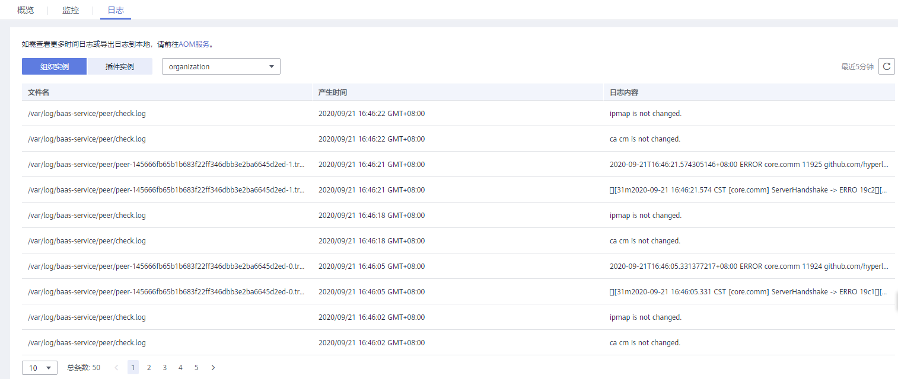

# 查看监控指标和日志信息

BCS服务自身提供运维监控能力，运维人员可以通过BCS查看监控指标和日志。

## 约束与限制

-   查看IEF集群下部署的BCS服务监控指标时，请确保BCS服务所在的IEF节点已安装ICAgent。
-   查看IEF集群下部署的BCS服务日志信息时，请确保BCS服务所在的IEF节点已安装ICAgent，并且配置日志采集路径，日志路径请参见[表2](查看运维日志.md#table17333749152318)。

## 查看监控

1.  登录区块链服务管理控制台。
2.  在左侧导航栏，单击“服务管理”，可查看已创建服务的基本信息，包括区块链类型、共识策略、状态、创建时间等信息。
3.  在服务卡片上单击区块链名称，可查看区块链服务的详细信息。
4.  单击“监控”页签，可查看服务监控和实例监控。
    -   服务监控：可查看服务的CPU使用率、物理内存使用率等信息。
    -   实例监控：可查看组织实例信息，包括CPU使用率、磁盘读取速率、磁盘写入速率、上行Bps、下行Bps等信息。

        您可以单击实例名称后面的“监控”，查看最近15分钟的数据信息。在实例监控页面，您也可以单击“更多监控”，查看更多监控信息。

        **图 1**  查看监控  
        

        **图 2**  查看更多监控  
        

## 查看日志

1.  登录区块链服务管理控制台。
2.  在左侧导航栏，单击“服务管理”，可查看已创建服务的基本信息，包括区块链的类型、共识策略、状态、创建时间等信息。

    **图 3**  查看服务  
    

3.  在服务卡片上单击区块链名称，可查看区块链服务的详细信息。
4.  单击“日志”页签，可查看日志信息。默认显示最近5分钟的日志信息，包括日志文件名、产生时间和日志内容。

    如需查看更多时间日志或导出日志到本地，请前往AOM服务。

    **图 4**  查看日志  
    

