# 查看运维日志<a name="bcs_usermanual_0816"></a>

## 背景信息<a name="section111719249157"></a>

在使用BCS的过程中，如果遇到异常情况，可以通过查看运维日志来帮助分析、定位问题，快速高效地进行设备运维管理。本章主要指导如何通过前台界面以及后台虚拟机查看CCE集群和IEF集群下部署的BCS服务各节点的运维日志。

**表 1**  BCS服务用户实例日志（CCE集群部署）

<a name="table1191211718176"></a>
<table><thead align="left"><tr id="row1291215713176"><th class="cellrowborder" valign="top" width="12.91%" id="mcps1.2.4.1.1"><p id="p1691287131713"><a name="p1691287131713"></a><a name="p1691287131713"></a>服务组件</p>
</th>
<th class="cellrowborder" valign="top" width="19.96%" id="mcps1.2.4.1.2"><p id="p79127710177"><a name="p79127710177"></a><a name="p79127710177"></a>说明</p>
</th>
<th class="cellrowborder" valign="top" width="67.13%" id="mcps1.2.4.1.3"><p id="p291227131712"><a name="p291227131712"></a><a name="p291227131712"></a>日志路径</p>
</th>
</tr>
</thead>
<tbody><tr id="row1191247121716"><td class="cellrowborder" valign="top" width="12.91%" headers="mcps1.2.4.1.1 "><p id="p1191216718173"><a name="p1191216718173"></a><a name="p1191216718173"></a>baas-agent</p>
</td>
<td class="cellrowborder" valign="top" width="19.96%" headers="mcps1.2.4.1.2 "><p id="p1691211711717"><a name="p1691211711717"></a><a name="p1691211711717"></a>区块链管理运行日志</p>
</td>
<td class="cellrowborder" valign="top" width="67.13%" headers="mcps1.2.4.1.3 "><p id="p39121677178"><a name="p39121677178"></a><a name="p39121677178"></a>/var/paas/sys/log/baas-agent/baas-agent.log</p>
<p id="p18239104572320"><a name="p18239104572320"></a><a name="p18239104572320"></a>/var/paas/sys/log/baas-agent/audit.log</p>
</td>
</tr>
<tr id="row189125712170"><td class="cellrowborder" valign="top" width="12.91%" headers="mcps1.2.4.1.1 "><p id="p891216751715"><a name="p891216751715"></a><a name="p891216751715"></a>peer</p>
</td>
<td class="cellrowborder" valign="top" width="19.96%" headers="mcps1.2.4.1.2 "><p id="p13912167141718"><a name="p13912167141718"></a><a name="p13912167141718"></a>peer运行日志</p>
</td>
<td class="cellrowborder" valign="top" width="67.13%" headers="mcps1.2.4.1.3 "><p id="p6912157141718"><a name="p6912157141718"></a><a name="p6912157141718"></a>/var/paas/sys/log/baas-service/peer/audit.peer-******-*.log</p>
<p id="p4414162019248"><a name="p4414162019248"></a><a name="p4414162019248"></a>/var/paas/sys/log/baas-service/peer/peer-******-*.trace</p>
</td>
</tr>
<tr id="row29124751710"><td class="cellrowborder" valign="top" width="12.91%" headers="mcps1.2.4.1.1 "><p id="p109122719177"><a name="p109122719177"></a><a name="p109122719177"></a>orderer</p>
</td>
<td class="cellrowborder" valign="top" width="19.96%" headers="mcps1.2.4.1.2 "><p id="p149121075173"><a name="p149121075173"></a><a name="p149121075173"></a>orderer运行日志</p>
</td>
<td class="cellrowborder" valign="top" width="67.13%" headers="mcps1.2.4.1.3 "><p id="p491218712170"><a name="p491218712170"></a><a name="p491218712170"></a>/var/paas/sys/log/baas-service/orderer/audit.orderer-******-*.log</p>
<p id="p1151712222516"><a name="p1151712222516"></a><a name="p1151712222516"></a>/var/paas/sys/log/baas-service/orderer/orderer-******-*-start.trace</p>
<p id="p1161192752511"><a name="p1161192752511"></a><a name="p1161192752511"></a>/var/paas/sys/log/baas-service/orderer/orderer-******-*.trace</p>
</td>
</tr>
</tbody>
</table>

**表 2**  BCS服务用户实例日志（IEF集群部署）

<a name="table17333749152318"></a>
<table><thead align="left"><tr id="row103331349202319"><th class="cellrowborder" valign="top" width="12.91%" id="mcps1.2.4.1.1"><p id="p233384919233"><a name="p233384919233"></a><a name="p233384919233"></a>服务组件</p>
</th>
<th class="cellrowborder" valign="top" width="19.96%" id="mcps1.2.4.1.2"><p id="p2333349132311"><a name="p2333349132311"></a><a name="p2333349132311"></a>说明</p>
</th>
<th class="cellrowborder" valign="top" width="67.13%" id="mcps1.2.4.1.3"><p id="p14333449132315"><a name="p14333449132315"></a><a name="p14333449132315"></a>日志路径</p>
</th>
</tr>
</thead>
<tbody><tr id="row163330491232"><td class="cellrowborder" valign="top" width="12.91%" headers="mcps1.2.4.1.1 "><p id="p033394922315"><a name="p033394922315"></a><a name="p033394922315"></a>baas-agent</p>
</td>
<td class="cellrowborder" valign="top" width="19.96%" headers="mcps1.2.4.1.2 "><p id="p6333134972315"><a name="p6333134972315"></a><a name="p6333134972315"></a>区块链管理运行日志</p>
</td>
<td class="cellrowborder" valign="top" width="67.13%" headers="mcps1.2.4.1.3 "><p id="p18426112114242"><a name="p18426112114242"></a><a name="p18426112114242"></a>/var/IEF/app/log/baas-agent/baas-agent.log</p>
<p id="p18426192102410"><a name="p18426192102410"></a><a name="p18426192102410"></a>/var/IEF/app/log/baas-agent/audit.log</p>
</td>
</tr>
<tr id="row633314493237"><td class="cellrowborder" valign="top" width="12.91%" headers="mcps1.2.4.1.1 "><p id="p173336494236"><a name="p173336494236"></a><a name="p173336494236"></a>peer</p>
</td>
<td class="cellrowborder" valign="top" width="19.96%" headers="mcps1.2.4.1.2 "><p id="p03337496232"><a name="p03337496232"></a><a name="p03337496232"></a>peer运行日志</p>
</td>
<td class="cellrowborder" valign="top" width="67.13%" headers="mcps1.2.4.1.3 "><p id="p64270218243"><a name="p64270218243"></a><a name="p64270218243"></a>/var/IEF/app/log/peer-******-*/peer-******-*-start.trace</p>
<p id="p542710214245"><a name="p542710214245"></a><a name="p542710214245"></a>/var/IEF/app/log/peer-******-*/peer-******-*.trace</p>
</td>
</tr>
<tr id="row5334134952315"><td class="cellrowborder" valign="top" width="12.91%" headers="mcps1.2.4.1.1 "><p id="p533484992311"><a name="p533484992311"></a><a name="p533484992311"></a>orderer</p>
</td>
<td class="cellrowborder" valign="top" width="19.96%" headers="mcps1.2.4.1.2 "><p id="p1133464916239"><a name="p1133464916239"></a><a name="p1133464916239"></a>orderer运行日志</p>
</td>
<td class="cellrowborder" valign="top" width="67.13%" headers="mcps1.2.4.1.3 "><p id="p9427102162410"><a name="p9427102162410"></a><a name="p9427102162410"></a>/var/IEF/app/log/orderer-******-*/orderer-******-*-start.trace</p>
</td>
</tr>
</tbody>
</table>

## 前台界面查看日志（CCE集群）<a name="section18993171211410"></a>

1.  在“云容器引擎 \> 工作负载”页面查看并记录节点名称。
    1.  单击“工作负载 \> 无状态负载”，选择BCS服务所在集群，查看并记录baas-agent与dev-peer节点名称，例如“baas-restapi”。

        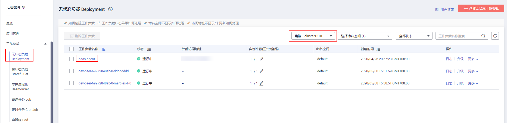

    2.  单击“ 工作负载 \> 有状态负载”，选择BCS服务所在集群，查看并记录peer和orderer节点名称，例如“peer-a4d420a7d08419d1173b99912321a2bc87f87c67”。

        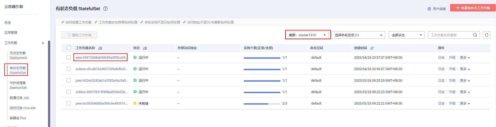

2.  进入AOM控制台，在AOM界面中查看日志。
    1.  在AOM左侧导航栏中选择“日志 \> 日志文件”，选择BCS服务所在集群。
    2.  选择记录的节点名称，单击“查看”，查看节点日志。

        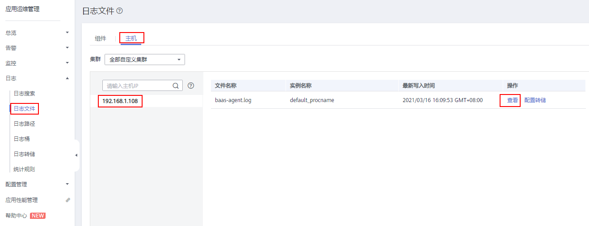

    3.  单击“开启实时查看”，实时查看运维日志。

        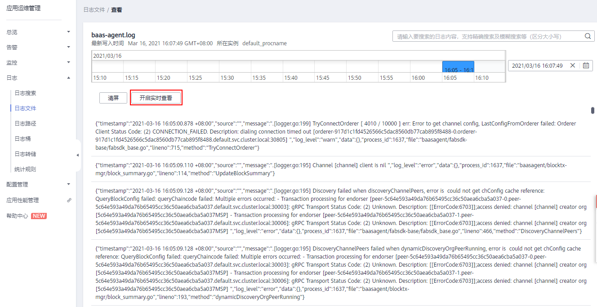


## 前台界面查看日志（IEF集群）<a name="section113187426505"></a>

请确保BCS服务所在的IEF节点已安装ICAgent，并且配置日志采集路径。

1.  在“智能边缘平台 \> 边缘应用”页面查看并记录节点名称及IP。
    1.  单击“边缘应用 \> 容器应用”，单击当前BCS服务节点，例如“bcs-0eab-baas-agent”。

        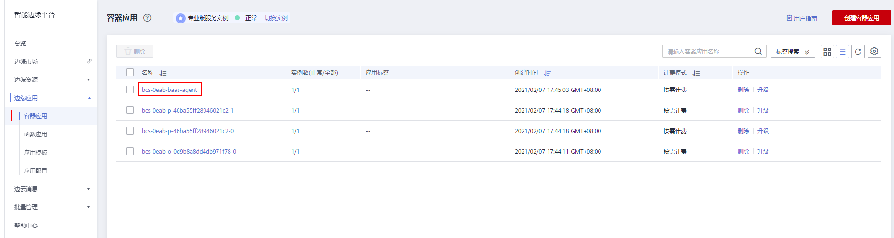

        记录节点名称，例如：“ecs-iefzcx04”。

        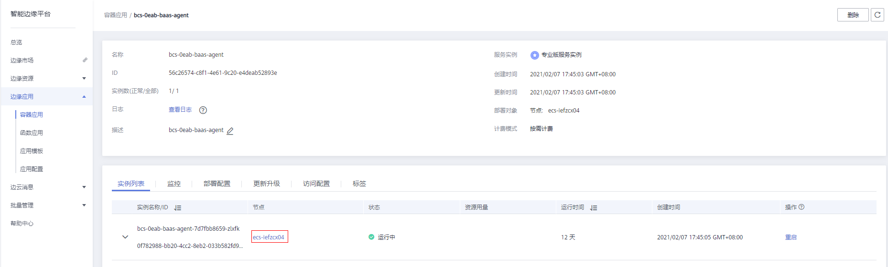

    2.  单击“边缘资源 \> 边缘节点”，选择刚才记录的节点名称，查看并记录节点IP，例如“192.168.0.210”。

        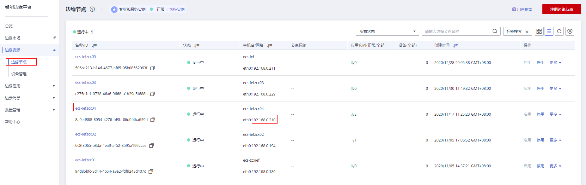

2.  在“区块链服务”页面中，单击“运维中心”进入AOM界面，在AOM界面中查看日志。
    1.  在AOM左侧导航栏中选择“日志 \> 日志文件 \> 主机”，选择全部自定义集群。
    2.  选择记录的节点IP，单击“查看”，查看节点日志。

        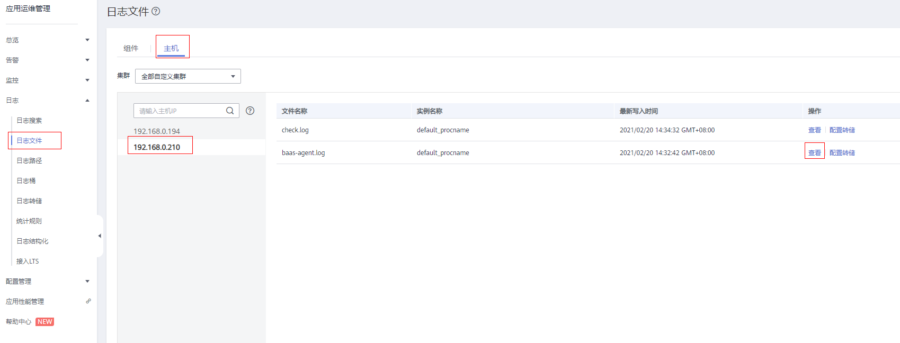

    3.  单击“开启实时查看”，实时查看运维日志。

        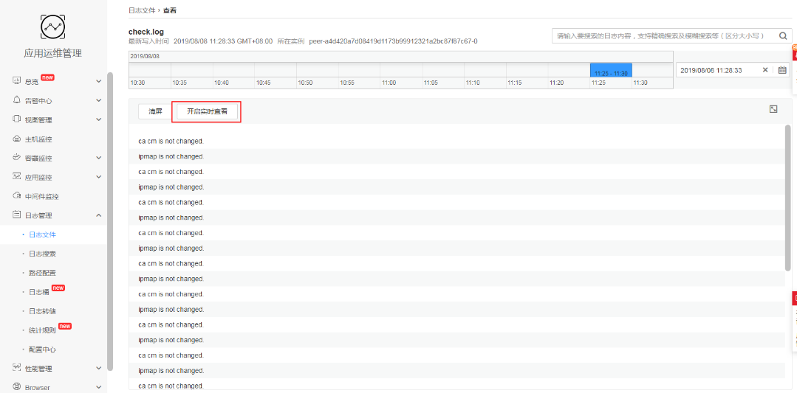


## 后台虚拟机查看运维日志（CCE集群）<a name="section127554933219"></a>

1.  在“云容器引擎 \> 工作负载”页面查看节点名称，方法请参见：[前台界面查看日志（CCE集群）](#section18993171211410)。
2.  <a name="li144201957133311"></a>在“区块链服务 \> 服务管理”页面中，在服务卡片中，单击对应的服务右侧的“更多 \> 更新访问地址”，查看访问地址。

    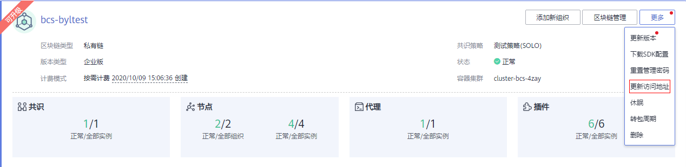

    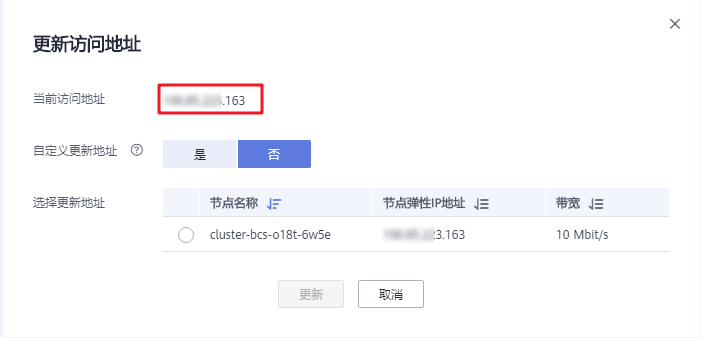

    > **说明：** 
    >服务部署节点需绑定弹性IP。

3.  登录访问地址对应的虚拟机，查看运维日志。

    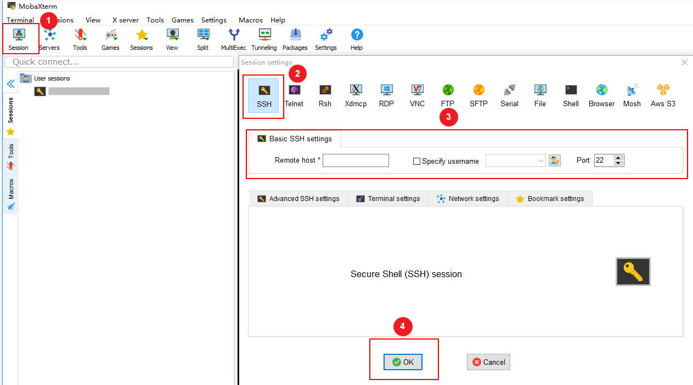

    在Remote host中填写虚拟机地址（即[2](#li144201957133311)获取的访问地址），并在Specify username中填写虚拟机的用户名。

    1.  查看dev-peer节点日志。
        1.  执行如下命令，查看dev-peer节点ID。

            ```
            docker ps|grep dev-peer
            ```

            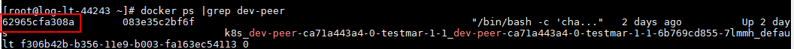

        2.  执行如下命令，查看dev-peer节点日志。

            ```
            docker logs –f ID  
            ```

            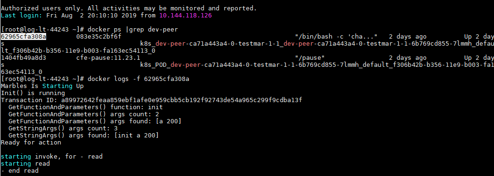

    2.  查看baas-agent节点日志。
        1.  执行如下命令，查看baas-agent节点的ID。

            ```
            docker ps|grep baas-agent
            ```

            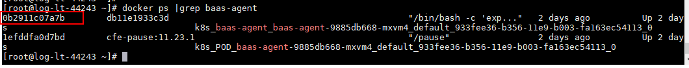

        2.  执行如下命令，查看baas-agent节点的日志。

            ```
            docker logs ID -f 
            ```

            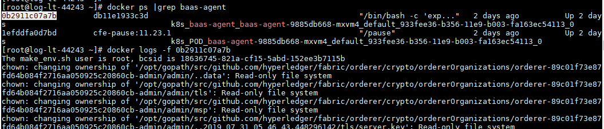

    3.  查看peer节点日志。
        1.  执行如下命令查看peer节点的ID。

            ```
            docker ps|grep peer 
            ```

            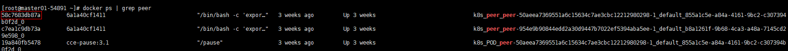

        2.  执行如下命令查看peer节点的日志。

            ```
            docker logs –f ID  
            ```

            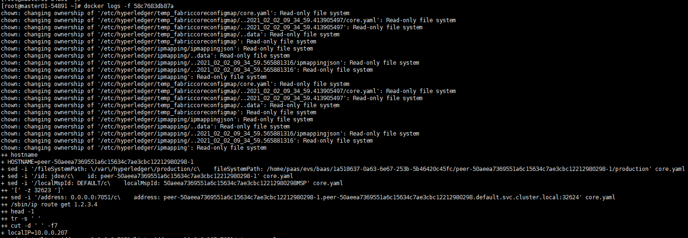

    4.  查看orderer节点日志。
        1.  执行如下命令查看orderer节点的ID。

            ```
            docker ps|grep orderer 
            ```

            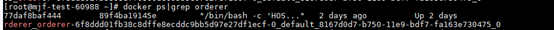

        2.  执行如下命令查看order节点的日志。

            ```
            docker logs –f ID  
            ```

            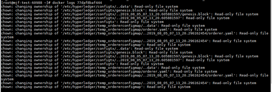


## 后台虚拟机查看运维日志（IEF集群）<a name="section51511247195119"></a>

1.  在“智能边缘平台 \> 边缘应用”页面查看节点名称，方法请参见：[前台界面查看日志（IEF集群）](#section113187426505)。
2.  在“弹性云服务器”页面中，根据节点名称及IP，查看并记录弹性IP。

    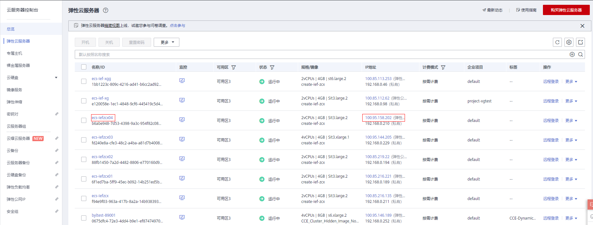

3.  登录弹性IP对应的虚拟机，查看运维日志。

    

    在Remote host中填写虚拟机地址（即[2](#li144201957133311)获取的弹性IP），并在Specify username中填写虚拟机的用户名。

    1.  查看baas-agent节点日志。

        到节点如下路径，查看baas-agent节点的日志。

        /var/IEF/app/log/baas-agent/

        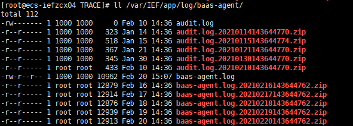

    2.  查看peer节点日志。

        到节点如下路径，查看peer节点的日志。

        /var/IEF/app/log/当前BCS服务peer节点名目录/

        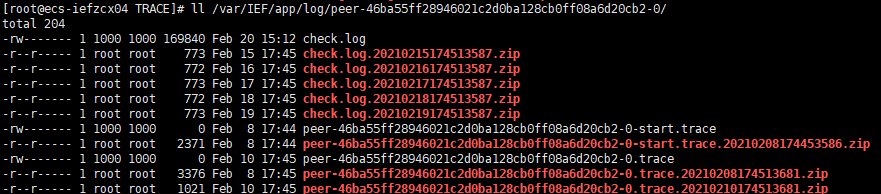

    3.  查看orderer节点日志。

        到节点如下路径，查看order节点的日志。

        /var/IEF/app/log/当前BCS服务order节点名目录/

        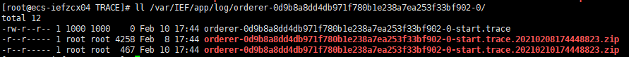


