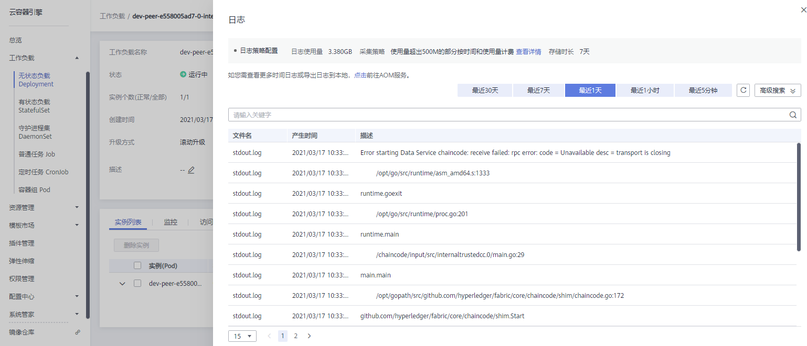

# 查看链代码调测日志

在使用BCS的过程中，可以通过查看链代码调测日志来帮助分析、定位问题。本章主要指导如何通过CCE界面查看链代码调测日志。

## 操作步骤

1.  登录CCE服务管理控制台。
2.  单击左侧导航栏中的“工作负载 \> 无状态负载 Deployment”。
3.  选择区块链服务部署的集群，单击名称为“dev-peer-”开头的工作负载，进入工作负载详情页。
4.  单击右上角“日志”，即可查看链代码容器对应的日志。如需查看更多时间日志或导出日志到本地，请前往AOM服务。

    **图 1**  链代码容器对应的日志  
    

