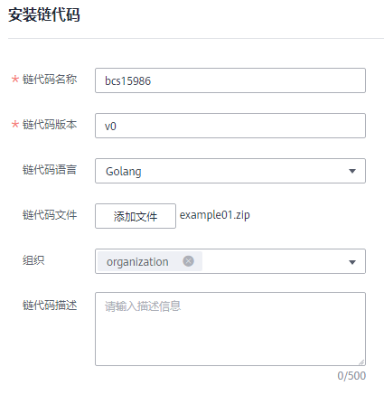

# 管理链代码

为您提供界面化链代码管理功能，包括链代码安装、实例化、更新链代码。

## 注意事项

链代码安装前需要将开发的链代码文件压缩成zip格式以执行安装。

## 安装链代码

1.  登录区块链服务管理控制台。
2.  单击左侧导航栏中的“服务管理”，选择华为链页签。
3.  请根据实际情况按如下方式进入链代码管理页面。
    -   基于华为云资源部署的华为链服务：
        1.  单击服务名称，进入服务概览页面。
        2.  选择左侧导航栏中的“链代码管理”，单击页面右上角的“安装链代码”。

    -   基于边缘集群部署的华为链服务：
        1.  单击服务名称，进入服务概览页面。
        2.  登录边缘侧Console页面。

            **图 1**  登录边缘侧Console页面  
            

        3.  单击页面右上角的“安装链代码”。

4.  在安装界面输入“链代码名称”、“链代码版本”，选择链代码语言以及组织，添加链代码文件等，如下图。

    **图 2**  链代码安装  
    

5.  单击“安装”，安装成功后，链代码管理页面显示一条已安装成功的链代码信息。

## 实例化链代码

链代码安装后需要将链代码实例化到链上，以便组织通过链代码容器和分布式账本进行交互。

实例化链代码前，请确保先将组织添加进链中，否则无法实例化链代码。

1.  在链代码管理页面，单击“操作”列的“实例化”。
2.  选择链代码版本、背书策略、背书组织列表等，填写链代码参数。
3.  单击“实例化”完成链代码在链上的实例化。

## 更新链代码

如果您的链代码更新，您需要对新版本链代码进行重新安装且实例化以满足新的业务需求。

1.  在链代码管理页面，单击“操作”列的“更新链代码”。
2.  填写链代码版本、选择安装节点、添加链代码文件等，单击“更新”。
3.  实例化新版本链代码，操作请参见[实例化链代码](#zh-cn_topic_0000001158950301_bcs_usermanual_0003_section8809155514549)。
4.  （可选）单击链代码名称前的，展开链代码详细信息，您可以查看当前链代码的版本列表、安装列表和实例化情况。

