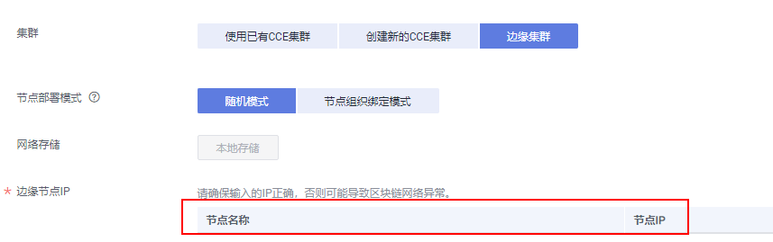
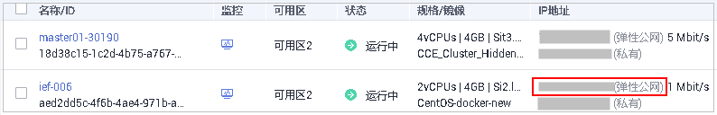
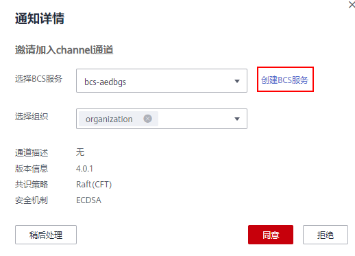

# 组建联盟链

当您已创建区块链服务类型为“联盟链”的区块链实例时，您可以通过邀请其他租户加入此联盟链，组建一个多成员参与的联盟链系统。

> **说明：** 
>-   Fabric 1.1.0版本BCS服务支持更新至1.4.0版本，同时取消1.1.0版本BCS服务的创建。
>-   单独创建仅支持Fabric2.2版本BCS服务，联盟链被邀请方支持创建Fabric2.2或Fabric1.4版本BCS服务。
>-   Fabric 1.4.0版本BCS服务支持更新至2.2版本。如果是联盟链，请确保所有联盟成员组件也升级到Fabric 2.2版本，否则无法正常交易。更新版本请参见[3](基本操作.md#li18397612105251)中的更新版本操作。
>    -   BCS版本3.x.x对应社区Hyperledger Fabric 1.4.0版本。
>    -   BCS版本4.x.x对应社区Hyperledger Fabric 2.2版本。
>-   对于已构建的1.1.0版本的联盟链，被邀请方服务仍旧可以创建1.1.0版本并加入联盟。
>-   华为区块链的基础版不支持构建联盟。

## 注意事项

基于CCE集群和基于边缘集群创建的区块链实例都支持组建联盟链，当基于边缘集群构建联盟链时，由于不同租户的边缘集群分属不同VPC网络，构建联盟需保证网络连通。

1.  使用公网IP地址创建服务。

    为保证网络连通，创建基于边缘集群的BCS服务时使用公网IP地址，即填写纳管边缘集群的云服务器所绑定的弹性公网IP地址。

    

2.  查看弹性公网IP地址。

    进入ECS服务页面，查看弹性云服务器列表。

    

3.  对于已有的边缘集群服务，可以通过更新访问地址切换至公网IP地址。

    在BCS服务卡片页面，选择“更多 \> 更新访问地址”，并填写弹性公网IP地址进行更新。

您还可以使用“VPC对等连接”、“云专线”等方法进行不同租户间VPC网络打通。

> **说明：** 
>对于已有的边缘集群服务，更新访问地址：
>-   达成联盟前请填写公网IP地址进行更新。
>-   达成联盟后不建议更新访问地址。

## 邀请成员

组建联盟链，即可邀请成员加入该联盟。

1.  登录区块链服务管理控制台。
2.  在页面左侧选择“成员管理”。单击页面右上角“邀请成员”。
3.  在邀请成员页面，选择邀请方的BCS服务、通道，填写被邀请方的租户名称。

    **图 1**  邀请成员  
    

4.  （可选）单击“邀请一个新租户”可添加多个成员进行邀请。

    > **说明：** 
    >最多支持邀请5个成员，铂金版本支持提交工单修改成员配额，其他版本不支持。

5.  单击确定，邀请通知信息将发送至被邀请方。

## 同意/拒绝邀请

当您收到加入联盟链的成员邀请时，您会收到通知信息，此时您可以同意/拒绝邀请。

1.  登录区块链服务管理控制台。
2.  在页面左侧选择“通知管理”。单击通知列表“操作”列的“查看”。
    -   同意邀请：选择需要加入联盟通道的组织，再单击“同意”。
    -   拒绝邀请：单击“拒绝”。

        > **说明：** 
        >-   作为被邀请方，选择服务前需要单击“创建BCS服务”来创建服务，否则无法加入联盟通道。
        >    **图 2**  创建BCS服务示意图  
        >    
        >-   创建BCS的步骤可参见[服务部署](基于CCE集群.md)。为了能成功加入联盟，您创建服务时部分参数需要与邀请方BCS服务保持一致，例如区块链类型、共识策略、安全机制等，故这些参数在界面上已灰化不可修改。

