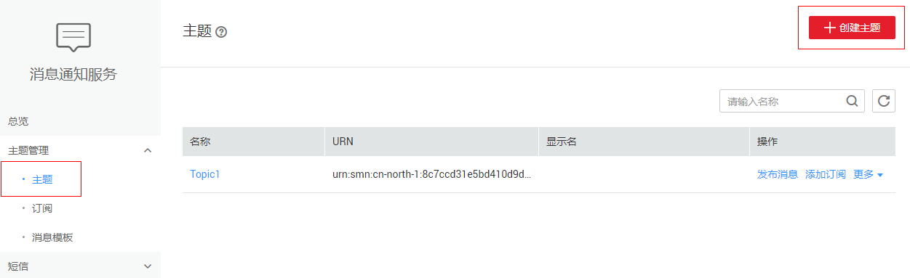
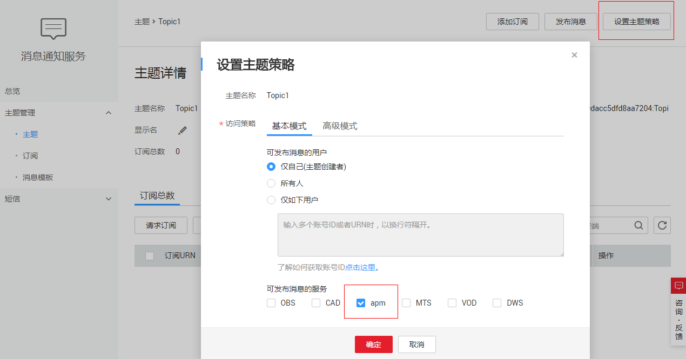
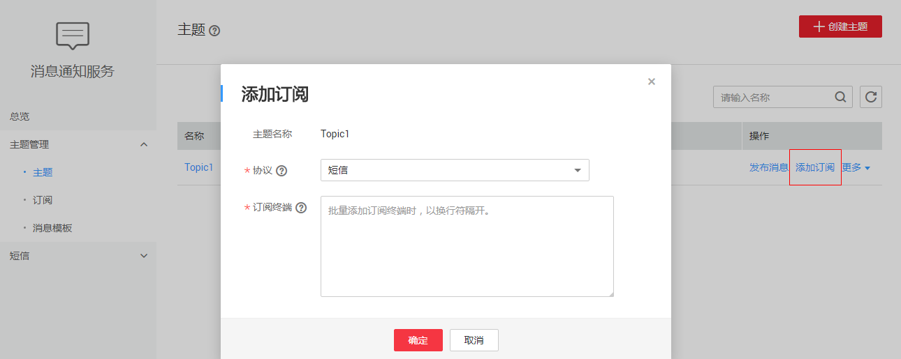
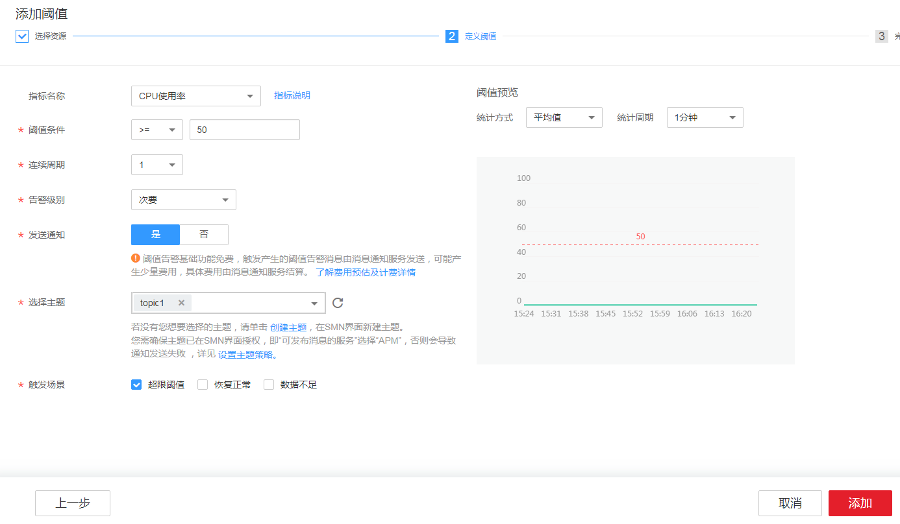
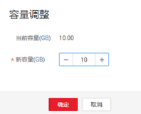

# 设置网盘阈值告警

## 背景信息

区块链服务对接应用运维管理服务（Application Operations Management），为运维人员提供一站式立体运维平台，实时监控服务、资源运行状态，通过指标、告警与日志关联分析，快速锁定问题根源，保障业务顺畅运行。

接下来我们介绍一下如何基于AOM服务来监控区块链实例所使用网盘（即文件存储）的磁盘状况。当运维人员收到磁盘空间不足的阈值告警通知后，需要对磁盘进行扩容操作，否则可能引起服务异常。

## 设置告警

当运维人员需要关心网盘磁盘指标时，就可以使用AOM服务根据指定维度设置磁盘指标阈值。一旦网盘指标超过阈值时，就能自动发送短信或邮件进行告警。

1.  登录消息通知服务管理控制台，创建主题并添加订阅者。

    当您需要第一时间获取资源的变更信息时，请先创建主题，并为这个主题添加相关的订阅者。即将变更信息接收人的邮箱或手机号码添加到系统中，以便在创建阈值规则时可选择对应的接收人。

    1.  创建主题。

        **图 1**  创建主题  
        

    2.  设置主题策略，“可发布消息的服务”请选择“apm”，否则会导致通知发送失败。

        **图 2**  设置主题策略  
        

    3.  为该主题添加相关的订阅者。

        **图 3**  添加订阅  
        

2.  单击区块链服务界面左侧“运维中心”进入AOM控制台，在AOM界面中创建阈值规则。
    1.  在左侧导航栏中选择“告警 \> 阈值规则”，单击“添加阈值”，展开安装了BCS的集群下的主机，设置“阈值名称”，选择“创建方式”、“资源类型”等参数，单击“下一步”。

    1.  ，可以参照下图设置阈值条件。

        **图 4**  设置阈值规则  
        

## 告警处理

当运维人员收到磁盘空间不足的阈值告警通知后，需要对磁盘进行扩容操作，否则可能引起服务异常。

1.  选择控制台最上方的“服务列表 \> 存储 \> 弹性文件服务”。
2.  在弹性文件服务列表中找到BCS服务所在集群对应的文件存储服务。
3.  单击“操作”列的“容量调整”。
4.  调整文件存储的容量后，单击“确定”。

    **图 5**  容量调整  
    

