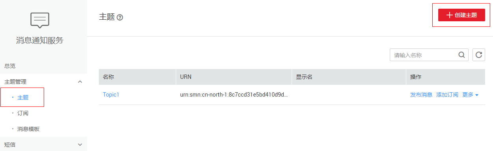
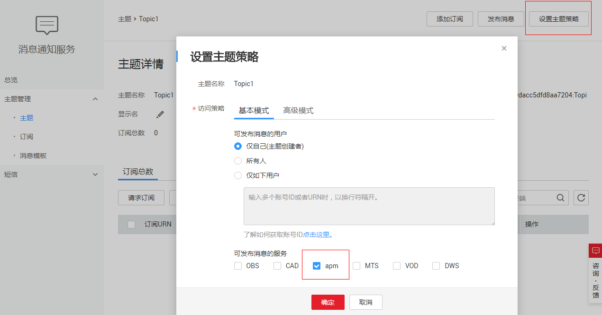
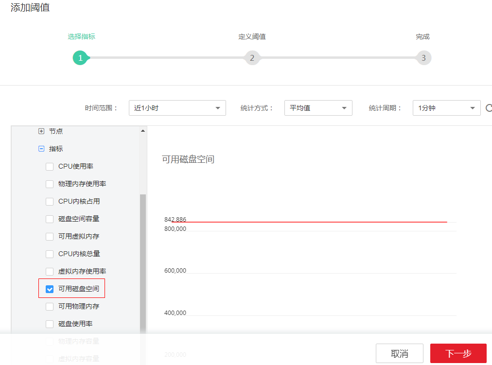
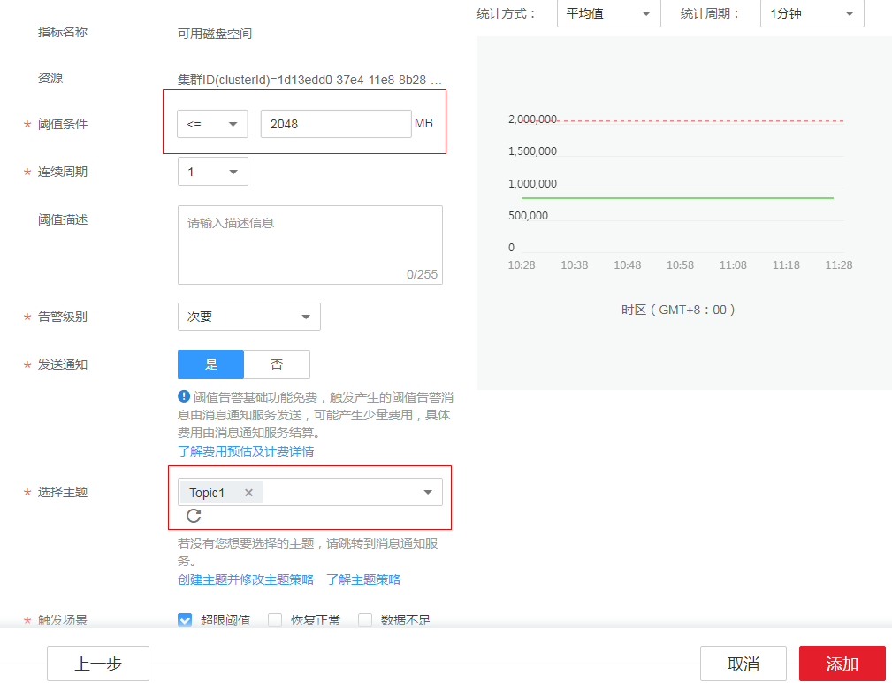
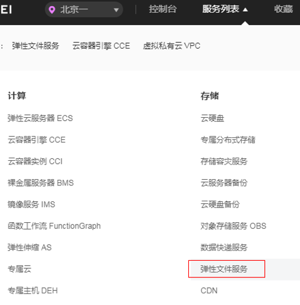

# 设置网盘阈值告警

## 背景信息

区块链服务运维中心对接应用运维管理服务（Application Operations Management），为运维人员提供一站式立体运维平台，实时监控服务、资源运行状态，通过指标、告警与日志关联分析，快速锁定问题根源，保障业务顺畅运行。

如下我们介绍一下如何基于AOM服务来监控区块链实例所使用网盘（即文件存储）磁盘状况。当运维人员收到磁盘空间不足的阈值告警通知后，需要对磁盘进行扩容操作，否则可能引起服务异常。关于AOM其他更详细的操作指导可参见[应用运维管理服务帮助中心](https://support.huaweicloud.com/productdesc-aom/aom_06_0006.html)[应用运维管理服务帮助中心](https://support-intl.huaweicloud.com/zh-cn/productdesc-aom/aom_06_0006.html)。

## 设置告警

当运维人员需要关心网盘磁盘指标时，就可以使用AOM服务根据指定维度设置磁盘指标阈值。一旦网盘指标超过阈值时，就能自动发送短信或邮件进行告警。

1.  在SMN中创建主题并添加订阅者。

    当您需要第一时间获取资源的变更信息时，请先创建主题，并为这个主题添加相关的订阅者。即将变更信息接收人的邮箱或手机号码添加到系统中，以便在创建阈值规则时可选择对应的接收人。

    1.  创建主题。
        1.  创建主题，详细操作请参见[创建主题](https://support.huaweicloud.com/usermanual-smn/zh-cn_topic_0043961401.html)[创建主题](https://support-intl.huaweicloud.com/zh-cn/usermanual-smn/zh-cn_topic_0043961401.html)。

            

        1.  设置主题策略。

            “可发布消息的服务”请选择“apm”，否则会导致通知发送失败。详细信息请参见[设置主题策略](https://support.huaweicloud.com/usermanual-smn/zh-cn_topic_0043394891.html)[设置主题策略](https://support-intl.huaweicloud.com/zh-cn/usermanual-smn/zh-cn_topic_0043394891.html)。

            

    2.  为该主题添加相关的订阅者，详细操作请参见[添加订阅](https://support.huaweicloud.com/usermanual-smn/zh-cn_topic_0043961402.html)[添加订阅](https://support-intl.huaweicloud.com/zh-cn/usermanual-smn/zh-cn_topic_0043961402.html)。

        

2.  单击区块链界面左侧“运维中心”进入AOM界面，在AOM界面中创建阈值规则。
    1.  在左侧导航栏中选择“告警中心 \> 阈值规则”，单击“添加单条阈值”，展开安装了BCS的集群下的主机，选择文件系统的指标，设置时间范围、统计方式等参数，单击“下一步”。以可用磁盘空间指标为例，如下图所示。

        

    1.  设置阈值规则基本信息并启用通知。例如，如果想要可用磁盘空间小于2048MB时收到超限阈值通知，则可以参照下图设置阈值条件。

        

        > **注意：**   
        >BCS服务的磁盘指标阈值设置建议：磁盘占用率超过90%或可用磁盘低于10%时上报告警。  

## 告警处理

当运维人员收到磁盘空间不足的阈值告警通知后，需要对磁盘进行扩容操作，否则可能引起服务异常。

1.  选择控制台最上方的“服务列表 \> 存储 \> 弹性文件服务”。

    

2.  在弹性文件服务列表中找到BCS服务所在集群对应的文件存储服务。
3.  单击“操作”列的“容量调整”。
4.  调整文件存储的容量后，单击“确定”。

    

