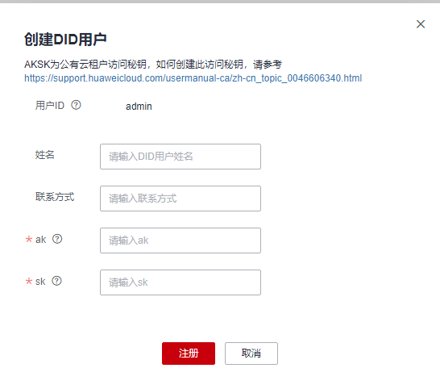
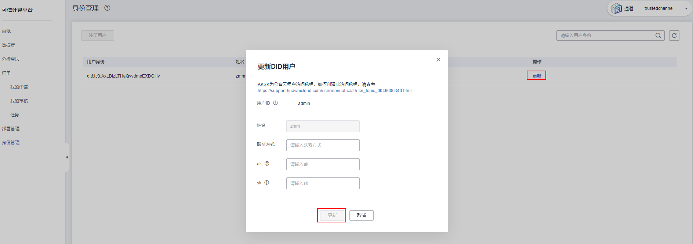

# 身份管理

可信计算平台管理是基于DID分布式身份的，因此在可信计算平台管理中一切业务活动都以DID身份为基础。当企业或组织添加可信计算后，即可创建其DID身份，以此身份进行业务活动。

本章节为您介绍注册用户和更新DID用户的方法。

## 注册用户

> **说明：** 
>-   系统用户：指登录可信计算平台的admin用户。可进行配置可信链代码操作，要执行其他操作需要创建并认证DID用户。
>-   DID用户：需要创建并认证DID用户后，才能进行数据集管理、分析算法管理、任务管理、订单管理页面操作。

1.  登录可信计算平台页面。单击左侧导航栏中的“身份管理”。
2.  单击“身份管理”页面中的“注册用户”。
3.  在注册用户界面输入“姓名”、“联系方式”、“ak”和“sk”。

    > **说明：** 
    >AK、SK为公有云租户访问秘钥，如何创建此访问秘钥，请参考：[我的凭证](https://support.huaweicloud.com/usermanual-ca/ca_01_0003.html)。

    **图 1**  注册用户  
    

4.  单击“注册”，完成注册。

## 更新DID用户

1.  登录可信计算平台页面。单击左侧导航栏中的“身份管理”。
2.  单击“身份管理”页面中，用户列表操作列的“更新”。

    

3.  单击“更新”，更新DID用户信息。

