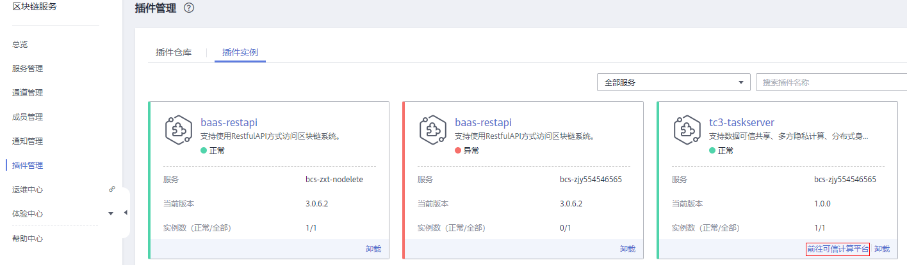
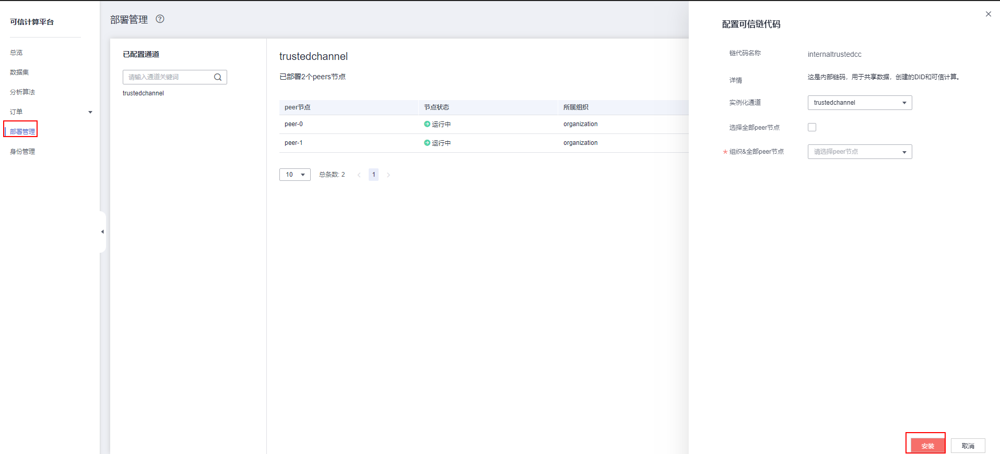

# 部署管理

可信计算平台通过可信链代码对区块链进行相关操作。部署可信计算链代码，安装并实例化可信协同计算相关智能合约。

本章节为您介绍部署可信计算链代码的方法。

1.  登录可信计算平台页面。

    请执行以下步骤进可信计算平台页面：

    1.  登录区块链服务管理控制台。
    2.  单击左侧导航栏中的“插件管理”。
    3.  在“插件实例”页签下，在可信插件卡片中，单击“前往可信计算平台”。
    4.  输入用户名、密码、验证码，单击登录。

        **图 1**  登录可信计算平台  
        

    > **说明：** 
    >-   您的初始用户名为admin，初始登录密码为您在部署区块链服务时设置的密码。为了保证系统安全，建议定期修改密码。
    >-   登录时，建议使用Firefox浏览器（38.0及以上版本）或Google Chrome浏览器（43.0及以上版本）效果更佳，进行操作若您使用的是IE浏览器，有可能会跳转失败并提示使用证书不受信任，此时您可以参考[Internet Explorer提供的指导方法](https://support.microsoft.com/zh-cn/topic/internet-explorer-11-%E6%B7%BB%E5%8A%A0%E4%BA%86%E5%AF%B9-http-%E4%B8%A5%E6%A0%BC%E4%BC%A0%E8%BE%93%E5%AE%89%E5%85%A8%E6%A0%87%E5%87%86%E7%9A%84%E6%94%AF%E6%8C%81-fa68823d-e59a-4119-9a87-f4130802ea70)进行处理。

2.  默认可信链代码已在默认通道trustedchannel上安装并实例化，如果有额外的通道请执行以下步骤。
3.  在可信计算平台页面单击左侧导航栏中的“部署管理”。
4.  单击页面右侧的“配置可信链代码”。
5.  在配置可信链代码界面根据需要选择“实例化通道”、“选择全部peer节点”或“组织&全部peer节点”等，如下图：

    **图 2**  配置可信链代码  
    

6.  单击“安装”，完成可信链代码安装。

