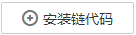
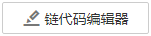
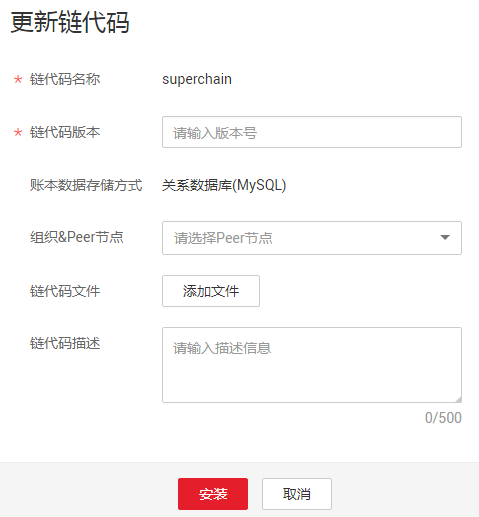
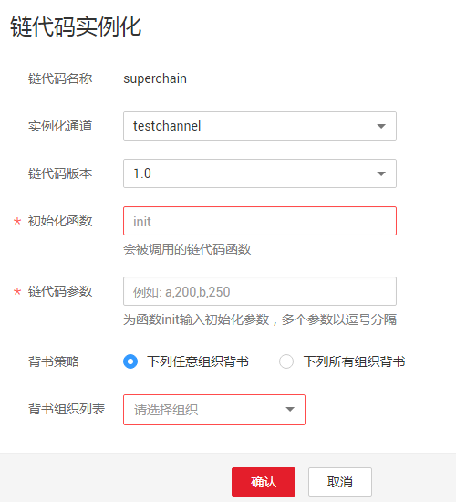

# 链代码管理

为您提供界面化链代码管理功能。

## 操作步骤

1.  登录链代码&区块管理页面。
    1.  登录区块链服务管理控制台。
    2.  单击服务列表操作列中的“链代码&区块管理”。
    3.  输入用户名、密码、验证码，点击登录。

        > **说明：**   
        >-   用户名为admin，初始登录密码为您在部署区块链服务时设置的密码。为了保证系统安全，建议定期修改密码。  
        >-   登录时，若您使用的是IE浏览器，有可能会跳转失败并提示使用证书不受信任，此时您可以[单击此处](https://support.microsoft.com/zh-cn/help/3071338/internet-explorer-11-adds-support-for-http-strict-transport-security-s)进行处理。  

2.  在链代码管理页面，您可以进行以下操作。

    **表 1**  操作列表

    
    <table><thead align="left"><tr id="row13312353168"><th class="cellrowborder" valign="top" width="16%" id="mcps1.2.3.1.1">
操作

    </th>
    <th class="cellrowborder" valign="top" width="84%" id="mcps1.2.3.1.2">
说明

    </th>
    </tr>
    </thead>
    <tbody><tr id="row3135164011912"><td class="cellrowborder" valign="top" width="16%" headers="mcps1.2.3.1.1 ">
安装链代码

    </td>
    <td class="cellrowborder" valign="top" width="84%" headers="mcps1.2.3.1.2 "><ol id="ol92201316245"><li>单击页面左上角的。</li><li>在安装界面输入“链代码名称”、“链代码版本”，选择安装链代码的Peer节点及链代码语言，添加链代码文件等，如下图。

    
 说明： 
<ul id="ul7609194912217"><li>链代码需要在每个组织的每个Peer节点均安装。</li><li>当账本数据存储方式为关系数据库时，链代码语言只支持golang。其他情况则支持golang与Nodejs。</li></ul>
    

    </li><li>单击“安装”。</li></ol>
    </td>
    </tr>
    <tr id="row156071345113920"><td class="cellrowborder" valign="top" width="16%" headers="mcps1.2.3.1.1 ">
链代码编辑器

    </td>
    <td class="cellrowborder" valign="top" width="84%" headers="mcps1.2.3.1.2 "><ol id="ol13575241405"><li>单击页面左上角的可使用BCS提供的在线链代码编辑器。</li><li>在链代码编辑器界面您可以进行链代码编辑、编译运行、初始化、API调用调试等多项操作。</li></ol>
    </td>
    </tr>
    <tr id="row20323513169"><td class="cellrowborder" valign="top" width="16%" headers="mcps1.2.3.1.1 ">
更新链代码

    </td>
    <td class="cellrowborder" valign="top" width="84%" headers="mcps1.2.3.1.2 "><ol id="ol187763404414"><li>链代码列表“操作”列的“更新链代码”。</li><li>填写链代码版本、选择安装节点、添加链代码文件等，单击“安装”。

    </li></ol>
    </td>
    </tr>
    <tr id="row63635201617"><td class="cellrowborder" valign="top" width="16%" headers="mcps1.2.3.1.1 ">
链代码实例化

    </td>
    <td class="cellrowborder" valign="top" width="84%" headers="mcps1.2.3.1.2 "><ol id="ol14191112711275"><li>单击链代码列表“操作”列的“实例化”。</li><li>选择实例化通道、链代码版本、背书策略、背书组织，并填写初始化函数、链代码参数等，</li><li>最后单击“确认”完成链代码在通道上的实例化。</li></ol>
    

    </td>
    </tr>
    <tr id="row391974893717"><td class="cellrowborder" valign="top" width="16%" headers="mcps1.2.3.1.1 ">
了解链代码详情

    </td>
    <td class="cellrowborder" valign="top" width="84%" headers="mcps1.2.3.1.2 ">
单击链代码名称前的，展开链代码详细信息，您可以查看当前链代码的版本列表、安装列表和实例化情况。

    </td>
    </tr>
    </tbody>
    </table>

    > **说明：**   
    >链代码的开发可参考[区块链服务开发指南](https://support.huaweicloud.com/devg-bcs/bcs_devg_0001.html)。  

