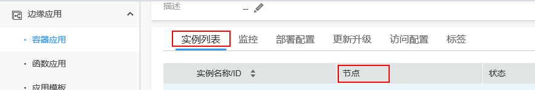
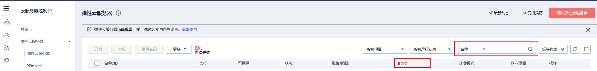
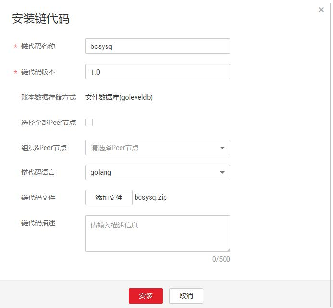
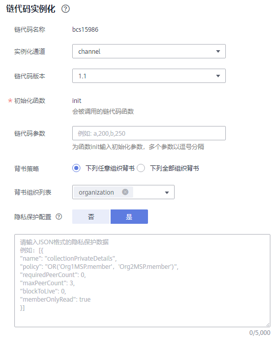
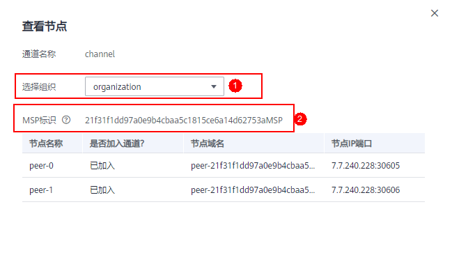
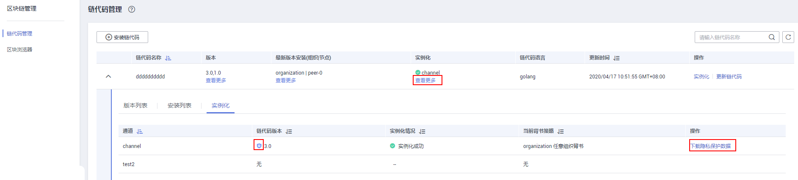

# 链代码管理<a name="bcs_usermanual_0003"></a>

为您提供界面化链代码管理功能，包括链代码安装、实例化、更新链代码。

## 约束与限制<a name="section97732313237"></a>

链代码安装前需要将开发的链代码文件压缩成zip格式以执行安装。

## 注意事项<a name="section1835510449446"></a>

1.  链代码安装前需要将开发的链代码文件压缩成zip格式以执行安装。
2.  如果链代码管理页面右上角出现“网络状态”异常提示，请不要立刻进行链代码管理操作，请稍等几分钟，待网络状态正常后，再进行操作。

    .png)


## 安装链代码<a name="section7324222174718"></a>

1.  登录区块链服务管理页面。
    -   如果部署在CCE集群上时，请执行以下步骤进区块链管理页面：
        1.  登录区块链服务管理控制台。
        2.  单击服务卡片中的“区块链管理”。
        3.  输入用户名、密码、验证码，单击“登录”。

            > **说明：** 
            >用户名为admin，初始登录密码为您在部署区块链服务时设置的资源初始密码。为了保证系统安全，建议定期修改密码。


    -   如果部署在边缘集群上时，请执行以下步骤进区块链管理页面：

        1.  登录IEF管理控制台。
        2.  选择左侧导航栏的“边缘应用 \> 容器应用“。
        3.  单击当前BCS服务的baas-agent容器，在实例列表中查看其边缘节点。

        **图 1**  查询边缘节点<a name="fig746531315507"></a>  
        

        1.  单击节点详情，查看主机名。
        2.  在弹性云服务中搜索主机名，查询纳管该边缘节点的弹性云服务器的IP（弹性公网）。

        **图 2**  查询弹性云服务器的IP<a name="fig44661813145015"></a>  
        

        1.  通过该地址https://IP:30603 访问区块链管理页面。
        2.  输入用户名、密码、验证码，单击登录。

            > **说明：** 
            >-   用户名为admin，初始登录密码为您在部署区块链服务时设置的资源初始密码。为了保证系统安全，建议定期修改密码。
            >-   登录时，若您使用的是IE浏览器，有可能会跳转失败并提示使用证书不受信任，此时您可以[单击此处](https://support.microsoft.com/zh-cn/help/3071338/internet-explorer-11-adds-support-for-http-strict-transport-security-s)进行处理。


2.  在链代码管理页面，单击“安装链代码”。
3.  在安装界面输入“链代码名称”、“链代码版本”，选择安装链代码的Peer节点及链代码语言，添加链代码文件等，如下图。

    

4.  单击“安装”。

## 实例化链代码<a name="section8809155514549"></a>

链代码安装后需要将链代码实例化到通道/链上，以便Peer节点通过链代码容器和分布式账本进行交互。

实例化链代码前，请确保先将组织中的Peer节点添加进通道/链中，否则无法实例化链代码。

1.  单击链代码列表“操作”列的“实例化”。
2.  选择实例化通道、链代码版本、背书策略、背书组织列表等，填写链代码参数。

    

3.  在“隐私保护配置”中输入JSON格式的隐私保护数据。

    如果您需要确保一个共享通道内数据的隐私性，例如指定A成员可以访问相关数据的权限，没有权限的成员B，则无法访问相关的数据，可以使用隐私保护功能。如果您的链代码不需要使用隐私保护功能，可以跳过本步骤。

    在配置隐私保护时，请参照示例进行配置，其中：

    -   name表示隐私数据空间的名称，此处为“collectionPrivateDetails”。
    -   policy表示隐私数据空间数据的访问策略，此处表示仅允许组织Org1和Org2的节点获取该隐私空间的数据。

        MSP标识获取方法：进入“通道管理”界面，在对应通道选择查看节点，切换组织，获取两个组织的MSP标识（如下图所示）。

        

    -   requiredPeerCount表示需要几个节点背书，并将隐私数据分发，此处为0表示自己背书。
    -   maxPeerCount表示共识节点最大个数，起冗余备份作用，若其中1个共识节点不可用，其他共识节点可以响应获取隐私数据的请求，此处配置为3。
    -   blockToLive表示可以保存的隐私数据最大块数，超过这个值，就会进行清除，若想无限存储，需要将该值设为0，此处设置为0。
    -   memberOnlyRead默认设置为true，只有该选项为true时policy中的策略才生效。

    隐私保护配置JSON定义举例：

    ```
    [
     {
        "name": "collectionPrivateDetails",
        "policy": "OR('<组织Org1的MSP标识>.member'，'<组织Org2的MSP标识>.member')",
        "requiredPeerCount": 0,
        "maxPeerCount": 3,
        "blockToLive":0,
        "memberOnlyRead": true
     }
    ]
    ```

    表示链码将使用一个叫做“collectionPrivateDetails”的隐私数据空间，只有组织“Org1”和“Org2”的节点才能获取该隐私空间内的数据。

    > **说明：** 
    >隐私保护配置中的“name”和“blockToLive” 一旦被设置，后续在升级链代码时，将不能对这两个值做修改。更多信息可以参考[Using Private Data in Fabric](https://hyperledger-fabric.readthedocs.io/en/release-1.4/private_data_tutorial.html?spm=a2c63.p38356.879954.12.159b3b3cr674N9)。

4.  最后单击“实例化”完成链代码在通道上的实例化。

    如果配置了隐私保护，实例化成功后，单击“查看更多”，可以下载隐私保护数据确认配置是否正确。

    **图 3**  下载隐私保护数据<a name="fig23821108472"></a>  
    

    若实例化失败，可根据[链代码实例化错误码列表](#section981510165457)查询错误信息以便定位失败原因。


## 更新链代码<a name="section13701331123"></a>

如果您的链代码更新，您需要对新版本链代码进行重新安装且实例化以满足新的业务需求。

1.  单击链代码列表“操作”列的“更新链代码”。
2.  填写链代码版本、选择安装节点、添加链代码文件等，单击“更新”。
3.  实例化新版本链代码，操作请参见[实例化链代码](#section8809155514549)。
4.  （可选）单击链代码名称前的，展开链代码详细信息，您可以查看当前链代码的版本列表、安装列表和实例化情况。

## 链代码实例化错误码列表<a name="section981510165457"></a>

链代码实例化过程中可能会由于种种原因，导致实例化失败。此时您可以在此表中查询错误码对应的错误信息。

**表 1**  错误码列表

<a name="table1479435354820"></a>
<table><thead align="left"><tr id="row57961653174817"><th class="cellrowborder" valign="top" width="28.82%" id="mcps1.2.3.1.1"><p id="p979610531481"><a name="p979610531481"></a><a name="p979610531481"></a>错误码</p>
</th>
<th class="cellrowborder" valign="top" width="71.17999999999999%" id="mcps1.2.3.1.2"><p id="p18796195310484"><a name="p18796195310484"></a><a name="p18796195310484"></a>异常信息</p>
</th>
</tr>
</thead>
<tbody><tr id="row187966539481"><td class="cellrowborder" valign="top" width="28.82%" headers="mcps1.2.3.1.1 "><p id="p13796155354810"><a name="p13796155354810"></a><a name="p13796155354810"></a>6001</p>
</td>
<td class="cellrowborder" valign="top" width="71.17999999999999%" headers="mcps1.2.3.1.2 "><p id="p187966537484"><a name="p187966537484"></a><a name="p187966537484"></a>执行超时</p>
</td>
</tr>
<tr id="row177961539483"><td class="cellrowborder" valign="top" width="28.82%" headers="mcps1.2.3.1.1 "><p id="p17961253204810"><a name="p17961253204810"></a><a name="p17961253204810"></a>6999</p>
</td>
<td class="cellrowborder" valign="top" width="71.17999999999999%" headers="mcps1.2.3.1.2 "><p id="p1679635354811"><a name="p1679635354811"></a><a name="p1679635354811"></a>未知错误</p>
</td>
</tr>
<tr id="row879617537484"><td class="cellrowborder" valign="top" width="28.82%" headers="mcps1.2.3.1.1 "><p id="p19796115354818"><a name="p19796115354818"></a><a name="p19796115354818"></a>6701</p>
</td>
<td class="cellrowborder" valign="top" width="71.17999999999999%" headers="mcps1.2.3.1.2 "><p id="p579665310481"><a name="p579665310481"></a><a name="p579665310481"></a>客户端连接Peer失败</p>
</td>
</tr>
<tr id="row379685315484"><td class="cellrowborder" valign="top" width="28.82%" headers="mcps1.2.3.1.1 "><p id="p1879675344813"><a name="p1879675344813"></a><a name="p1879675344813"></a>6703</p>
</td>
<td class="cellrowborder" valign="top" width="71.17999999999999%" headers="mcps1.2.3.1.2 "><p id="p679618532481"><a name="p679618532481"></a><a name="p679618532481"></a>Peer背书时，验证签名失败</p>
</td>
</tr>
<tr id="row19796185314483"><td class="cellrowborder" valign="top" width="28.82%" headers="mcps1.2.3.1.1 "><p id="p1179635311483"><a name="p1179635311483"></a><a name="p1179635311483"></a>6704</p>
</td>
<td class="cellrowborder" valign="top" width="71.17999999999999%" headers="mcps1.2.3.1.2 "><p id="p1579665318486"><a name="p1579665318486"></a><a name="p1579665318486"></a>链代码编译时，拉取ccenv镜像失败</p>
</td>
</tr>
<tr id="row5796185319483"><td class="cellrowborder" valign="top" width="28.82%" headers="mcps1.2.3.1.1 "><p id="p13796125317489"><a name="p13796125317489"></a><a name="p13796125317489"></a>6705</p>
</td>
<td class="cellrowborder" valign="top" width="71.17999999999999%" headers="mcps1.2.3.1.2 "><p id="p2796553134812"><a name="p2796553134812"></a><a name="p2796553134812"></a>链代码编译失败</p>
</td>
</tr>
<tr id="row5797135315488"><td class="cellrowborder" valign="top" width="28.82%" headers="mcps1.2.3.1.1 "><p id="p1979755313487"><a name="p1979755313487"></a><a name="p1979755313487"></a>6707</p>
</td>
<td class="cellrowborder" valign="top" width="71.17999999999999%" headers="mcps1.2.3.1.2 "><p id="p4797153134815"><a name="p4797153134815"></a><a name="p4797153134815"></a>链代码镜像构建失败</p>
</td>
</tr>
<tr id="row5627154020517"><td class="cellrowborder" valign="top" width="28.82%" headers="mcps1.2.3.1.1 "><p id="p46275404511"><a name="p46275404511"></a><a name="p46275404511"></a>6708</p>
</td>
<td class="cellrowborder" valign="top" width="71.17999999999999%" headers="mcps1.2.3.1.2 "><p id="p162704025112"><a name="p162704025112"></a><a name="p162704025112"></a>链代码容器创建失败</p>
</td>
</tr>
<tr id="row13208173835117"><td class="cellrowborder" valign="top" width="28.82%" headers="mcps1.2.3.1.1 "><p id="p122088387514"><a name="p122088387514"></a><a name="p122088387514"></a>6709</p>
</td>
<td class="cellrowborder" valign="top" width="71.17999999999999%" headers="mcps1.2.3.1.2 "><p id="p7208123835112"><a name="p7208123835112"></a><a name="p7208123835112"></a>链代码容器注册失败</p>
</td>
</tr>
<tr id="row075418355516"><td class="cellrowborder" valign="top" width="28.82%" headers="mcps1.2.3.1.1 "><p id="p137541935155114"><a name="p137541935155114"></a><a name="p137541935155114"></a>6710</p>
</td>
<td class="cellrowborder" valign="top" width="71.17999999999999%" headers="mcps1.2.3.1.2 "><p id="p18754735185112"><a name="p18754735185112"></a><a name="p18754735185112"></a>客户端连接Orderer失败</p>
</td>
</tr>
<tr id="row106431733165118"><td class="cellrowborder" valign="top" width="28.82%" headers="mcps1.2.3.1.1 "><p id="p8643533175115"><a name="p8643533175115"></a><a name="p8643533175115"></a>6712</p>
</td>
<td class="cellrowborder" valign="top" width="71.17999999999999%" headers="mcps1.2.3.1.2 "><p id="p17643113312519"><a name="p17643113312519"></a><a name="p17643113312519"></a>交易信息写入分布式账本失败</p>
</td>
</tr>
<tr id="row11439193120513"><td class="cellrowborder" valign="top" width="28.82%" headers="mcps1.2.3.1.1 "><p id="p14439231165111"><a name="p14439231165111"></a><a name="p14439231165111"></a>6713</p>
</td>
<td class="cellrowborder" valign="top" width="71.17999999999999%" headers="mcps1.2.3.1.2 "><p id="p44397317515"><a name="p44397317515"></a><a name="p44397317515"></a>Orderer判定请求错误</p>
</td>
</tr>
<tr id="row3362181764218"><td class="cellrowborder" valign="top" width="28.82%" headers="mcps1.2.3.1.1 "><p id="p1362117184216"><a name="p1362117184216"></a><a name="p1362117184216"></a>6714</p>
</td>
<td class="cellrowborder" valign="top" width="71.17999999999999%" headers="mcps1.2.3.1.2 "><p id="p1636218173421"><a name="p1636218173421"></a><a name="p1636218173421"></a>背书策略校验失败</p>
</td>
</tr>
<tr id="row14781296511"><td class="cellrowborder" valign="top" width="28.82%" headers="mcps1.2.3.1.1 "><p id="p1580829155119"><a name="p1580829155119"></a><a name="p1580829155119"></a>6715</p>
</td>
<td class="cellrowborder" valign="top" width="71.17999999999999%" headers="mcps1.2.3.1.2 "><p id="p1780132975111"><a name="p1780132975111"></a><a name="p1780132975111"></a>同一个Peer节点上，不能同时实例化多个链代码</p>
</td>
</tr>
<tr id="row18768182665113"><td class="cellrowborder" valign="top" width="28.82%" headers="mcps1.2.3.1.1 "><p id="p076816264518"><a name="p076816264518"></a><a name="p076816264518"></a>6716</p>
</td>
<td class="cellrowborder" valign="top" width="71.17999999999999%" headers="mcps1.2.3.1.2 "><p id="p1176822685120"><a name="p1176822685120"></a><a name="p1176822685120"></a>实例化时，init参数错误</p>
</td>
</tr>
<tr id="row15343162455114"><td class="cellrowborder" valign="top" width="28.82%" headers="mcps1.2.3.1.1 "><p id="p53431724155111"><a name="p53431724155111"></a><a name="p53431724155111"></a>6717</p>
</td>
<td class="cellrowborder" valign="top" width="71.17999999999999%" headers="mcps1.2.3.1.2 "><p id="p8343152413518"><a name="p8343152413518"></a><a name="p8343152413518"></a>实例化时，invoke参数错误</p>
</td>
</tr>
<tr id="row139891321125110"><td class="cellrowborder" valign="top" width="28.82%" headers="mcps1.2.3.1.1 "><p id="p8989162125111"><a name="p8989162125111"></a><a name="p8989162125111"></a>6720</p>
</td>
<td class="cellrowborder" valign="top" width="71.17999999999999%" headers="mcps1.2.3.1.2 "><p id="p89891721205113"><a name="p89891721205113"></a><a name="p89891721205113"></a>证书创建失败</p>
</td>
</tr>
<tr id="row19679131916519"><td class="cellrowborder" valign="top" width="28.82%" headers="mcps1.2.3.1.1 "><p id="p6679121925118"><a name="p6679121925118"></a><a name="p6679121925118"></a>6721</p>
</td>
<td class="cellrowborder" valign="top" width="71.17999999999999%" headers="mcps1.2.3.1.2 "><p id="p196793193510"><a name="p196793193510"></a><a name="p196793193510"></a>链代码容器启动超时</p>
</td>
</tr>
<tr id="row153319174513"><td class="cellrowborder" valign="top" width="28.82%" headers="mcps1.2.3.1.1 "><p id="p15533141705113"><a name="p15533141705113"></a><a name="p15533141705113"></a>6722</p>
</td>
<td class="cellrowborder" valign="top" width="71.17999999999999%" headers="mcps1.2.3.1.2 "><p id="p65338178519"><a name="p65338178519"></a><a name="p65338178519"></a>链代码容器启动后执行init时遇到异常退出，导致交易超时</p>
</td>
</tr>
<tr id="row125320152512"><td class="cellrowborder" valign="top" width="28.82%" headers="mcps1.2.3.1.1 "><p id="p85341555118"><a name="p85341555118"></a><a name="p85341555118"></a>6723</p>
</td>
<td class="cellrowborder" valign="top" width="71.17999999999999%" headers="mcps1.2.3.1.2 "><p id="p135314151511"><a name="p135314151511"></a><a name="p135314151511"></a>包含相同Schema的链代码已经实例化</p>
</td>
</tr>
<tr id="row156652589409"><td class="cellrowborder" valign="top" width="28.82%" headers="mcps1.2.3.1.1 "><p id="p666617580403"><a name="p666617580403"></a><a name="p666617580403"></a>6725</p>
</td>
<td class="cellrowborder" valign="top" width="71.17999999999999%" headers="mcps1.2.3.1.2 "><p id="p1366685844017"><a name="p1366685844017"></a><a name="p1366685844017"></a>签名集不满足背书策略</p>
</td>
</tr>
<tr id="row39415262416"><td class="cellrowborder" valign="top" width="28.82%" headers="mcps1.2.3.1.1 "><p id="p139411526114119"><a name="p139411526114119"></a><a name="p139411526114119"></a>6726</p>
</td>
<td class="cellrowborder" valign="top" width="71.17999999999999%" headers="mcps1.2.3.1.2 "><p id="p11941172624115"><a name="p11941172624115"></a><a name="p11941172624115"></a>实例化策略校验失败，请使用老组织节点升级链代码</p>
</td>
</tr>
<tr id="row1358261215111"><td class="cellrowborder" valign="top" width="28.82%" headers="mcps1.2.3.1.1 "><p id="p6582212135118"><a name="p6582212135118"></a><a name="p6582212135118"></a>6901</p>
</td>
<td class="cellrowborder" valign="top" width="71.17999999999999%" headers="mcps1.2.3.1.2 "><p id="p115841012145119"><a name="p115841012145119"></a><a name="p115841012145119"></a>失败，实例化版本链码必须包含上版本所有表</p>
</td>
</tr>
<tr id="row7299167513"><td class="cellrowborder" valign="top" width="28.82%" headers="mcps1.2.3.1.1 "><p id="p102991164517"><a name="p102991164517"></a><a name="p102991164517"></a>6902</p>
</td>
<td class="cellrowborder" valign="top" width="71.17999999999999%" headers="mcps1.2.3.1.2 "><p id="p122994612512"><a name="p122994612512"></a><a name="p122994612512"></a>失败，实例化版本链码必须包含上版本所有字段</p>
</td>
</tr>
<tr id="row10871178135116"><td class="cellrowborder" valign="top" width="28.82%" headers="mcps1.2.3.1.1 "><p id="p1587198145114"><a name="p1587198145114"></a><a name="p1587198145114"></a>6903</p>
</td>
<td class="cellrowborder" valign="top" width="71.17999999999999%" headers="mcps1.2.3.1.2 "><p id="p08716865117"><a name="p08716865117"></a><a name="p08716865117"></a>失败，实例化版本链码不能改变上版本字段属性</p>
</td>
</tr>
<tr id="row41247735315"><td class="cellrowborder" valign="top" width="28.82%" headers="mcps1.2.3.1.1 "><p id="p121241879536"><a name="p121241879536"></a><a name="p121241879536"></a>6904</p>
</td>
<td class="cellrowborder" valign="top" width="71.17999999999999%" headers="mcps1.2.3.1.2 "><p id="p15124379531"><a name="p15124379531"></a><a name="p15124379531"></a>实例化版本链码的schema文件不存在</p>
</td>
</tr>
<tr id="row2097615412532"><td class="cellrowborder" valign="top" width="28.82%" headers="mcps1.2.3.1.1 "><p id="p2976243537"><a name="p2976243537"></a><a name="p2976243537"></a>6905</p>
</td>
<td class="cellrowborder" valign="top" width="71.17999999999999%" headers="mcps1.2.3.1.2 "><p id="p897610418536"><a name="p897610418536"></a><a name="p897610418536"></a>实例化版本链码的schema文件解析错误</p>
</td>
</tr>
<tr id="row69271354172119"><td class="cellrowborder" valign="top" width="28.82%" headers="mcps1.2.3.1.1 "><p id="p49281154112115"><a name="p49281154112115"></a><a name="p49281154112115"></a>6906</p>
</td>
<td class="cellrowborder" valign="top" width="71.17999999999999%" headers="mcps1.2.3.1.2 "><p id="p49281854102115"><a name="p49281854102115"></a><a name="p49281854102115"></a>磁盘空间不足</p>
</td>
</tr>
</tbody>
</table>

