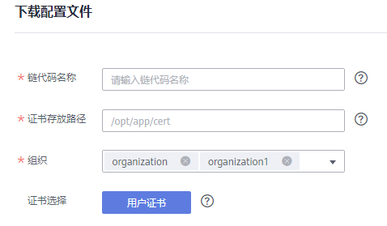

# 下载配置文件

BCS支持执行链代码、查询链代码等功能。开发应用之前您需要进行配置文件下载，配置文件中包含用户证书和SDK。

-   使用用户证书进行普通的交易和查询操作。
-   SDK基于该配置文件可以方便地访问区块链网络并完成事务处理，您可以免去手工配置的繁琐流程。

> **说明：** 
>请妥善保管下载用户证书中的私钥，建议您对私钥进行加密存储。

1.  登录区块链服务管理控制台。
2.  单击左侧导航栏中的“服务管理”，选择华为链。
3.  请根据实际情况按如下方式选择下载配置文件：
    -   基于华为云资源部署的华为链服务：在服务卡片的右上角单击“下载配置文件”。

        **图 1**  下载配置文件  
        

    -   基于边缘集群部署的华为链服务：
        1.  单击服务名称，进入服务概览页面。
        2.  登录边缘侧Console页面。
        3.  单击链代码“操作”列的“下载配置文件”。

4.  配置SDK参数信息如下[表1](#zh-cn_topic_0000001152808299_table1234405715376)。

    **图 2**  配置文件页面  
    

    **表 1**  参数表

    
    <table><thead align="left"><tr id="zh-cn_topic_0000001152808299_row16344557173718"><th class="cellrowborder" valign="top" width="21%" id="mcps1.2.3.1.1">
参数名称

    </th>
    <th class="cellrowborder" valign="top" width="79%" id="mcps1.2.3.1.2">
说明

    </th>
    </tr>
    </thead>
    <tbody><tr id="zh-cn_topic_0000001152808299_row834415712379"><td class="cellrowborder" valign="top" width="21%" headers="mcps1.2.3.1.1 ">
链代码名称

    </td>
    <td class="cellrowborder" valign="top" width="79%" headers="mcps1.2.3.1.2 ">
根据您的实际情况填写。链代码名称需要和链代码安装、实例化时的一致。

    </td>
    </tr>
    <tr id="zh-cn_topic_0000001152808299_row634415575377"><td class="cellrowborder" valign="top" width="21%" headers="mcps1.2.3.1.1 ">
证书存放路径

    </td>
    <td class="cellrowborder" valign="top" width="79%" headers="mcps1.2.3.1.2 ">
用户在编译应用程序时，证书的最终存放路径。如果证书路径后期有变更，您需要手动修改SDK配置文件中所有证书相关路径。

    </td>
    </tr>
    <tr id="zh-cn_topic_0000001152808299_row1734411576374"><td class="cellrowborder" valign="top" width="21%" headers="mcps1.2.3.1.1 ">
组织

    </td>
    <td class="cellrowborder" valign="top" width="79%" headers="mcps1.2.3.1.2 ">
选择组织。

    </td>
    </tr>
    <tr id="zh-cn_topic_0000001152808299_row20344175712371"><td class="cellrowborder" valign="top" width="21%" headers="mcps1.2.3.1.1 ">
证书选择

    </td>
    <td class="cellrowborder" valign="top" width="79%" headers="mcps1.2.3.1.2 ">
用户证书

    </td>
    </tr>
    </tbody>
    </table>

5.  单击“下载”。
6.  将下载的配置文件压缩包解压并放置在某应用目录中，使应用程序可访问，下载后解压出yaml文件备用。

