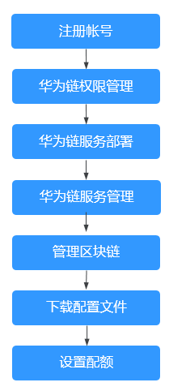

# 使用流程

区块链服务BCS提供服务部署、区块链管理、业务链管理等功能。以下为区块链服务使用全景图，希望对您的使用有所引导及帮助。

> **说明：** 
>BCS本身不涉及用户敏感信息。使用BCS处理数据的目的、范围、处理方式、时限等请遵从当地适用的法律法规。BCS本身不建议传输和存储敏感数据，如果传输和存储敏感数据，请自行加密后再传输和存储。

**图 1**  华为链使用流程  

1.  [注册账号](华为链权限管理.md)

    新用户请先注册完成实名认证，具体请参见[帐号注册](https://support.huaweicloud.com/usermanual-account/account_id_001.html)和[帐号实名认证](https://support.huaweicloud.com/usermanual-account/account_auth_00001.html)。

2.  [华为链权限管理](华为链权限管理.md)

    创建用户并授权使用BCS。

3.  [华为链服务部署](基于华为云资源部署.md)

    购买华为链服务。

4.  [华为链服务管理](华为链服务管理.md)

    提供华为链管理功能，可实时查看华为链服务运行状况，并对区块链服务做相应的操作。

5.  [管理区块链](管理区块链.md)

    提供界面化链代码管理功能，包括链代码安装、实例化、更新链代码。

6.  [下载配置文件](下载配置文件.md)

    开发应用之前需要进行配置文件下载，配置文件中包含用户证书和SDK。

7.  [设置配额](设置配额.md)

    支持查看服务的配额使用情况和扩大配额。

