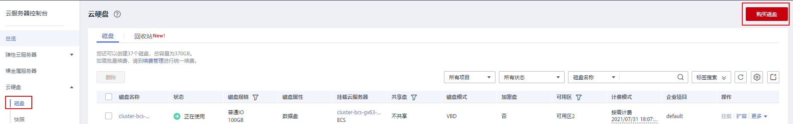
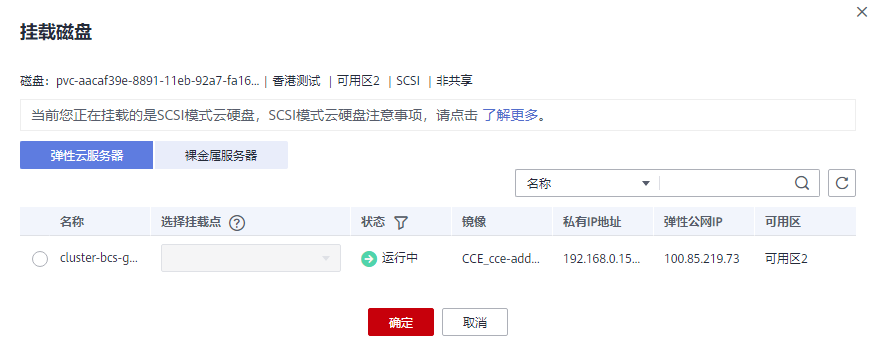
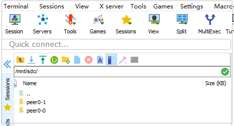
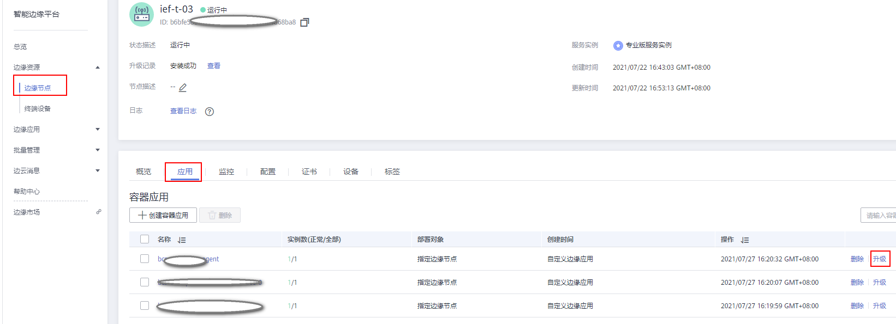
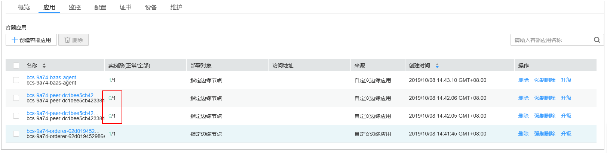
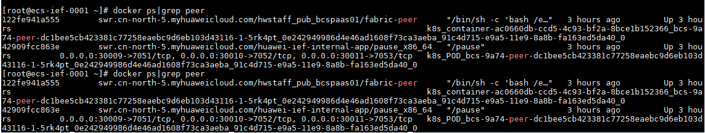
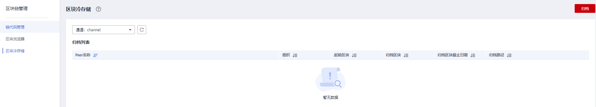
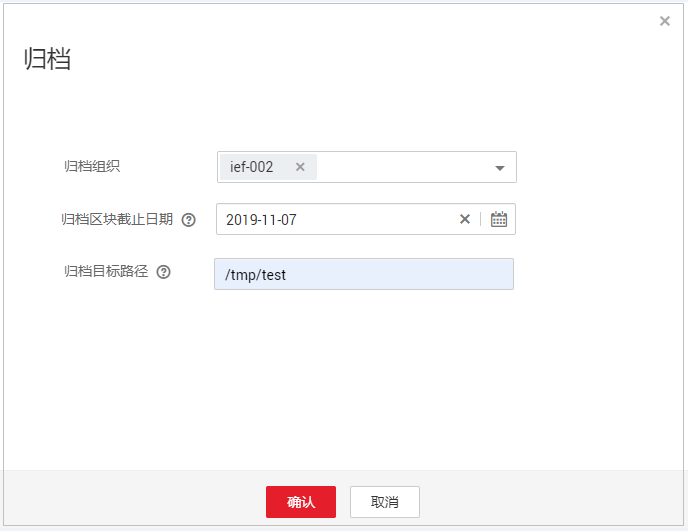

# 区块冷存储

## 区块冷存储

随着时间的推移或者业务量的增加，区块链分布式账本不断增加，数据越来越多，磁盘空间将面临不足的问题，累积的历史数据还会导致交易的性能下降，以致业务无法正常运行。

区块冷存储指将历史区块链分布式账本数据进行归档存储，防止账本数据膨胀导致区块链服务异常，已归档的账本数据还可以进行查询。

## 使用前提

-   区块冷存储只针对IEF模式的Fabric架构中1.4.0版本和2.2版本的BCS服务使用，并且建议在“节点绑定”模式下使用。
-   边缘节点服务器的时间，均务必与实际时间相同（时区可不同）。
-   必须升级至BCS 3.0.6及以上版本，方可使用账本冷存储功能。

## 如何使用

1.  购买磁盘。
    1.  进入云服务器控制台，选择“云硬盘 \> 磁盘 \> 购买磁盘”。详细操作请参考[购买磁盘](https://support.huaweicloud.com/qs-evs/zh-cn_topic_0021738346.html)。

        **图 1**  购买磁盘  
        

        > **说明：** 
        >购买磁盘选择的可用区需要与ECS服务器所在的可用区相同。

    2.  单击新购买磁盘操作列的“挂载”，选择纳管节点的ECS服务器以及挂载点（数据盘）。

        **图 2**  挂载磁盘  
        

2.  磁盘分区以及本地挂载。
    1.  将新购买的磁盘挂载至本地**/mnt/sdc**路径，并设置开机自动挂载磁盘分区。详情请参考：[初始化Linux数据盘](https://support.huaweicloud.com/qs-evs/evs_01_0034.html)。
    2.  在本地挂载路径**/mnt/sdc/**下建立若干个子路径，分别对应各peer节点。

        **图 3**  创建子路径  
        

3.  挂载磁盘至peer节点容器内路径。
    1.  进入智能边缘平台（IEF服务），选择“边缘资源 \> 边缘节点 \> 选择BCS服务所在节点 \> 应用 \> peer容器 \> 升级”。

        **图 4**  容器升级  
        

    2.  在“高级配置”中，选择“数据存储 \> 添加卷 ”，填写挂载信息，并单击“提交”。

        **图 5**  高级配置  
        

        
        <table><thead align="left"><tr id="row19705155622616"><th class="cellrowborder" valign="top" width="50%" id="mcps1.1.3.1.1">
参数

        </th>
        <th class="cellrowborder" valign="top" width="50%" id="mcps1.1.3.1.2">
值

        </th>
        </tr>
        </thead>
        <tbody><tr id="row27051856172617"><td class="cellrowborder" valign="top" width="50%" headers="mcps1.1.3.1.1 ">
本地卷名称

        </td>
        <td class="cellrowborder" valign="top" width="50%" headers="mcps1.1.3.1.2 ">
data0（可自由填写）

        </td>
        </tr>
        <tr id="row7705656112611"><td class="cellrowborder" rowspan="2" valign="top" width="50%" headers="mcps1.1.3.1.1 ">
类型

        </td>
        <td class="cellrowborder" valign="top" width="50%" headers="mcps1.1.3.1.2 ">
hostPath

        </td>
        </tr>
        <tr id="row1970585642615"><td class="cellrowborder" valign="top" headers="mcps1.1.3.1.1 ">
/mnt/sdc/peer0-1（本地挂载路径, peer0-1为路径下建立的子路径，每个子路径对应一个peer）

        </td>
        </tr>
        <tr id="row870515614262"><td class="cellrowborder" valign="top" width="50%" headers="mcps1.1.3.1.1 ">
挂载目录

        </td>
        <td class="cellrowborder" valign="top" width="50%" headers="mcps1.1.3.1.2 ">
/tmp/test（容器内路径）

        
 说明： 

各peer容器需要选择相同路径。并且请记录各peer所挂载的路径，BCS服务版本升级后，容器内原挂载路径将会失效，需要重新挂载原网盘至原有路径（已转储的数据不会丢失，保留在网盘中，重新挂载后即可恢复）。

        

        </td>
        </tr>
        <tr id="row1270545662615"><td class="cellrowborder" valign="top" width="50%" headers="mcps1.1.3.1.1 ">
权限

        </td>
        <td class="cellrowborder" valign="top" width="50%" headers="mcps1.1.3.1.2 ">
读写

        </td>
        </tr>
        </tbody>
        </table>

    3.  等待容器应用重启，实例数变为1/1后，表示重启成功，磁盘挂载成功。

        **图 6**  磁盘挂载成功  
        

    4.  登录Peer节点所在的云服务器，执行如下命令查看peer节点ID。

        **docker ps|grep peer**

        **图 7**  peer节点的ID  
        

    5.  执行如下命令，分别进入各peer容器。

        **docker exec -u root -it**  容器ID  **bash**

    6.  执行如下命令，将转储路径用户修改为**paas**用户。

        **chown -R paas:paas /tmp/test**

4.  将历史分布式账本数据进行冷存储。
    1.  进入区块链服务控制台，选择对应版本的BCS服务，进入区块链管理页面。
    2.  在“区块链管理”页面，选择“区块冷存储”，单击左上角通道下拉框，选取待归档的通道。

        **图 8**  选择归档通道  
        

    3.  单击右上角的“归档”，填写参数信息后，单击“确定”，开始归档操作。

        -   归档组织”：选择需要归档的组织。
        -   归档区块截止时间：将所选日期及其之前产生的所有区块数据进行归档。
        -   归档目标路径：填写容器内的磁盘挂载目录，老账本数据将归档至该路径中。

        **图 9**  归档操作  
        

    4.  归档成功后，可以在归档列表中查询已归档的区块信息，包括起始区块、归档区块，归档路径等。

