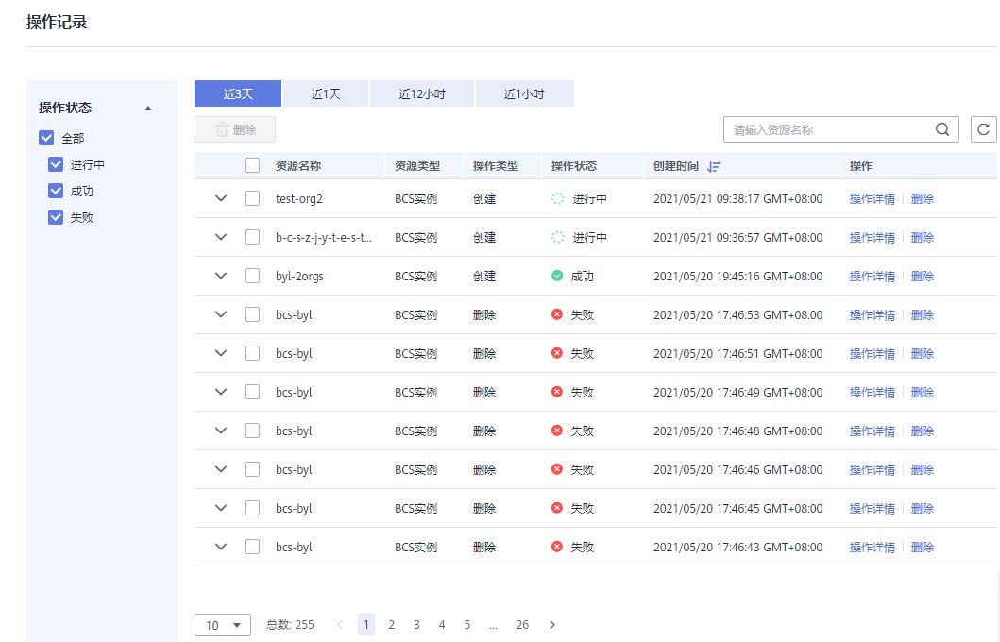

# 基于华为云资源部署

本页面介绍如何基于华为云资源创建华为链服务。

## 前提条件

如果您使用华为云帐号创建的IAM用户进行操作，IAM用户需要具备足够的权限才能操作并订购区块链服务。具体操作请参见：[华为链权限管理](华为链权限管理.md)。

您可以通过先创建用户组并授权再将用户加入到用户组的方式，使用户具有用户组中的权限。

## 部署区块链服务

完成环境准备工作后，可按照如下步骤购买并部署区块链服务。

1.  登录区块链服务管理控制台，进入“服务管理”，在华为链页面单击“购买”。

    > **说明：** 
    >已部署的服务，单击左侧导航栏中的“服务管理”，单击右侧的“操作记录”，查看操作记录并在服务右侧进行“操作详情”及“删除”操作。

2.  根据界面提示，配置区块链基本信息，参数如[表1](#zh-cn_topic_0000001105888388_table1025291617346)所示。

    **表 1**  基本信息配置

    
    <table><thead align="left"><tr id="zh-cn_topic_0000001105888388_row5250916183411"><th class="cellrowborder" valign="top" width="21.92%" id="mcps1.2.4.1.1">
参数

    </th>
    <th class="cellrowborder" valign="top" width="53.02%" id="mcps1.2.4.1.2">
描述

    </th>
    <th class="cellrowborder" valign="top" width="25.06%" id="mcps1.2.4.1.3">
示例

    </th>
    </tr>
    </thead>
    <tbody><tr id="zh-cn_topic_0000001105888388_row19250191616348"><td class="cellrowborder" valign="top" width="21.92%" headers="mcps1.2.4.1.1 ">
计费模式

    </td>
    <td class="cellrowborder" valign="top" width="53.02%" headers="mcps1.2.4.1.2 ">
区块链服务管理费收费模式，支持包年/包月。

    </td>
    <td class="cellrowborder" valign="top" width="25.06%" headers="mcps1.2.4.1.3 ">
包年/包月

    </td>
    </tr>
    <tr id="zh-cn_topic_0000001105888388_row525011611341"><td class="cellrowborder" valign="top" width="21.92%" headers="mcps1.2.4.1.1 ">
区域

    </td>
    <td class="cellrowborder" valign="top" width="53.02%" headers="mcps1.2.4.1.2 ">
区块链基础设施所在的区域，建议选择与业务应用系统相同的地域。

    </td>
    <td class="cellrowborder" valign="top" width="25.06%" headers="mcps1.2.4.1.3 ">
使用默认区域

    </td>
    </tr>
    <tr id="zh-cn_topic_0000001105888388_row14250141693410"><td class="cellrowborder" valign="top" width="21.92%" headers="mcps1.2.4.1.1 ">
区块链服务名称

    </td>
    <td class="cellrowborder" valign="top" width="53.02%" headers="mcps1.2.4.1.2 ">
支持英文字符、数字及中划线，不能以中划线开头，长度为4-24个字符。

    </td>
    <td class="cellrowborder" valign="top" width="25.06%" headers="mcps1.2.4.1.3 ">
bcs-wh

    </td>
    </tr>
    <tr id="row20437154244918"><td class="cellrowborder" valign="top" width="21.92%" headers="mcps1.2.4.1.1 ">
管理模式

    </td>
    <td class="cellrowborder" valign="top" width="53.02%" headers="mcps1.2.4.1.2 ">
选择云端管理：使用华为云资源管理区块链数据。

    </td>
    <td class="cellrowborder" valign="top" width="25.06%" headers="mcps1.2.4.1.3 ">
云端管理

    </td>
    </tr>
    <tr id="zh-cn_topic_0000001105888388_row1225119161341"><td class="cellrowborder" valign="top" width="21.92%" headers="mcps1.2.4.1.1 ">
版本类型

    </td>
    <td class="cellrowborder" valign="top" width="53.02%" headers="mcps1.2.4.1.2 ">
BCS提供专业版、企业版和铂金版供您选择。

    </td>
    <td class="cellrowborder" valign="top" width="25.06%" headers="mcps1.2.4.1.3 ">
专业版

    </td>
    </tr>
    <tr id="zh-cn_topic_0000001105888388_row1025118168348"><td class="cellrowborder" valign="top" width="21.92%" headers="mcps1.2.4.1.1 ">
组织配置

    </td>
    <td class="cellrowborder" valign="top" width="53.02%" headers="mcps1.2.4.1.2 ">
支持增加组织成员数。

    
专业版支持最大成员组织数2个，企业版支持最大成员组织数10个。

    </td>
    <td class="cellrowborder" valign="top" width="25.06%" headers="mcps1.2.4.1.3 ">
-

    </td>
    </tr>
    <tr id="zh-cn_topic_0000001105888388_row925201614347"><td class="cellrowborder" valign="top" width="21.92%" headers="mcps1.2.4.1.1 ">
高级设置

    </td>
    <td class="cellrowborder" valign="top" width="53.02%" headers="mcps1.2.4.1.2 "><ul id="zh-cn_topic_0000001105888388_ul182511116173419"><li>共识策略：区块链网络中节点之间达成共识需要遵从的规则。默认为Raft(CFT)策略。</li><li>安全机制：保证数据安全的加密算法，默认为ECDSA；支持国密算法。</li></ul>
    </td>
    <td class="cellrowborder" valign="top" width="25.06%" headers="mcps1.2.4.1.3 ">
-

    </td>
    </tr>
    <tr id="zh-cn_topic_0000001105888388_row325231643412"><td class="cellrowborder" valign="top" width="21.92%" headers="mcps1.2.4.1.1 ">
购买时长

    </td>
    <td class="cellrowborder" valign="top" width="53.02%" headers="mcps1.2.4.1.2 ">
支持自定义购买服务的使用时间，最短1个月。

    
您可根据需要选择勾选自动续费，按月购买的自动续费周期为1个月，按年购买的自动续费周期为1年。

    </td>
    <td class="cellrowborder" valign="top" width="25.06%" headers="mcps1.2.4.1.3 ">
默认1个月

    </td>
    </tr>
    </tbody>
    </table>

3.  单击“立即创建”。
4.  确认配置信息无误后，勾选协议和免责声明，并单击“提交”。
5.  进入支付页面，确认订单费用无误后，单击“确认付款”，订单支付成功后，即可返回区块链服务控制台查看正在创建的服务。
6.  服务创建大概需要18-25分钟，请耐心等待。服务创建成功后，查看服务状态变为“正常”后，表示区块链服务部署完成。

## 后续操作（可选）

已部署的服务，支持查看创建、删除等操作记录。左侧操作状态栏会展示已有操作记录的状态，操作状态类型包括：进行中、成功和失败。

**图 1**  华为链操作记录  

系统将保留最近三天的操作记录。

1.  登录区块链服务管理控制台，单击左侧导航栏中的“服务管理”，选择华为链。
2.  单击“操作记录”，查看各个资源的操作记录。

    您可以按资源名称搜索操作记录，还可以在资源所在行进行“操作详情”及“删除”操作。

