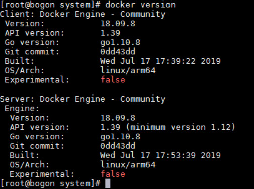
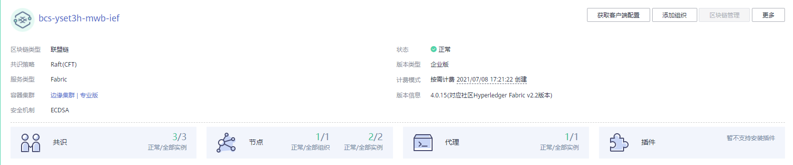

# 基于边缘集群<a name="bcs_usermanual_0011"></a>

区块链服务支持在CCE集群和边缘集群上部署，本页面介绍如何部署基于边缘集群的区块链服务。

同一个区块链服务所使用的多个边缘节点，这些边缘节点之间需要内部网络互通，区块链服务才能正常工作。

## 节点要求<a name="section1360710816419"></a>

**表 1**  边缘节点规格要求

<a name="table155322618422"></a>
<table><thead align="left"><tr id="row10554102674213"><th class="cellrowborder" valign="top" width="17.82%" id="mcps1.2.3.1.1"><p id="p1155472684214"><a name="p1155472684214"></a><a name="p1155472684214"></a>项目</p>
</th>
<th class="cellrowborder" valign="top" width="82.17999999999999%" id="mcps1.2.3.1.2"><p id="p45541261422"><a name="p45541261422"></a><a name="p45541261422"></a>规格要求</p>
</th>
</tr>
</thead>
<tbody><tr id="row113111068288"><td class="cellrowborder" valign="top" width="17.82%" headers="mcps1.2.3.1.1 "><p id="p1297822415617"><a name="p1297822415617"></a><a name="p1297822415617"></a>OS</p>
</td>
<td class="cellrowborder" valign="top" width="82.17999999999999%" headers="mcps1.2.3.1.2 "><a name="ul81515583324"></a><a name="ul81515583324"></a><ul id="ul81515583324"><li>x86_64架构<p id="p537919594322"><a name="p537919594322"></a><a name="p537919594322"></a>Ubuntu 16.04 LTS (Xenial Xerus)、Ubuntu 18.04 LTS (Bionic Beaver) 、CentOS 7.x 和RHEL 7.x、银河麒麟4.0.2、中兴新支点v5.5、中标麒麟v7.0</p>
</li><li>armv7i（arm32）架构<p id="p665115093317"><a name="p665115093317"></a><a name="p665115093317"></a>Raspbian GNU/Linux 9 (stretch)</p>
</li><li>aarch64（arm64）架构<p id="p45101517335"><a name="p45101517335"></a><a name="p45101517335"></a>Ubuntu 18.04.2 LTS (Bionic Beaver)</p>
</li></ul>
</td>
</tr>
<tr id="row123101467282"><td class="cellrowborder" valign="top" width="17.82%" headers="mcps1.2.3.1.1 "><p id="p199785241567"><a name="p199785241567"></a><a name="p199785241567"></a>内存</p>
</td>
<td class="cellrowborder" valign="top" width="82.17999999999999%" headers="mcps1.2.3.1.2 "><p id="p1897815243569"><a name="p1897815243569"></a><a name="p1897815243569"></a>边缘软件开销约128MB，为保证业务的正常运行，建议边缘节点的内存大于256MB</p>
</td>
</tr>
<tr id="row133101163287"><td class="cellrowborder" valign="top" width="17.82%" headers="mcps1.2.3.1.1 "><p id="p697918247565"><a name="p697918247565"></a><a name="p697918247565"></a>CPU</p>
</td>
<td class="cellrowborder" valign="top" width="82.17999999999999%" headers="mcps1.2.3.1.2 "><p id="p29794244569"><a name="p29794244569"></a><a name="p29794244569"></a>&gt;=1核</p>
</td>
</tr>
<tr id="row163106652820"><td class="cellrowborder" valign="top" width="17.82%" headers="mcps1.2.3.1.1 "><p id="p67191519112514"><a name="p67191519112514"></a><a name="p67191519112514"></a>硬盘</p>
</td>
<td class="cellrowborder" valign="top" width="82.17999999999999%" headers="mcps1.2.3.1.2 "><p id="p2719171917254"><a name="p2719171917254"></a><a name="p2719171917254"></a>&gt;=1GB</p>
</td>
</tr>
<tr id="row11309126152810"><td class="cellrowborder" valign="top" width="17.82%" headers="mcps1.2.3.1.1 "><p id="p3106211114610"><a name="p3106211114610"></a><a name="p3106211114610"></a>GPU（可选）</p>
</td>
<td class="cellrowborder" valign="top" width="82.17999999999999%" headers="mcps1.2.3.1.2 "><p id="p18651721174615"><a name="p18651721174615"></a><a name="p18651721174615"></a>同一个边缘节点上的GPU型号必须相同。</p>
<div class="note" id="note16132114154310"><a name="note16132114154310"></a><a name="note16132114154310"></a><span class="notetitle"> 说明： </span><div class="notebody"><p id="p61344416434"><a name="p61344416434"></a><a name="p61344416434"></a>当前支持Nvidia Tesla系列P4、P40、T4等型号GPU。</p>
<p id="p74591838185310"><a name="p74591838185310"></a><a name="p74591838185310"></a>含有GPU硬件的机器，作为边缘节点的时候可以不适用GPU。</p>
<p id="p380735918531"><a name="p380735918531"></a><a name="p380735918531"></a>如果边缘节点使用GPU，您需要在纳管前安装GPU驱动。</p>
</div></div>
</td>
</tr>
<tr id="row121283243566"><td class="cellrowborder" valign="top" width="17.82%" headers="mcps1.2.3.1.1 "><p id="p7128202418562"><a name="p7128202418562"></a><a name="p7128202418562"></a>NPU（可选）</p>
</td>
<td class="cellrowborder" valign="top" width="82.17999999999999%" headers="mcps1.2.3.1.2 "><p id="p181281024185611"><a name="p181281024185611"></a><a name="p181281024185611"></a>华为昇腾AI加速处理器。</p>
<div class="note" id="note348912975718"><a name="note348912975718"></a><a name="note348912975718"></a><span class="notetitle"> 说明： </span><div class="notebody"><p id="p1489119165716"><a name="p1489119165716"></a><a name="p1489119165716"></a>当前仅支持集成了华为昇腾310、910芯片的边缘节点，如Atlas 300推理卡、Atlas 500智能小站、Atlas 800推理服务器。</p>
<p id="p78301057205817"><a name="p78301057205817"></a><a name="p78301057205817"></a>如果边缘节点使用NPU，请确保边缘节点已安装驱动（目前昇腾310仅支持1.3.x.x和1.32.x.x的固件版本，例如1.3.2.B893，可用npu-info命令查看固件版本）。如果没有安装驱动，请联系设备厂商获取支持。</p>
</div></div>
</td>
</tr>
<tr id="row13309468288"><td class="cellrowborder" valign="top" width="17.82%" headers="mcps1.2.3.1.1 "><p id="p868112183572"><a name="p868112183572"></a><a name="p868112183572"></a>容器引擎（使用容器应用的场景必选）</p>
</td>
<td class="cellrowborder" valign="top" width="82.17999999999999%" headers="mcps1.2.3.1.2 "><p id="p7836620141219"><a name="p7836620141219"></a><a name="p7836620141219"></a>Docker版本必须高于17.06，推荐使用18.06.3版本。</p>
<p id="p179796194144"><a name="p179796194144"></a><a name="p179796194144"></a>（请勿使用18.09.0版本Docker，该版本存在严重bug，详见<a href="https://github.com/docker/for-linux/issues/543" target="_blank" rel="noopener noreferrer">https://github.com/docker/for-linux/issues/543</a>；如果已使用此版本，请尽快升级。Atlas 500小站预置的Docker 18.09.0.60软件版本已经修改该问题。）</p>
<div class="note" id="note9175439121110"><a name="note9175439121110"></a><a name="note9175439121110"></a><span class="notetitle"> 说明： </span><div class="notebody"><p id="p14695123941120"><a name="p14695123941120"></a><a name="p14695123941120"></a>Docker安装完成后，请将Docker进程配置为开机启动，避免系统重启后Docker进程未启动引起的系统异常。</p>
</div></div>
</td>
</tr>
<tr id="row1730813642815"><td class="cellrowborder" valign="top" width="17.82%" headers="mcps1.2.3.1.1 "><p id="p189792024135610"><a name="p189792024135610"></a><a name="p189792024135610"></a>glibc</p>
</td>
<td class="cellrowborder" valign="top" width="82.17999999999999%" headers="mcps1.2.3.1.2 "><p id="p39791624185619"><a name="p39791624185619"></a><a name="p39791624185619"></a>版本必须高于2.17。</p>
</td>
</tr>
<tr id="row113073613283"><td class="cellrowborder" valign="top" width="17.82%" headers="mcps1.2.3.1.1 "><p id="p1528412423297"><a name="p1528412423297"></a><a name="p1528412423297"></a>端口使用</p>
</td>
<td class="cellrowborder" valign="top" width="82.17999999999999%" headers="mcps1.2.3.1.2 "><p id="p13601037103210"><a name="p13601037103210"></a><a name="p13601037103210"></a>边缘节点需要使用如下端口，请确保这些端口能够正常使用。</p>
<a name="ul8900031153219"></a><a name="ul8900031153219"></a><ul id="ul8900031153219"><li>8102：边缘节点日志上报至AOM</li><li>8149：边缘节点监控上报至AOM</li><li>8065：边缘节点告警上报至AOM</li><li>443：边缘节点连接IEF</li><li>8883：内置MQTT Broker使用的端口</li><li>1883：外置MQTT Broker使用的端口</li><li>20004：边缘节点上报消息到DIS</li></ul>
</td>
</tr>
<tr id="row155881114419"><td class="cellrowborder" valign="top" width="17.82%" headers="mcps1.2.3.1.1 "><p id="p14588151418119"><a name="p14588151418119"></a><a name="p14588151418119"></a>时间同步</p>
</td>
<td class="cellrowborder" valign="top" width="82.17999999999999%" headers="mcps1.2.3.1.2 "><p id="p15588111420117"><a name="p15588111420117"></a><a name="p15588111420117"></a>边缘节点时间需要与UTC标准时间保持一致，否则会导致边缘节点的监控数据、日志上传出现偏差。您可以选择合适的NTP服务器进行时间同步，从而保持时间一致。详细配置方法请参见<a href="https://support.huaweicloud.com/ief_faq/ief_faq_0053.html" target="_blank" rel="noopener noreferrer">如何同步NTP服务器</a>。</p>
</td>
</tr>
</tbody>
</table>

## 配置节点<a name="section1448845915463"></a>

由于边缘节点一般处于企业内网，与互联网不通且未安装必要的软件，所以需要对边缘节点进行如下配置。

1.  使用远程登录工具分别登录准备好的边缘节点。
2.  执行如下命令配置HTTP代理，使边缘节点与互联网相通。其中IP和端口请根据实际情况填写。

    ```
    export https_proxy=ip:port 
    export http_proxy=ip:port
    ```

3.  执行如下命令安装Docker。

    ```
    yum install epel-release
    yum install docker
    ```

4.  检查docker相关配置。
    -   检查docker.sock的权限。

        ```
        [root@localhost ~]# ll /var/run/docker.sock
        srwxrwxrwx. 1 root root 0 Apr 25 21:59 /var/run/docker.sock
        ```

        注意：如果权限不是777，请执行以下命令修改：

        ```
        chmod 777 /var/run/docker.sock
        ```

    -   检查docker配置文件。

        ```
        [root@localhost ~]#  cat /etc/sysconfig/docker
        # /etc/sysconfig/docker
        # Modify these options if you want to change the way the docker daemon runs
        OPTIONS='--selinux-enabled --log-driver=journald --signature-verification=false'
        ```

        OPTIONS行删除selinux-enabled配置，如下所示：

        ```
        OPTIONS='--log-driver=journald --signature-verification=false'
        ```

    -   执行以下命令，检查docker容器是否安装成功。

        ```
        docker version
        ```

        显示如下回显信息，表示docker容器安装成功。

        **图 1**  结果显示信息<a name="fig253020538268"></a>  
        

5.  配置Docker代理。
    1.  创建目录和文件。

        ```
        mkdir /etc/systemd/system/docker.service.d
        vim /etc/systemd/system/docker.service.d/http-proxy.conf
        ```

    2.  为http-proxy.conf文件增加以下配置内容。

        ```
        [Service]
        Environment="HTTP_PROXY=http://proxy_id:proxy_port"
        ```

    3.  加载配置并重启Docker。

        ```
        systemctl daemon-reload
        systemctl restart docker
        ```

    4.  检查变量是否加载成功。

        ```
        systemctl show docker --property Environment
        ```


## 创建纳管边缘节点<a name="section76822255278"></a>

请参见[创建边缘节点/纳管边缘节点](https://support.huaweicloud.com/usermanual-ief/ief_01_0003.html)。

> **说明：** 
>配置边缘节点时，边缘节点的名称长度为4-24字符。

## 部署区块链服务<a name="section62951130114013"></a>

完成环境准备工作后，可按照如下步骤购买并部署区块链服务。“集群”请选择“边缘集群”，并填写需要使用的边缘节点IP。

> **说明：** 
>现网帐号欠费会导致服务网盘被释放，已购买的服务不可用。
>创建区块链服务和添加组织时，请务必保证弹性IP或私有IP与边缘节点一一对应，否则可能导致节点部署失败。

1.  登录区块链服务管理控制台，进入“服务管理”，单击Hyperledger Fabric增强版的“购买”按钮。
2.  根据界面提示，配置区块链基本信息，参数如[表2](#table3975125216483)所示。

    **表 2**  基本信息配置

    <a name="table3975125216483"></a>
    <table><thead align="left"><tr id="row9975145216482"><th class="cellrowborder" valign="top" width="21.92%" id="mcps1.2.4.1.1"><p id="p1975155224816"><a name="p1975155224816"></a><a name="p1975155224816"></a>参数</p>
    </th>
    <th class="cellrowborder" valign="top" width="53.080000000000005%" id="mcps1.2.4.1.2"><p id="p3975195214818"><a name="p3975195214818"></a><a name="p3975195214818"></a>描述</p>
    </th>
    <th class="cellrowborder" valign="top" width="25%" id="mcps1.2.4.1.3"><p id="p79767525481"><a name="p79767525481"></a><a name="p79767525481"></a>示例</p>
    </th>
    </tr>
    </thead>
    <tbody><tr id="row197620521487"><td class="cellrowborder" valign="top" width="21.92%" headers="mcps1.2.4.1.1 "><p id="p2097625244810"><a name="p2097625244810"></a><a name="p2097625244810"></a>计费模式</p>
    </td>
    <td class="cellrowborder" valign="top" width="53.080000000000005%" headers="mcps1.2.4.1.2 "><p id="p1497610527489"><a name="p1497610527489"></a><a name="p1497610527489"></a>区块链服务管理费收费模式，支持包年/包月、按需计费。</p>
    </td>
    <td class="cellrowborder" valign="top" width="25%" headers="mcps1.2.4.1.3 "><p id="p6976252124811"><a name="p6976252124811"></a><a name="p6976252124811"></a>包年/包月</p>
    </td>
    </tr>
    <tr id="row11976105294814"><td class="cellrowborder" valign="top" width="21.92%" headers="mcps1.2.4.1.1 "><p id="p11976135214810"><a name="p11976135214810"></a><a name="p11976135214810"></a>区域</p>
    </td>
    <td class="cellrowborder" valign="top" width="53.080000000000005%" headers="mcps1.2.4.1.2 "><p id="p997625284819"><a name="p997625284819"></a><a name="p997625284819"></a>区块链基础设施所在的区域，建议选择与业务应用系统相同的地域。</p>
    </td>
    <td class="cellrowborder" valign="top" width="25%" headers="mcps1.2.4.1.3 "><p id="p1497785204816"><a name="p1497785204816"></a><a name="p1497785204816"></a>使用默认区域</p>
    </td>
    </tr>
    <tr id="row19977652164818"><td class="cellrowborder" valign="top" width="21.92%" headers="mcps1.2.4.1.1 "><p id="p189778525487"><a name="p189778525487"></a><a name="p189778525487"></a>企业项目</p>
    </td>
    <td class="cellrowborder" valign="top" width="53.080000000000005%" headers="mcps1.2.4.1.2 "><p id="p11977105214819"><a name="p11977105214819"></a><a name="p11977105214819"></a>请选择已创建的企业项目，将区块链服务添加至企业项目中。</p>
    <div class="note" id="note297719521483"><a name="note297719521483"></a><a name="note297719521483"></a><span class="notetitle"> 说明： </span><div class="notebody"><a name="ul2977115224811"></a><a name="ul2977115224811"></a><ul id="ul2977115224811"><li>如果您没有开通企业管理服务，将无法看到企业项目选项。</li><li>如果您使用已有CCE集群部署区块链服务，建议您将区块链服务添加至CCE集群的企业项目中，如果区块链服务与部署区块链服务的CCE集群处于不同的企业项目，可能导致使用异常。</li></ul>
    </div></div>
    </td>
    <td class="cellrowborder" valign="top" width="25%" headers="mcps1.2.4.1.3 "><p id="p9977105214819"><a name="p9977105214819"></a><a name="p9977105214819"></a>default</p>
    </td>
    </tr>
    <tr id="row297714525480"><td class="cellrowborder" valign="top" width="21.92%" headers="mcps1.2.4.1.1 "><p id="p39772520486"><a name="p39772520486"></a><a name="p39772520486"></a>区块链服务名称</p>
    </td>
    <td class="cellrowborder" valign="top" width="53.080000000000005%" headers="mcps1.2.4.1.2 "><p id="p17977165211486"><a name="p17977165211486"></a><a name="p17977165211486"></a>支持中英文字符、数字及中划线，不能以中划线开头，长度为4-24个字符。</p>
    </td>
    <td class="cellrowborder" valign="top" width="25%" headers="mcps1.2.4.1.3 "><p id="p1097718525486"><a name="p1097718525486"></a><a name="p1097718525486"></a>bcs-wh</p>
    </td>
    </tr>
    <tr id="row13977185294817"><td class="cellrowborder" valign="top" width="21.92%" headers="mcps1.2.4.1.1 "><p id="p189781752164810"><a name="p189781752164810"></a><a name="p189781752164810"></a>版本类型</p>
    </td>
    <td class="cellrowborder" valign="top" width="53.080000000000005%" headers="mcps1.2.4.1.2 "><p id="p149787529483"><a name="p149787529483"></a><a name="p149787529483"></a>BCS提供基础版、专业版、企业版和铂金版供您选择。</p>
    </td>
    <td class="cellrowborder" valign="top" width="25%" headers="mcps1.2.4.1.3 "><p id="p7978125215489"><a name="p7978125215489"></a><a name="p7978125215489"></a>企业版</p>
    </td>
    </tr>
    <tr id="row1397815212484"><td class="cellrowborder" valign="top" width="21.92%" headers="mcps1.2.4.1.1 "><p id="p6978105212482"><a name="p6978105212482"></a><a name="p6978105212482"></a>区块链类型</p>
    </td>
    <td class="cellrowborder" valign="top" width="53.080000000000005%" headers="mcps1.2.4.1.2 "><p id="p69780525485"><a name="p69780525485"></a><a name="p69780525485"></a>私有链指仅本租户内部使用的区块链服务，联盟链指可邀请其他租户一起组建联盟的区块链服务。</p>
    </td>
    <td class="cellrowborder" valign="top" width="25%" headers="mcps1.2.4.1.3 "><p id="p497819529486"><a name="p497819529486"></a><a name="p497819529486"></a>私有链</p>
    </td>
    </tr>
    <tr id="row19504349114915"><td class="cellrowborder" valign="top" width="21.92%" headers="mcps1.2.4.1.1 "><p id="p1978652184819"><a name="p1978652184819"></a><a name="p1978652184819"></a>Fabric内核</p>
    </td>
    <td class="cellrowborder" valign="top" width="53.080000000000005%" headers="mcps1.2.4.1.2 "><p id="p4978135294811"><a name="p4978135294811"></a><a name="p4978135294811"></a>区块链服务的版本号。</p>
    </td>
    <td class="cellrowborder" valign="top" width="25%" headers="mcps1.2.4.1.3 "><p id="p6978175215481"><a name="p6978175215481"></a><a name="p6978175215481"></a>v2.2</p>
    </td>
    </tr>
    <tr id="row109787529488"><td class="cellrowborder" valign="top" width="21.92%" headers="mcps1.2.4.1.1 "><p id="p197825264810"><a name="p197825264810"></a><a name="p197825264810"></a>共识策略</p>
    </td>
    <td class="cellrowborder" valign="top" width="53.080000000000005%" headers="mcps1.2.4.1.2 "><p id="p79780521482"><a name="p79780521482"></a><a name="p79780521482"></a>区块链网络中节点之间达成共识需要遵从的规则。</p>
    <p id="p159789523489"><a name="p159789523489"></a><a name="p159789523489"></a>支持快速拜占庭容错共识算法(FBFT)、Raft(CFT)，各策略分别具有不同的特性及使用场景，请参见<a href="https://support.huaweicloud.com/productdesc-bcs/bcs_productdesc_0002.html" target="_blank" rel="noopener noreferrer">产品功能</a>。</p>
    <div class="note" id="note12979115294814"><a name="note12979115294814"></a><a name="note12979115294814"></a><span class="notetitle"> 说明： </span><div class="notebody"><p id="p119791552124814"><a name="p119791552124814"></a><a name="p119791552124814"></a>raft共识基础版默认1个orderer共识节点，专业版、企业版、铂金版默认3个orderer节点。</p>
    </div></div>
    </td>
    <td class="cellrowborder" valign="top" width="25%" headers="mcps1.2.4.1.3 "><p id="p1797975224810"><a name="p1797975224810"></a><a name="p1797975224810"></a>Raft(CFT)</p>
    </td>
    </tr>
    <tr id="row17979952144818"><td class="cellrowborder" valign="top" width="21.92%" headers="mcps1.2.4.1.1 "><p id="p897925294818"><a name="p897925294818"></a><a name="p897925294818"></a>资源初始密码</p>
    </td>
    <td class="cellrowborder" valign="top" width="53.080000000000005%" headers="mcps1.2.4.1.2 "><p id="p11979145264818"><a name="p11979145264818"></a><a name="p11979145264818"></a>登录区块链管理界面时的admin账户的密码、云主机的root密码和CouchDB密码。</p>
    <p id="p1097965244814"><a name="p1097965244814"></a><a name="p1097965244814"></a>高级配置中的区块链管理初始密码、云主机的root密码和CouchDB密码为选填项、如果您填写了就以填写值为准、如果您不填写就以资源初始密码的值为准。</p>
    </td>
    <td class="cellrowborder" valign="top" width="25%" headers="mcps1.2.4.1.3 "><p id="p18979145254818"><a name="p18979145254818"></a><a name="p18979145254818"></a>-</p>
    </td>
    </tr>
    <tr id="row69799529482"><td class="cellrowborder" valign="top" width="21.92%" headers="mcps1.2.4.1.1 "><p id="p14979185218484"><a name="p14979185218484"></a><a name="p14979185218484"></a>资源初始密码确认</p>
    </td>
    <td class="cellrowborder" valign="top" width="53.080000000000005%" headers="mcps1.2.4.1.2 "><p id="p9979165264818"><a name="p9979165264818"></a><a name="p9979165264818"></a>再次输入资源初始密码进行确认。</p>
    </td>
    <td class="cellrowborder" valign="top" width="25%" headers="mcps1.2.4.1.3 "><p id="p8979135212486"><a name="p8979135212486"></a><a name="p8979135212486"></a>-</p>
    </td>
    </tr>
    <tr id="row1165202194315"><td class="cellrowborder" valign="top" width="21.92%" headers="mcps1.2.4.1.1 "><p id="p2098065254813"><a name="p2098065254813"></a><a name="p2098065254813"></a>购买时长</p>
    </td>
    <td class="cellrowborder" valign="top" width="53.080000000000005%" headers="mcps1.2.4.1.2 "><p id="p12980852114816"><a name="p12980852114816"></a><a name="p12980852114816"></a>选择区块链服务的购买时长。</p>
    </td>
    <td class="cellrowborder" valign="top" width="25%" headers="mcps1.2.4.1.3 "><p id="p79801652164812"><a name="p79801652164812"></a><a name="p79801652164812"></a>一个月</p>
    </td>
    </tr>
    </tbody>
    </table>

3.  单击“下一步：资源配置”，进行资源配置，参数如[表3](#table169417818359)所示。

    **表 3**  资源配置

    <a name="table169417818359"></a>
    <table><thead align="left"><tr id="row6942083350"><th class="cellrowborder" valign="top" width="21.92%" id="mcps1.2.4.1.1"><p id="p1394258113517"><a name="p1394258113517"></a><a name="p1394258113517"></a>参数</p>
    </th>
    <th class="cellrowborder" valign="top" width="53.080000000000005%" id="mcps1.2.4.1.2"><p id="p79423813512"><a name="p79423813512"></a><a name="p79423813512"></a>描述</p>
    </th>
    <th class="cellrowborder" valign="top" width="25%" id="mcps1.2.4.1.3"><p id="p99441488357"><a name="p99441488357"></a><a name="p99441488357"></a>示例</p>
    </th>
    </tr>
    </thead>
    <tbody><tr id="row99442883515"><td class="cellrowborder" valign="top" width="21.92%" headers="mcps1.2.4.1.1 "><p id="p8531453429"><a name="p8531453429"></a><a name="p8531453429"></a>环境资源</p>
    </td>
    <td class="cellrowborder" valign="top" width="53.080000000000005%" headers="mcps1.2.4.1.2 "><p id="p64411217116"><a name="p64411217116"></a><a name="p64411217116"></a>根据实际需求选择“创建默认环境”或“自定义环境”。</p>
    </td>
    <td class="cellrowborder" valign="top" width="25%" headers="mcps1.2.4.1.3 "><p id="p185273513427"><a name="p185273513427"></a><a name="p185273513427"></a>自定义环境</p>
    </td>
    </tr>
    <tr id="row12452183234410"><td class="cellrowborder" valign="top" width="21.92%" headers="mcps1.2.4.1.1 "><p id="p159911752124816"><a name="p159911752124816"></a><a name="p159911752124816"></a>集群</p>
    </td>
    <td class="cellrowborder" valign="top" width="53.080000000000005%" headers="mcps1.2.4.1.2 "><p id="p999125212488"><a name="p999125212488"></a><a name="p999125212488"></a>用于部署区块链服务。</p>
    <p id="p99918522484"><a name="p99918522484"></a><a name="p99918522484"></a>选择边缘集群，需要先纳管边缘节点并检查边缘节点状态。</p>
    </td>
    <td class="cellrowborder" valign="top" width="25%" headers="mcps1.2.4.1.3 "><p id="p399114526484"><a name="p399114526484"></a><a name="p399114526484"></a>边缘集群</p>
    </td>
    </tr>
    <tr id="row146263335815"><td class="cellrowborder" valign="top" width="21.92%" headers="mcps1.2.4.1.1 "><p id="p146961529123019"><a name="p146961529123019"></a><a name="p146961529123019"></a>节点部署模式</p>
    </td>
    <td class="cellrowborder" valign="top" width="53.080000000000005%" headers="mcps1.2.4.1.2 "><p id="p19474192375420"><a name="p19474192375420"></a><a name="p19474192375420"></a>根据实际选择“随机模式”或者“节点组织绑定模式”。</p>
    </td>
    <td class="cellrowborder" valign="top" width="25%" headers="mcps1.2.4.1.3 "><p id="p106982029113012"><a name="p106982029113012"></a><a name="p106982029113012"></a>节点组织绑定模式</p>
    </td>
    </tr>
    <tr id="row189416015582"><td class="cellrowborder" valign="top" width="21.92%" headers="mcps1.2.4.1.1 "><p id="p1630719234327"><a name="p1630719234327"></a><a name="p1630719234327"></a>网络存储</p>
    </td>
    <td class="cellrowborder" valign="top" width="53.080000000000005%" headers="mcps1.2.4.1.2 "><p id="p12307112373213"><a name="p12307112373213"></a><a name="p12307112373213"></a>默认“本地存储”。</p>
    </td>
    <td class="cellrowborder" valign="top" width="25%" headers="mcps1.2.4.1.3 "><p id="p19307182313213"><a name="p19307182313213"></a><a name="p19307182313213"></a>本地存储</p>
    </td>
    </tr>
    <tr id="row194911964"><td class="cellrowborder" valign="top" width="21.92%" headers="mcps1.2.4.1.1 "><p id="p14388813144516"><a name="p14388813144516"></a><a name="p14388813144516"></a>边缘集群实例</p>
    </td>
    <td class="cellrowborder" valign="top" width="53.080000000000005%" headers="mcps1.2.4.1.2 "><p id="p18388913134510"><a name="p18388913134510"></a><a name="p18388913134510"></a>可以选择专业版。</p>
    </td>
    <td class="cellrowborder" valign="top" width="25%" headers="mcps1.2.4.1.3 "><p id="p6848103684712"><a name="p6848103684712"></a><a name="p6848103684712"></a>专业版</p>
    </td>
    </tr>
    <tr id="row16452113216447"><td class="cellrowborder" valign="top" width="21.92%" headers="mcps1.2.4.1.1 "><p id="p1747563453210"><a name="p1747563453210"></a><a name="p1747563453210"></a>边缘节点IP</p>
    </td>
    <td class="cellrowborder" valign="top" width="53.080000000000005%" headers="mcps1.2.4.1.2 "><p id="p2475123416322"><a name="p2475123416322"></a><a name="p2475123416322"></a>输入边缘节点IP地址，请确保输入的IP地址正确，否则可能会导致区块链网络异常。</p>
    </td>
    <td class="cellrowborder" valign="top" width="25%" headers="mcps1.2.4.1.3 "><p id="p15475193463218"><a name="p15475193463218"></a><a name="p15475193463218"></a>-</p>
    </td>
    </tr>
    </tbody>
    </table>

4.  单击“下一步：区块链配置”，进行区块链配置，参数如[表4](#table2088518231)所示。

    **表 4**  区块链配置

    <a name="table2088518231"></a>
    <table><thead align="left"><tr id="row18925110231"><th class="cellrowborder" valign="top" width="21.92%" id="mcps1.2.4.1.1"><p id="p169155122314"><a name="p169155122314"></a><a name="p169155122314"></a>参数</p>
    </th>
    <th class="cellrowborder" valign="top" width="53.080000000000005%" id="mcps1.2.4.1.2"><p id="p17910511233"><a name="p17910511233"></a><a name="p17910511233"></a>描述</p>
    </th>
    <th class="cellrowborder" valign="top" width="25%" id="mcps1.2.4.1.3"><p id="p29115113231"><a name="p29115113231"></a><a name="p29115113231"></a>示例</p>
    </th>
    </tr>
    </thead>
    <tbody><tr id="row79135115236"><td class="cellrowborder" valign="top" width="21.92%" headers="mcps1.2.4.1.1 "><p id="p1191651152318"><a name="p1191651152318"></a><a name="p1191651152318"></a>区块链配置</p>
    </td>
    <td class="cellrowborder" valign="top" width="53.080000000000005%" headers="mcps1.2.4.1.2 "><p id="p29175117239"><a name="p29175117239"></a><a name="p29175117239"></a>根据实际需求选择“系统默认配置”或“自定义配置”。</p>
    </td>
    <td class="cellrowborder" valign="top" width="25%" headers="mcps1.2.4.1.3 "><p id="p129195118236"><a name="p129195118236"></a><a name="p129195118236"></a>自定义配置</p>
    </td>
    </tr>
    <tr id="row11522155717260"><td class="cellrowborder" valign="top" width="21.92%" headers="mcps1.2.4.1.1 "><p id="p13523145716261"><a name="p13523145716261"></a><a name="p13523145716261"></a>区块链管理初始密码</p>
    </td>
    <td class="cellrowborder" valign="top" width="53.080000000000005%" headers="mcps1.2.4.1.2 "><p id="p4523357122616"><a name="p4523357122616"></a><a name="p4523357122616"></a>输入登录区块链服务管理界面的admin账户的密码进行确认。</p>
    </td>
    <td class="cellrowborder" valign="top" width="25%" headers="mcps1.2.4.1.3 "><p id="p12523185719267"><a name="p12523185719267"></a><a name="p12523185719267"></a>-</p>
    </td>
    </tr>
    <tr id="row13332114511268"><td class="cellrowborder" valign="top" width="21.92%" headers="mcps1.2.4.1.1 "><p id="p161201945122616"><a name="p161201945122616"></a><a name="p161201945122616"></a>区块链管理确认密码</p>
    </td>
    <td class="cellrowborder" valign="top" width="53.080000000000005%" headers="mcps1.2.4.1.2 "><p id="p31203456263"><a name="p31203456263"></a><a name="p31203456263"></a>再次输入登录区块链服务管理界面的admin账户的密码进行确认。</p>
    </td>
    <td class="cellrowborder" valign="top" width="25%" headers="mcps1.2.4.1.3 "><p id="p1412014451266"><a name="p1412014451266"></a><a name="p1412014451266"></a>-</p>
    </td>
    </tr>
    <tr id="row182659674711"><td class="cellrowborder" valign="top" width="21.92%" headers="mcps1.2.4.1.1 "><p id="p543534183820"><a name="p543534183820"></a><a name="p543534183820"></a>部署方式</p>
    </td>
    <td class="cellrowborder" valign="top" width="53.080000000000005%" headers="mcps1.2.4.1.2 "><p id="p155861324144010"><a name="p155861324144010"></a><a name="p155861324144010"></a>当版本类型选择“铂金版”时需要设置该参数。</p>
    <a name="ul38021636103915"></a><a name="ul38021636103915"></a><ul id="ul38021636103915"><li>选择“全量部署”，则在购买区块链服务时需将全部Peer节点配置到节点组织中。</li><li>选择“部分部署”，则在购买区块链服务时只需将部分Peer节点配置到节点组织中，剩余Peer节点可在购买区块链服务以后任意时刻通过添加组织或添加节点方式部署。</li></ul>
    </td>
    <td class="cellrowborder" valign="top" width="25%" headers="mcps1.2.4.1.3 "><p id="p14320344389"><a name="p14320344389"></a><a name="p14320344389"></a>部分部署</p>
    </td>
    </tr>
    <tr id="row18317194517267"><td class="cellrowborder" valign="top" width="21.92%" headers="mcps1.2.4.1.1 "><p id="p12125164552612"><a name="p12125164552612"></a><a name="p12125164552612"></a>peer节点组织</p>
    </td>
    <td class="cellrowborder" valign="top" width="53.080000000000005%" headers="mcps1.2.4.1.2 "><p id="p1212574582616"><a name="p1212574582616"></a><a name="p1212574582616"></a>为区块链服务添加peer节点组织。</p>
    </td>
    <td class="cellrowborder" valign="top" width="25%" headers="mcps1.2.4.1.3 "><p id="p1312584518263"><a name="p1312584518263"></a><a name="p1312584518263"></a>organization，节点数量为2。</p>
    </td>
    </tr>
    <tr id="row11173014478"><td class="cellrowborder" valign="top" width="21.92%" headers="mcps1.2.4.1.1 "><p id="p14763784214"><a name="p14763784214"></a><a name="p14763784214"></a>部署节点总数</p>
    </td>
    <td class="cellrowborder" valign="top" width="53.080000000000005%" headers="mcps1.2.4.1.2 "><p id="p17476117174219"><a name="p17476117174219"></a><a name="p17476117174219"></a>当版本类型选择“铂金版”且部署方式为“部分部署”时，需要设置该参数。最大可设置为铂金版Peer节点配额。</p>
    <div class="note" id="note172381254123"><a name="note172381254123"></a><a name="note172381254123"></a><span class="notetitle"> 说明： </span><div class="notebody"><p id="p17730185101212"><a name="p17730185101212"></a><a name="p17730185101212"></a>所有Peer节点自购买区块链订单完成之后开始计费。</p>
    </div></div>
    </td>
    <td class="cellrowborder" valign="top" width="25%" headers="mcps1.2.4.1.3 "><p id="p2476187184215"><a name="p2476187184215"></a><a name="p2476187184215"></a>50</p>
    </td>
    </tr>
    <tr id="row12466425173413"><td class="cellrowborder" valign="top" width="21.92%" headers="mcps1.2.4.1.1 "><p id="p1612716458269"><a name="p1612716458269"></a><a name="p1612716458269"></a>通道配置</p>
    </td>
    <td class="cellrowborder" valign="top" width="53.080000000000005%" headers="mcps1.2.4.1.2 "><p id="p131272045132615"><a name="p131272045132615"></a><a name="p131272045132615"></a>通道主要用于实现联盟链中业务的隔离。通道内包含业务的参与方（联盟内的部分或全部组织）作为通道成员。每个通道可视为一条子链，并且对应一套分布式账本。</p>
    </td>
    <td class="cellrowborder" valign="top" width="25%" headers="mcps1.2.4.1.3 "><p id="p1612717459268"><a name="p1612717459268"></a><a name="p1612717459268"></a>默认创建名为“channel”的实例通道，并将刚才创建的示例节点组织添加进此通道。</p>
    </td>
    </tr>
    <tr id="row17672419185819"><td class="cellrowborder" valign="top" width="21.92%" headers="mcps1.2.4.1.1 "><p id="p2040892116598"><a name="p2040892116598"></a><a name="p2040892116598"></a>共识节点数量</p>
    </td>
    <td class="cellrowborder" valign="top" width="53.080000000000005%" headers="mcps1.2.4.1.2 "><p id="p1457111237147"><a name="p1457111237147"></a><a name="p1457111237147"></a>区块链网络中参与交易共识的节点数量。</p>
    <p id="p17571152312143"><a name="p17571152312143"></a><a name="p17571152312143"></a>当共识策略是Raft(CFT)时，共识节点数量为3。</p>
    </td>
    <td class="cellrowborder" valign="top" width="25%" headers="mcps1.2.4.1.3 "><p id="p1457102371411"><a name="p1457102371411"></a><a name="p1457102371411"></a>3</p>
    </td>
    </tr>
    <tr id="row13308194512620"><td class="cellrowborder" valign="top" width="21.92%" headers="mcps1.2.4.1.1 "><p id="p81261945152618"><a name="p81261945152618"></a><a name="p81261945152618"></a>安全机制</p>
    </td>
    <td class="cellrowborder" valign="top" width="53.080000000000005%" headers="mcps1.2.4.1.2 "><p id="p14126845172610"><a name="p14126845172610"></a><a name="p14126845172610"></a>保证数据安全的加密算法，支持ECDSA和国密算法。</p>
    </td>
    <td class="cellrowborder" valign="top" width="25%" headers="mcps1.2.4.1.3 "><p id="p1126845122612"><a name="p1126845122612"></a><a name="p1126845122612"></a>ECDSA</p>
    </td>
    </tr>
    <tr id="row630214572617"><td class="cellrowborder" valign="top" width="21.92%" headers="mcps1.2.4.1.1 "><p id="p21271445192613"><a name="p21271445192613"></a><a name="p21271445192613"></a>账本数据存储方式</p>
    </td>
    <td class="cellrowborder" valign="top" width="53.080000000000005%" headers="mcps1.2.4.1.2 "><p id="p812794582616"><a name="p812794582616"></a><a name="p812794582616"></a>支持多种存储方式，不同方式的区别可参见界面提示信息。</p>
    </td>
    <td class="cellrowborder" valign="top" width="25%" headers="mcps1.2.4.1.3 "><p id="p121274459260"><a name="p121274459260"></a><a name="p121274459260"></a>文件数据库（GoLevelDB）</p>
    </td>
    </tr>
    <tr id="row172951345182616"><td class="cellrowborder" valign="top" width="21.92%" headers="mcps1.2.4.1.1 "><p id="p17128945192617"><a name="p17128945192617"></a><a name="p17128945192617"></a>区块生成配置</p>
    </td>
    <td class="cellrowborder" valign="top" width="53.080000000000005%" headers="mcps1.2.4.1.2 "><p id="p12128174512261"><a name="p12128174512261"></a><a name="p12128174512261"></a>产生的区块配置可支持区块产生时间，区块交易数量和区块容量，其中任何一个条件满足，区块就会产生，可根据交易频率和业务量灵活配置。</p>
    </td>
    <td class="cellrowborder" valign="top" width="25%" headers="mcps1.2.4.1.3 "><p id="p11128114512267"><a name="p11128114512267"></a><a name="p11128114512267"></a>否</p>
    </td>
    </tr>
    </tbody>
    </table>

5.  单击“下一步：确认订单”。
6.  确认配置信息无误后，勾选协议和免责声明，并单击“提交订单”。

    请等待数分钟，安装页面提示安装成功，查看服务状态变为“正常”后，表示区块链服务部署完成。

    **图 2**  查看服务状态<a name="fig24951413192718"></a>  
    


