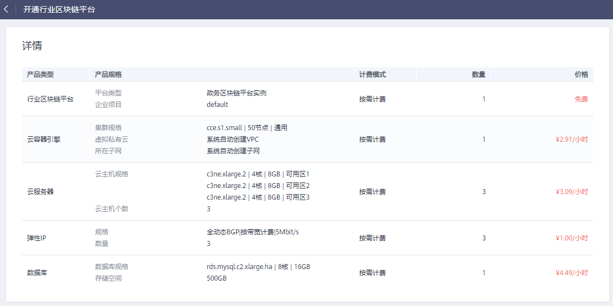
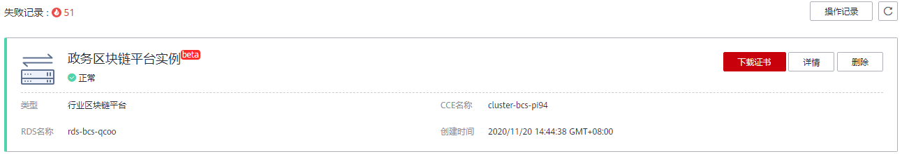

# 开通行业区块链平台

行业区块链平台（Unified Governmental BaaS，简称UGBaaS）是提供具有行业属性的区块链平台，支持行业区块链应用、软硬资源、智能合约等管理和维护。

> **说明：** 
>目前一个租户只支持创建一个政务区块链平台实例。

## 开通行业区块链平台

1.  登录区块链服务管理控制台。
2.  单击左侧导航栏中的“行业区块链平台”。
3.  单击页面右上角的“开通行业区块链平台”，开通行业区块链平台。
4.  根据界面提示配置参数，参数说明如[表1](#table48264368583)所示。

    **表 1**  参数说明

    
    <table><thead align="left"><tr id="row168263365583"><th class="cellrowborder" valign="top" width="26.18261826182618%" id="mcps1.2.4.1.1">
参数

    </th>
    <th class="cellrowborder" valign="top" width="40.484048404840486%" id="mcps1.2.4.1.2">
说明

    </th>
    <th class="cellrowborder" valign="top" width="33.33333333333333%" id="mcps1.2.4.1.3">
示例

    </th>
    </tr>
    </thead>
    <tbody><tr id="row1982716362589"><td class="cellrowborder" valign="top" width="26.18261826182618%" headers="mcps1.2.4.1.1 ">
计费模式

    </td>
    <td class="cellrowborder" valign="top" width="40.484048404840486%" headers="mcps1.2.4.1.2 ">
选择“按需计费”。

    </td>
    <td class="cellrowborder" valign="top" width="33.33333333333333%" headers="mcps1.2.4.1.3 ">
按需计费

    </td>
    </tr>
    <tr id="row1982713625814"><td class="cellrowborder" valign="top" width="26.18261826182618%" headers="mcps1.2.4.1.1 ">
区域

    </td>
    <td class="cellrowborder" valign="top" width="40.484048404840486%" headers="mcps1.2.4.1.2 ">
根据实际选择“区域”。

    </td>
    <td class="cellrowborder" valign="top" width="33.33333333333333%" headers="mcps1.2.4.1.3 ">
-

    </td>
    </tr>
    <tr id="row188271136135815"><td class="cellrowborder" valign="top" width="26.18261826182618%" headers="mcps1.2.4.1.1 ">
企业项目

    </td>
    <td class="cellrowborder" valign="top" width="40.484048404840486%" headers="mcps1.2.4.1.2 ">
选择“企业项目”，若未创建企业项目，单击“新建企业项目”。

    </td>
    <td class="cellrowborder" valign="top" width="33.33333333333333%" headers="mcps1.2.4.1.3 ">
default

    </td>
    </tr>
    <tr id="row8827193685818"><td class="cellrowborder" valign="top" width="26.18261826182618%" headers="mcps1.2.4.1.1 ">
平台类型

    </td>
    <td class="cellrowborder" valign="top" width="40.484048404840486%" headers="mcps1.2.4.1.2 ">
选择“政务区块链平台实例”。

    </td>
    <td class="cellrowborder" valign="top" width="33.33333333333333%" headers="mcps1.2.4.1.3 ">
政务区块链平台实例

    </td>
    </tr>
    <tr id="row107490253597"><td class="cellrowborder" valign="top" width="26.18261826182618%" headers="mcps1.2.4.1.1 ">
资源初始密码

    </td>
    <td class="cellrowborder" valign="top" width="40.484048404840486%" headers="mcps1.2.4.1.2 ">
输入资源初始密码。

    </td>
    <td class="cellrowborder" valign="top" width="33.33333333333333%" headers="mcps1.2.4.1.3 ">
-

    </td>
    </tr>
    <tr id="row1748172514596"><td class="cellrowborder" valign="top" width="26.18261826182618%" headers="mcps1.2.4.1.1 ">
确认密码

    </td>
    <td class="cellrowborder" valign="top" width="40.484048404840486%" headers="mcps1.2.4.1.2 ">
请再次输入密码。

    </td>
    <td class="cellrowborder" valign="top" width="33.33333333333333%" headers="mcps1.2.4.1.3 ">
-

    </td>
    </tr>
    </tbody>
    </table>

5.  单击“立即创建”。开通行业区块链平台需要创建云容器引擎、云服务器、弹性IP和数据库资源，如下图所示。

    **图 1**  开通行业区块链平台  
    

    > **说明：** 
    >区块链平台实例本身不收费，但开通行业区块链平台需要创建云容器引擎、云服务器、网络存储、弹性IP和数据库资源，这些云服务资源是收费的，您需要为这些云服务资源付费。

6.  确认完毕后，单击“提交”。

## 查看和删除政务区块链平台实例

1.  登录区块链服务管理控制台。
2.  单击左侧导航栏中的“行业区块链平台”。
3.  在政务区块链平台实例卡片中，可查看政务区块链平台实例的基本信息。

    **图 2**  政务区块链平台实例  
    

4.  单击“详情”，可查看政务区块链平台实例的详细信息。
5.  单击“删除”，可删除政务区块链平台实例。

    您也可以单击“下载证书”，可下载证书，用于政务区块链平台连接使用。

