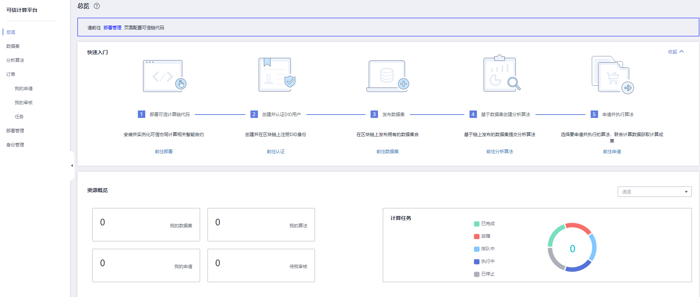

# 总览

区块链的可信计算已经逐渐成为区块链安全层面的保证，底层构建基于可信计算的平台可以解决企业数据合作中数据安全和隐私保护问题，打通数据孤岛，将计算移动到数据端，达成数据可用不可见，安全促进业务创新。可信计算平台能提供以下的能力：

-   隐私保护：利用TEE（Trusted Execution Environment）技术 & 联邦学习计算能力保障数据可用不可见、充分保护原数据隐私。TEE可信数据交换协议层，即可信计算平台的一部分，包括数据交换、可信计算、凭证管理和token管理。
-   全流程可信：资源注册、身份认证、数据发布，计算审核、计算调度和资产结算。评价、审计和追溯等用区块链及智能合约驱动及存证。

可信计算平台构建完成后可以支持大数据局、经信局、大型企业、科研机构、医疗机构等使用。

## 添加可信计算平台

添加可信计算平台有两种方式:

-   购买区块链服务时，选择“可信计算平台“参数时，选择“是“，即可添加可信计算平台。具体请参见[基于CCE集群](基于CCE集群.md)。
-   购买区块链时，选择“可信计算平台参数“时，如果选择“否“，您也可以购买区块链后，在插件管理中，安装可信插件，具体请参见[插件介绍](插件介绍.md)。

    > **说明：** 
    >以下特点的区块链服务暂不支持可信计算平台：
    >-   Fabric服务
    >    -   基础版服务
    >    -   边缘集群
    >    -   国密算法
    >-   华为区块链服务

## 查看总览

通过总览您可以快速了解可信计算平台的使用步骤、可查看任务状态及资源概览。在总览界面中可进行如下操作：

快速入口操作指引：“[部署可信计算链代码](部署管理.md)  ”\> “[创建并认证DID用户](身份管理.md)” \> “[发布数据集](数据集管理.md)  ”\> “[基于数据集创建分析算法](分析算法管理.md)  ”\> “[申请并执行算法](订单管理.md)”。

**图 1**  总览界面  

